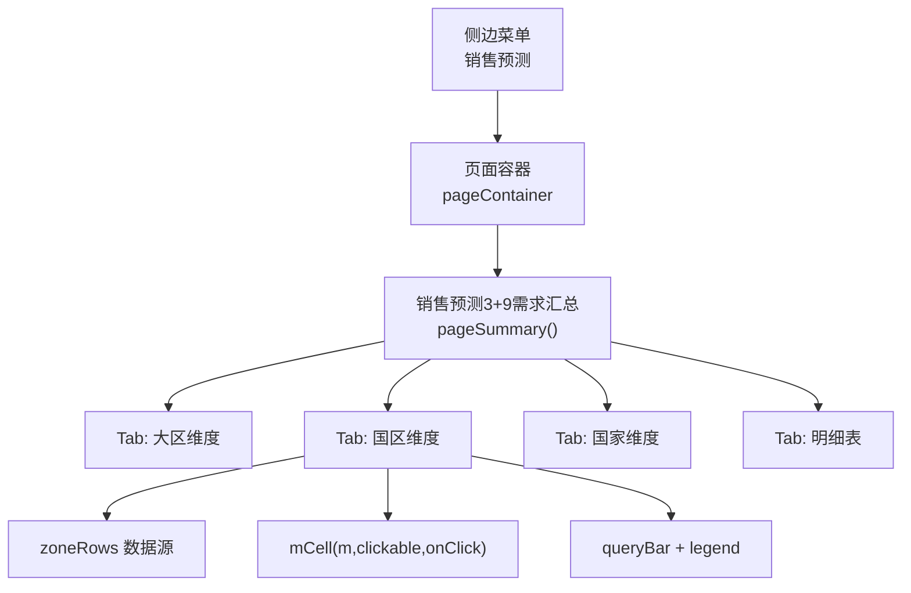
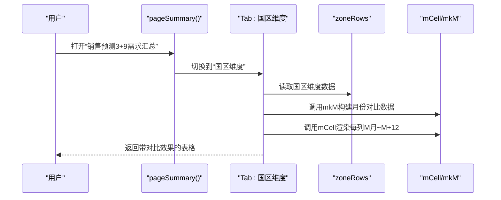
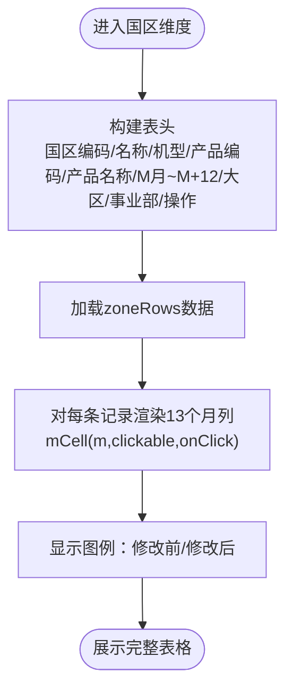
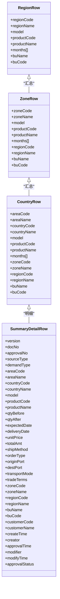
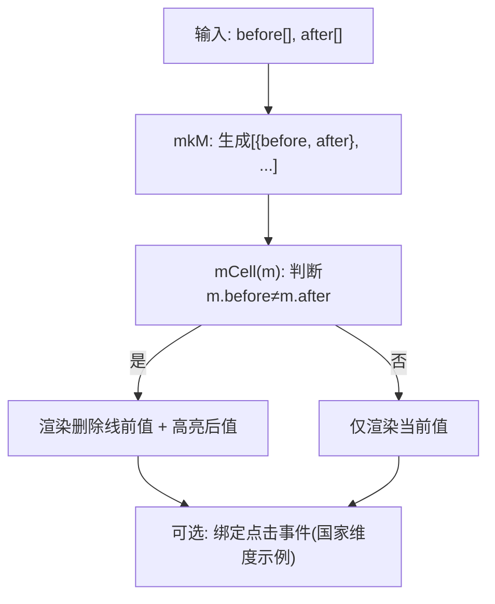
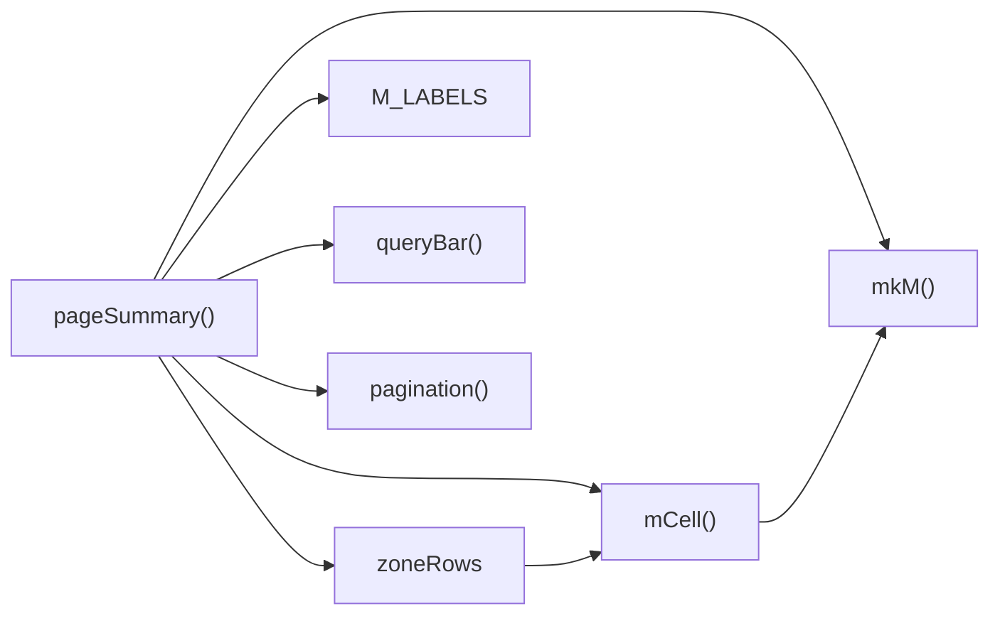
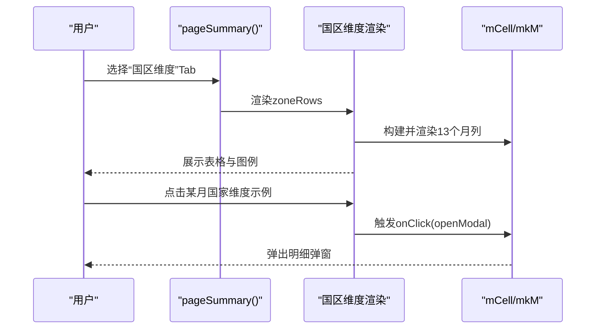

# 国区维度汇总表

<cite>
**本文引用的文件**
- [sales-forecast-prototype.html](file://sales-forecast-prototype.html)
- [sales-forecast-prototype_副本.html](file://sales-forecast-prototype_副本.html)
</cite>

## 目录
1. [简介](#简介)
2. [项目结构](#项目结构)
3. [核心组件](#核心组件)
4. [架构总览](#架构总览)
5. [详细组件分析](#详细组件分析)
6. [依赖关系分析](#依赖关系分析)
7. [性能考量](#性能考量)
8. [故障排查指南](#故障排查指南)
9. [结论](#结论)
10. [附录](#附录)

## 简介
本文件围绕“销售预测3+9需求汇总”中的“国区维度汇总表”功能，系统阐述其数据聚合逻辑、字段结构、修改前后对比展示机制（mCell）、与大区/国家维度的层级关系及导航方式、筛选条件、导出与批量操作等。该原型通过前端HTML/JS实现，使用工具函数mkM与mCell完成月度预测数据的结构化与可视化渲染，并通过Tab切换在大区、国区、国家、明细四个维度间导航。

## 项目结构
- 单页应用：左侧菜单切换页面，右侧主内容区动态渲染表格、查询栏、图例、分页等。
- 关键页面：销售预测3+9需求汇总（含大区/国区/国家/明细四个Tab）。
- 关键脚本：定义月份标签、工具函数（mkM、mCell、queryBar、pagination等），以及各Tab的数据与渲染函数。

图表来源
- [sales-forecast-prototype.html:384-453](file://sales-forecast-prototype.html#L384-L453)

章节来源
- [sales-forecast-prototype.html:1-126](file://sales-forecast-prototype.html#L1-L126)
- [sales-forecast-prototype.html:384-453](file://sales-forecast-prototype.html#L384-L453)

## 核心组件
- 月份标签与数据结构
  - M_LABELS：包含“M月、M+1…M+12”共13个月份标签。
  - mkM(b,a)：将“修改前数组b”和“修改后数组a”映射为对象数组，每个对象包含before与after两个字段，用于后续渲染对比。
- 单元格渲染
  - mCell(m,clickable,onClick)：根据m.before与m.after是否相等决定样式；若不等则显示删除线的“修改前”与高亮的“修改后”，支持可选点击交互。
- 查询与分页
  - queryBar(fields)：生成查询栏（年份、产品线、作战区域等）。
  - pagination(total)：生成分页控件。
- 状态与来源标签
  - statusPill(s)、sourceTag(s)：用于审批状态与数据来源的彩色标签。

章节来源
- [sales-forecast-prototype.html:142-176](file://sales-forecast-prototype.html#L142-L176)
- [sales-forecast-prototype.html:148-176](file://sales-forecast-prototype.html#L148-L176)

## 架构总览
国区维度汇总表属于“销售预测3+9需求汇总”页面的一个Tab，负责按“国区×机型×产品”维度展示13个月预测数据，并附带大区、事业部等关联信息。用户可通过查询栏筛选，通过“查看详情”向下钻取到国家或明细，或通过“导出”导出数据。

图表来源
- [sales-forecast-prototype.html:384-453](file://sales-forecast-prototype.html#L384-L453)
- [sales-forecast-prototype.html:148-176](file://sales-forecast-prototype.html#L148-L176)

## 详细组件分析

### 国区维度汇总表结构与字段
- 行维度键：国区编码、国区名称、机型、产品编码、产品名称。
- 预测列：M月到M+12共13列，每列以mCell渲染，显示修改前/修改后对比。
- 关联字段：大区编码、大区名称、事业部名称、事业部编码。
- 操作列：提供“查看详情 →”跳转至国家维度或明细。

图表来源
- [sales-forecast-prototype.html:430-437](file://sales-forecast-prototype.html#L430-L437)

章节来源
- [sales-forecast-prototype.html:393-398](file://sales-forecast-prototype.html#L393-L398)
- [sales-forecast-prototype.html:430-437](file://sales-forecast-prototype.html#L430-L437)

### 数据聚合与层级关系
- 层级关系：大区→国区→国家（作战区域）→明细。
- 向上汇总：从国家/国区可汇总到大区维度查看合计趋势。
- 向下钻取：从国区维度点击“查看详情 →”进入国家维度，再进入明细表。
- 数据来源：zoneRows为国区维度数据源，regionRows为大区维度数据源，countryRows为国家维度数据源，summaryDetailRows为明细数据源。

图表来源
- [sales-forecast-prototype.html:385-392](file://sales-forecast-prototype.html#L385-L392)
- [sales-forecast-prototype.html:393-398](file://sales-forecast-prototype.html#L393-L398)
- [sales-forecast-prototype.html:399-403](file://sales-forecast-prototype.html#L399-L403)
- [sales-forecast-prototype.html:404-411](file://sales-forecast-prototype.html#L404-L411)

章节来源
- [sales-forecast-prototype.html:385-411](file://sales-forecast-prototype.html#L385-L411)

### 修改前后对比展示机制（mCell）
- 数据结构：mkM将两个数值数组映射为{before, after}对象数组，对应13个月。
- 渲染逻辑：mCell比较before与after，若不同则显示删除线的前值与高亮的新值；支持可选点击事件（如国家维度某月点击弹出明细弹窗）。
- 视觉样式：m-before（灰色删除线）、m-after（蓝色加粗）、m-clickable（悬停高亮）。

图表来源
- [sales-forecast-prototype.html:148-156](file://sales-forecast-prototype.html#L148-L156)
- [sales-forecast-prototype.html:440-444](file://sales-forecast-prototype.html#L440-L444)

章节来源
- [sales-forecast-prototype.html:148-156](file://sales-forecast-prototype.html#L148-L156)
- [sales-forecast-prototype.html:440-444](file://sales-forecast-prototype.html#L440-L444)

### 筛选功能说明
- 查询条件：年份、产品线、作战区域（部分Tab还包含审批状态、单据号等）。
- 交互：查询栏内下拉选择与文本输入，配合“查询”“重置”按钮。
- 适用范围：国区维度汇总表支持年份、产品线、作战区域三类筛选。

章节来源
- [sales-forecast-prototype.html:421-422](file://sales-forecast-prototype.html#L421-L422)
- [sales-forecast-prototype.html:351](file://sales-forecast-prototype.html#L351)

### 导出与批量操作
- 导出：各Tab均提供“导出”按钮，便于将当前视图数据导出。
- 批量操作：在明细表中支持多选行进行发布、提交审批、撤回、废弃、删除等操作；国区维度汇总表主要提供导出能力。

章节来源
- [sales-forecast-prototype.html:426](file://sales-forecast-prototype.html#L426)
- [sales-forecast-prototype.html:449](file://sales-forecast-prototype.html#L449)

### 与例外需求汇总表的联动
- 例外需求汇总表同样采用mCell展示修改前后对比，并提供“查看详情 →”跳转到明细表。
- 国区维度汇总表与例外需求汇总表共享相同的视觉与交互模式，确保一致性。

章节来源
- [sales-forecast-prototype.html:349-355](file://sales-forecast-prototype.html#L349-L355)

## 依赖关系分析
- 模块耦合
  - pageSummary依赖zoneRows、M_LABELS、mCell、mkM、queryBar、pagination等工具与数据。
  - 国区维度与大区/国家/明细维度通过Tab切换与“查看详情”按钮形成松耦合导航。
- 外部依赖
  - 无后端依赖，所有数据与渲染在前端完成。
- 潜在循环依赖
  - 无直接循环依赖，Tab切换通过状态变量currentTab控制。

图表来源
- [sales-forecast-prototype.html:384-453](file://sales-forecast-prototype.html#L384-L453)
- [sales-forecast-prototype.html:148-176](file://sales-forecast-prototype.html#L148-L176)

章节来源
- [sales-forecast-prototype.html:384-453](file://sales-forecast-prototype.html#L384-L453)

## 性能考量
- 渲染开销：13个月列×多行数据，mCell逐条渲染，建议大数据量时考虑虚拟滚动或分页优化。
- DOM更新：Tab切换与查询会触发整表重渲染，可引入局部更新或缓存策略减少重绘。
- 交互响应：国家维度中点击某月弹出明细弹窗，避免频繁DOM操作以提升体验。

[本节为通用指导，不直接分析具体文件]

## 故障排查指南
- 现象：月份列未显示修改前后对比
  - 检查mkM是否正确传入两个等长数组，且m.before与m.after存在差异。
- 现象：点击某月无反应
  - 检查mCell第三个参数onClick是否正确绑定，国家维度示例中使用了openModal。
- 现象：筛选无效
  - 确认queryBar字段与后端/数据源字段一致，前端筛选逻辑需与数据模型匹配。
- 现象：导出为空或异常
  - 检查导出按钮绑定的数据源是否为当前Tab视图数据。

章节来源
- [sales-forecast-prototype.html:148-156](file://sales-forecast-prototype.html#L148-L156)
- [sales-forecast-prototype.html:440-444](file://sales-forecast-prototype.html#L440-L444)

## 结论
国区维度汇总表通过清晰的字段结构与统一的mCell渲染机制，实现了13个月预测数据的直观对比与高效浏览。依托大区/国区/国家/明细四级维度，用户可灵活向上汇总与向下钻取，结合筛选、导出与批量操作，满足日常分析与决策需求。建议在数据规模增长时引入虚拟化与增量更新，进一步提升性能与用户体验。

[本节为总结性内容，不直接分析具体文件]

## 附录

### 字段字典（国区维度）
- 国区编码：标识国区的唯一代码。
- 国区名称：国区中文名称。
- 机型：产品系列（如A系列、B系列等）。
- 产品编码：产品唯一编码。
- 产品名称：产品中文名称。
- M月~M+12：13个月预测数据列，每列显示修改前/修改后对比。
- 大区编码/名称：所属大区的编码与名称。
- 事业部名称/编码：归属事业部的名称与编码。
- 操作：提供“查看详情 →”跳转。

章节来源
- [sales-forecast-prototype.html:430-437](file://sales-forecast-prototype.html#L430-L437)

### 数据流向与交互时序

图表来源
- [sales-forecast-prototype.html:384-453](file://sales-forecast-prototype.html#L384-L453)
- [sales-forecast-prototype.html:148-156](file://sales-forecast-prototype.html#L148-L156)