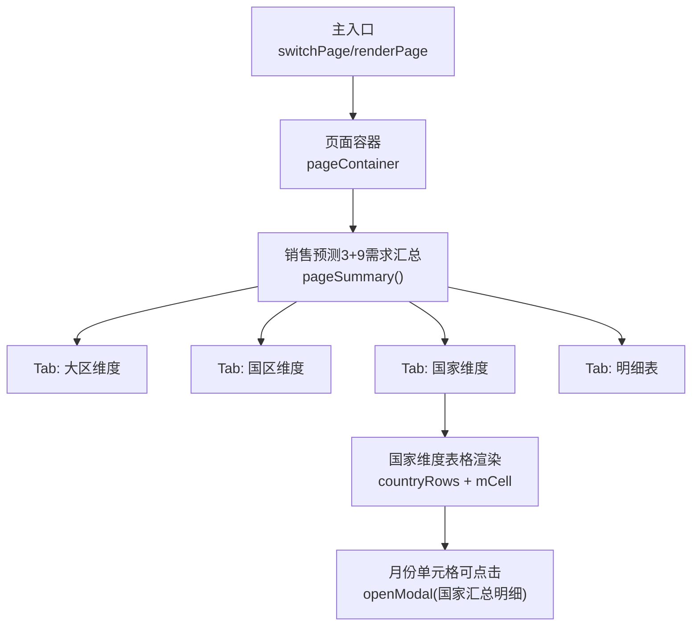
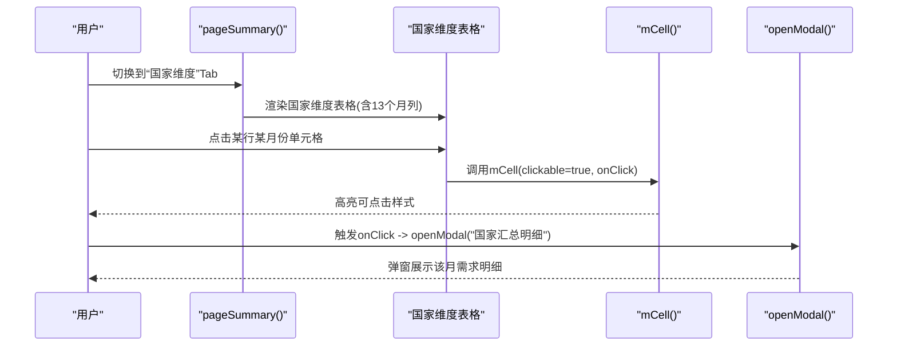
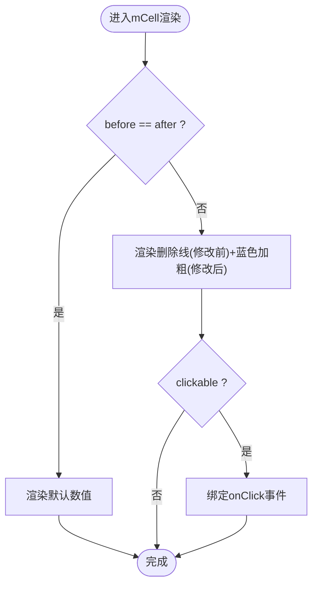
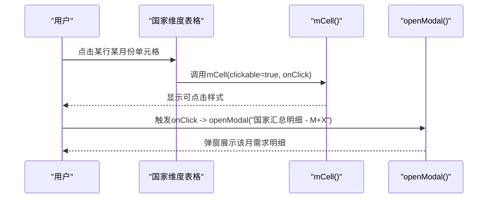
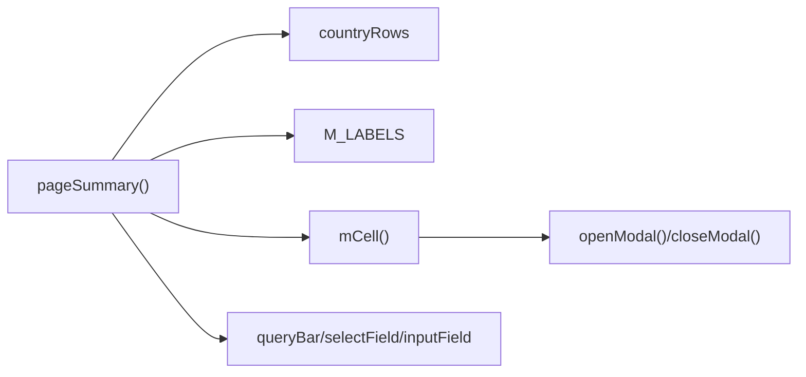

# 国家维度汇总表

<cite>
**本文引用的文件**   
- [sales-forecast-prototype.html](file://sales-forecast-prototype.html)
</cite>

## 目录
1. [简介](#简介)
2. [项目结构](#项目结构)
3. [核心组件](#核心组件)
4. [架构总览](#架构总览)
5. [详细组件分析](#详细组件分析)
6. [依赖关系分析](#依赖关系分析)
7. [性能考量](#性能考量)
8. [故障排查指南](#故障排查指南)
9. [结论](#结论)
10. [附录](#附录)

## 简介
本文件围绕“销售预测3+9需求汇总”中的“国家维度汇总表”功能，系统性阐述其数据聚合逻辑、表格字段结构、修改前后对比展示机制（mCell函数双色显示）、与上级维度（国区、大区）及事业部信息的关联、以及点击月份单元格查看该月需求明细的交互流程。同时给出筛选查询能力说明与使用建议，帮助产品、研发与业务人员快速理解并正确使用该功能。

## 项目结构
该原型为单页应用，所有页面与交互逻辑集中在一个HTML文件中，通过JavaScript动态渲染不同Tab与弹窗内容。国家维度汇总表位于“销售预测3+9需求汇总”页面的第三个Tab中，由统一的渲染函数根据当前Tab切换呈现。

图表来源
- [sales-forecast-prototype.html:283-292](file://sales-forecast-prototype.html#L283-L292)
- [sales-forecast-prototype.html:412-445](file://sales-forecast-prototype.html#L412-L445)

章节来源
- [sales-forecast-prototype.html:1-126](file://sales-forecast-prototype.html#L1-L126)
- [sales-forecast-prototype.html:283-292](file://sales-forecast-prototype.html#L283-L292)

## 核心组件
- 数据标签与常量
  - M_LABELS：定义M月到M+12共13个月份列标题，用于国家维度及各维度汇总表的横向时间轴。
- 工具函数
  - mkM(before, after)：将“修改前/后”数组包装为对象数组，供mCell渲染。
  - mCell(m, clickable, onClick)：统一渲染单格“修改前/后”的双色对比效果；当clickable为true时，单元格可点击触发onClick回调。
  - openModal/closeModal：通用弹窗控制。
  - queryBar/selectField/inputField：统一查询栏与表单控件生成。
- 页面渲染
  - pageSummary：负责“销售预测3+9需求汇总”四个Tab的渲染，其中国家维度Tab包含完整的国家层级信息与13个月预测列。

章节来源
- [sales-forecast-prototype.html:142-178](file://sales-forecast-prototype.html#L142-L178)
- [sales-forecast-prototype.html:412-445](file://sales-forecast-prototype.html#L412-L445)

## 架构总览
国家维度汇总表的渲染与交互遵循“数据驱动+模板拼接”的前端模式：
- 数据层：countryRows提供国家维度的行级数据，每行包含作战区域、国家、机型、产品、上级维度（国区、大区）、事业部信息，以及13个月的“修改前/后”预测值数组。
- 视图层：pageSummary在Tab=country分支下，按列头ths拼接表格，逐行渲染各字段，并将13个月列以mCell渲染。
- 交互层：当mCell传入clickable=true与onClick时，月份单元格可点击弹出“国家汇总明细”弹窗，展示该月的需求明细。

图表来源
- [sales-forecast-prototype.html:412-445](file://sales-forecast-prototype.html#L412-L445)
- [sales-forecast-prototype.html:151-156](file://sales-forecast-prototype.html#L151-L156)

## 详细组件分析

### 国家维度数据模型与聚合逻辑
- 数据来源与结构
  - countryRows：每条记录代表一个“作战区域×国家×机型×产品”的组合，包含：
    - 基础标识：areaCode、areaName、countryCode、countryName、model、productCode、productName
    - 上级维度：zoneCode、zoneName、regionCode、regionName
    - 事业部：buName、buCode
    - 预测数据：months数组，每项为{before, after}，对应M月到M+12共13个月
- 聚合维度
  - 国家维度汇总以“作战区域→国家→机型→产品”为粒度进行数据汇总，横向展开13个月预测列，纵向附带上级维度与事业部信息，便于从国家视角向上钻取至国区、大区，向下穿透到明细。
- 数据更新对比
  - months数组中的before/after分别表示修改前与修改后的预测值，mCell渲染时自动对比两者差异，若不同则显示删除线与蓝色强调的新值，直观体现变更。

章节来源
- [sales-forecast-prototype.html:399-403](file://sales-forecast-prototype.html#L399-L403)
- [sales-forecast-prototype.html:439-444](file://sales-forecast-prototype.html#L439-L444)

### 表格字段结构与含义
国家维度汇总表列头定义如下（按顺序）：
- 作战区域编码、作战区域名称
- 国家编码、国家名称(目的国)
- 机型、产品编码、产品名称
- M月、M+1、M+2、…、M+12（共13个月预测列）
- 国区编码、国区名称
- 大区编码、大区名称
- 事业部名称、事业部编码
- 操作（查看详情等）

说明：
- “国家名称(目的国)”明确该国家为需求目的地，避免歧义。
- 13个月预测列采用mCell渲染，支持双击或点击打开当月明细。
- 上级维度与事业部信息辅助定位与权限过滤。

章节来源
- [sales-forecast-prototype.html:440](file://sales-forecast-prototype.html#L440)

### 修改前/后数据的对比展示（mCell函数）
- 渲染规则
  - 当before与after相等：仅显示默认颜色数值。
  - 当before与after不等：before显示灰色删除线，after显示蓝色加粗，突出变更。
- 可点击交互
  - 当clickable=true且传入onClick时，单元格具备点击态（hover背景变化），点击后执行回调（如打开弹窗）。
- 视觉图例
  - 页面顶部提供图例：浅灰框表示“修改前”，浅蓝框表示“修改后”。

图表来源
- [sales-forecast-prototype.html:151-156](file://sales-forecast-prototype.html#L151-L156)
- [sales-forecast-prototype.html:80-85](file://sales-forecast-prototype.html#L80-L85)

章节来源
- [sales-forecast-prototype.html:151-156](file://sales-forecast-prototype.html#L151-L156)
- [sales-forecast-prototype.html:80-85](file://sales-forecast-prototype.html#L80-L85)

### 国家维度明细查看（点击月份单元格）
- 交互路径
  - 在国家维度表格中，点击任意月份的mCell单元格（clickable=true），触发openModal，弹窗标题为“国家汇总明细 - M+X”，内容包含该月的需求明细列表（单据号、数据来源、机型、产品编码、产品名称、修改前、修改后）。
- 数据结构
  - 弹窗内表格字段：单据号、数据来源（确定性需求/例外需求/历史销售预测）、机型、产品编码、产品名称、修改前、修改后。
- 关闭方式
  - 弹窗底部提供“关闭”按钮，调用closeModal。

图表来源
- [sales-forecast-prototype.html:443](file://sales-forecast-prototype.html#L443)
- [sales-forecast-prototype.html:179-182](file://sales-forecast-prototype.html#L179-L182)

章节来源
- [sales-forecast-prototype.html:443](file://sales-forecast-prototype.html#L443)
- [sales-forecast-prototype.html:179-182](file://sales-forecast-prototype.html#L179-L182)

### 与国家相关的完整层级信息展示
国家维度汇总表不仅展示国家本身，还附带上级维度与事业部信息，形成从大区到国家的完整链路：
- 大区编码/名称（regionCode/regionName）
- 国区编码/名称（zoneCode/zoneName）
- 国家编码/名称（countryCode/countryName）
- 作战区域编码/名称（areaCode/areaName）
- 事业部编码/名称（buCode/buName）

这些字段有助于：
- 快速定位所属组织与业务域
- 支持按大区/国区/事业部进行筛选与统计
- 为后续钻取与下钻提供上下文

章节来源
- [sales-forecast-prototype.html:399-403](file://sales-forecast-prototype.html#L399-L403)
- [sales-forecast-prototype.html:440](file://sales-forecast-prototype.html#L440)

### 数据筛选与查询功能
- 查询栏字段
  - 年份：支持选择2026年、2025年等
  - 产品线：全部产品、A系列、B系列、C系列、D系列
  - 作战区域：全部、华东作战区、华南作战区、华北作战区等
- 查询行为
  - 点击“查询”按钮触发筛选（原型中为静态演示，实际应联动后端或前端数据过滤）
  - “重置”按钮清空筛选条件
- 分页
  - 每页显示条数可选（10/20/50/100），显示总记录数与页码导航

章节来源
- [sales-forecast-prototype.html:421](file://sales-forecast-prototype.html#L421)
- [sales-forecast-prototype.html:170-172](file://sales-forecast-prototype.html#L170-L172)
- [sales-forecast-prototype.html:167-169](file://sales-forecast-prototype.html#L167-L169)

## 依赖关系分析
- 模块耦合
  - pageSummary依赖countryRows数据与M_LABELS标签
  - 月份列渲染依赖mCell工具函数
  - 弹窗交互依赖openModal/closeModal
- 外部依赖
  - 无外部库依赖，纯原生JS实现
- 潜在循环依赖
  - 无循环引用，渲染与工具函数解耦清晰

图表来源
- [sales-forecast-prototype.html:412-445](file://sales-forecast-prototype.html#L412-L445)
- [sales-forecast-prototype.html:142-178](file://sales-forecast-prototype.html#L142-L178)

章节来源
- [sales-forecast-prototype.html:412-445](file://sales-forecast-prototype.html#L412-L445)
- [sales-forecast-prototype.html:142-178](file://sales-forecast-prototype.html#L142-L178)

## 性能考量
- 渲染性能
  - 国家维度表格列较多（含13个月列），建议使用虚拟滚动或分页加载以提升首屏渲染速度
- 交互性能
  - mCell在大量单元格上绑定onClick需避免重复创建闭包，可考虑事件委托
- 数据量
  - 若countryRows规模较大，建议在查询阶段进行服务端过滤，减少前端处理压力

[本节为通用指导，不直接分析具体文件]

## 故障排查指南
- 月份单元格不可点击
  - 检查mCell调用是否传入clickable=true与有效的onClick回调
  - 确认CSS类m-clickable未被覆盖
- 修改前后对比未显示
  - 检查months数组中before与after是否一致，不一致才会显示对比样式
- 弹窗无法打开
  - 检查openModal参数是否正确，确保modal元素存在且未被遮挡
- 筛选无效
  - 原型中为静态演示，实际需对接查询逻辑与数据源

章节来源
- [sales-forecast-prototype.html:151-156](file://sales-forecast-prototype.html#L151-L156)
- [sales-forecast-prototype.html:179-182](file://sales-forecast-prototype.html#L179-L182)
- [sales-forecast-prototype.html:170-172](file://sales-forecast-prototype.html#L170-L172)

## 结论
国家维度汇总表以“作战区域×国家×机型×产品”为核心维度，横向展开13个月预测数据，纵向附带国区、大区与事业部信息，形成从国家视角的全链路数据视图。通过mCell函数的双色对比与可点击交互，用户可以直观感知数据变更并快速下钻查看月度明细。结合年份、产品线、作战区域的筛选能力，满足多维度分析与决策需求。

[本节为总结性内容，不直接分析具体文件]

## 附录

### 国家维度字段字典
- 作战区域编码：areaCode
- 作战区域名称：areaName
- 国家编码：countryCode
- 国家名称(目的国)：countryName
- 机型：model
- 产品编码：productCode
- 产品名称：productName
- 预测列：M月、M+1、…、M+12（每个单元格包含before/after）
- 国区编码：zoneCode
- 国区名称：zoneName
- 大区编码：regionCode
- 大区名称：regionName
- 事业部名称：buName
- 事业部编码：buCode

章节来源
- [sales-forecast-prototype.html:399-403](file://sales-forecast-prototype.html#L399-L403)
- [sales-forecast-prototype.html:440](file://sales-forecast-prototype.html#L440)