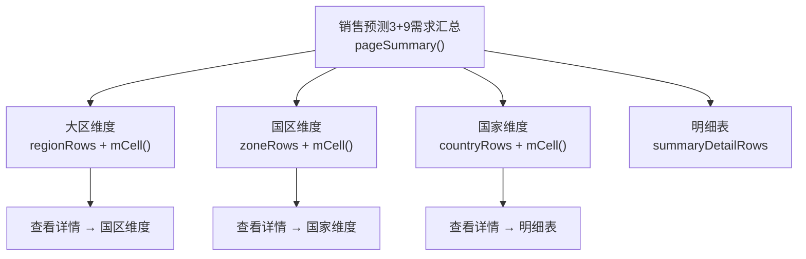
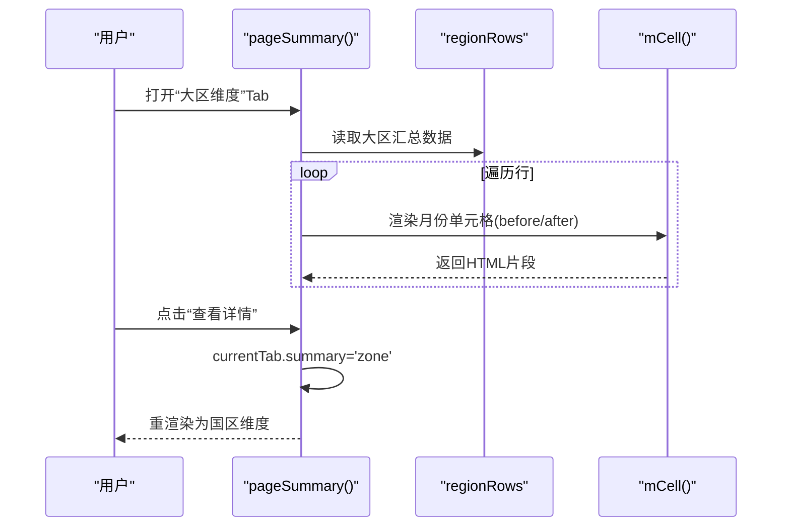
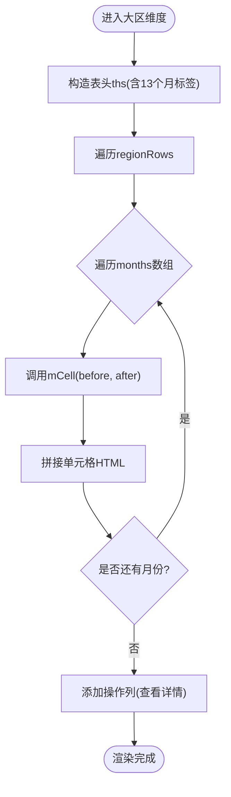
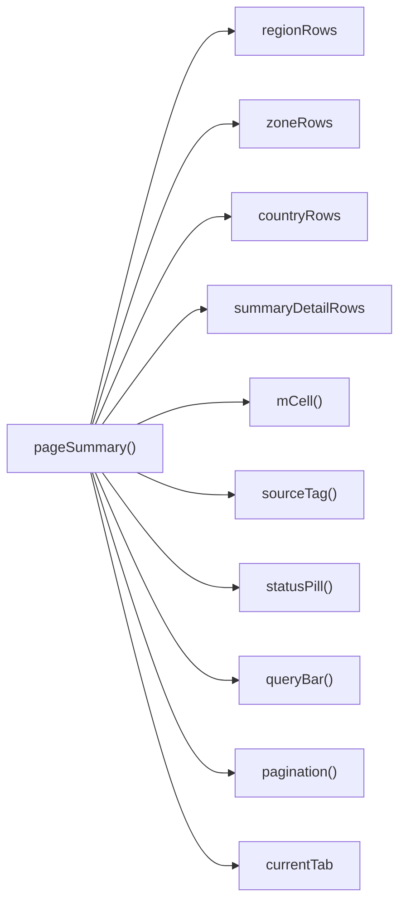

# 大区维度汇总表

<cite>
**本文档引用的文件**   
- [sales-forecast-prototype.html](file://sales-forecast-prototype.html)
</cite>

## 目录
1. [简介](#简介)
2. [项目结构](#项目结构)
3. [核心组件](#核心组件)
4. [架构总览](#架构总览)
5. [详细组件分析](#详细组件分析)
6. [依赖关系分析](#依赖关系分析)
7. [性能考虑](#性能考虑)
8. [故障排查指南](#故障排查指南)
9. [结论](#结论)
10. [附录](#附录)

## 简介
本文件围绕“销售预测3+9需求汇总”中的“大区维度汇总表”功能进行系统化说明，重点解释：
- 按BU与产品线进行数据聚合的机制
- 表格字段结构与含义（大区编码、大区名称、机型、产品编码、产品名称及M月到M+12月的13个月预测列）
- 修改前/后数据的对比展示方式（mCell函数的双色显示）
- 数据来源标识系统（确定性需求、例外需求、历史销售预测）
- 与大区相关的业务属性（事业部名称、事业部编码等）
- 筛选与查询能力（年份、产品线、作战区域等）
- 与国区维度的钻取关系（通过“查看详情”按钮实现层级下钻）

该原型采用单页HTML+内联脚本实现，页面渲染由函数驱动，数据以数组对象形式定义，交互通过DOM操作完成。

## 项目结构
- 前端界面与逻辑集中在一个HTML文件中，包含样式、模板与脚本。
- 页面通过顶部导航切换不同模块，“销售预测3+9需求汇总”为其中一个主模块。
- “销售预测3+9需求汇总”内部使用多Tab组织视图：大区维度、国区维度、国家维度、明细表。
- 关键数据结构包括：
  - M_LABELS：13个月标签（M月、M+1…M+12）
  - regionRows：大区维度汇总数据（含months数组，每个元素为{before, after}）
  - zoneRows：国区维度汇总数据
  - countryRows：国家维度汇总数据
  - summaryDetailRows：汇总明细数据（含sourceType、qtyBefore/After等）

图表来源
- [sales-forecast-prototype.html:412-452](file://sales-forecast-prototype.html#L412-L452)

章节来源
- [sales-forecast-prototype.html:142-146](file://sales-forecast-prototype.html#L142-L146)
- [sales-forecast-prototype.html:385-411](file://sales-forecast-prototype.html#L385-L411)
- [sales-forecast-prototype.html:412-452](file://sales-forecast-prototype.html#L412-L452)

## 核心组件
- mCell函数：用于渲染每个月的“修改前/后”对比单元格，支持可点击与颜色区分。
- mkM函数：将前后值数组映射为{before, after}对象数组，供mCell渲染。
- sourceTag函数：根据数据来源类型渲染彩色标签（确定性需求、例外需求、历史销售预测）。
- statusPill函数：渲染审批状态标签（已通过、审批中、草稿、已驳回、已撤回、已废弃）。
- queryBar/selectField/inputField：构建查询栏与表单控件。
- pagination：分页控件渲染。
- openModal/closeModal：通用弹窗控制。

章节来源
- [sales-forecast-prototype.html:149-178](file://sales-forecast-prototype.html#L149-L178)
- [sales-forecast-prototype.html:151-156](file://sales-forecast-prototype.html#L151-L156)
- [sales-forecast-prototype.html:157-166](file://sales-forecast-prototype.html#L157-L166)
- [sales-forecast-prototype.html:167-178](file://sales-forecast-prototype.html#L167-L178)

## 架构总览
大区维度汇总表属于“销售预测3+9需求汇总”的一个Tab视图，其数据来源于regionRows数组，每条记录包含：
- 大区编码、大区名称
- 机型、产品编码、产品名称
- months：长度为13的数组，每项为{before, after}表示M月到M+12月的预测值
- 事业部名称、事业部编码
- 操作列：提供“查看详情”跳转至国区维度

渲染流程：
- pageSummary(tab==='region')构造表头ths，包含13个月标签
- 遍历regionRows，调用mCell渲染每个月份单元
- 点击“查看详情”切换currentTab.summary='zone'并重新渲染

图表来源
- [sales-forecast-prototype.html:412-428](file://sales-forecast-prototype.html#L412-L428)
- [sales-forecast-prototype.html:151-156](file://sales-forecast-prototype.html#L151-L156)

章节来源
- [sales-forecast-prototype.html:412-428](file://sales-forecast-prototype.html#L412-L428)

## 详细组件分析

### 大区维度汇总表
- 表头字段：大区编码、大区名称、机型、产品编码、产品名称、M月~M+12（共13列）、事业部名称、事业部编码、操作
- 数据来源：regionRows数组，每条记录包含months数组（13项），每项为{before, after}
- 渲染逻辑：遍历regionRows，对每个months项调用mCell渲染；操作列提供“查看详情”按钮跳转到国区维度
- 筛选条件：年份、产品线、作战区域（queryBar组合selectField）
- 图例：修改前（灰色删除线）、修改后（蓝色加粗）

图表来源
- [sales-forecast-prototype.html:423-428](file://sales-forecast-prototype.html#L423-L428)
- [sales-forecast-prototype.html:151-156](file://sales-forecast-prototype.html#L151-L156)

章节来源
- [sales-forecast-prototype.html:385-392](file://sales-forecast-prototype.html#L385-L392)
- [sales-forecast-prototype.html:423-428](file://sales-forecast-prototype.html#L423-L428)

### 数据聚合逻辑（按BU与产品线）
- 当前原型中，regionRows直接提供按“大区+机型+产品”聚合后的结果，未展示后端聚合算法
- BU信息通过buName与buCode字段体现，产品线通过model与productCode体现
- 实际系统中，聚合可能由后端按BU、产品线、大区维度进行GROUP BY计算，再返回给前端渲染

章节来源
- [sales-forecast-prototype.html:385-392](file://sales-forecast-prototype.html#L385-L392)

### 修改前/后对比展示（mCell函数）
- mCell接收一个对象{before, after}，比较两者是否相等
- 若不相等：before显示为灰色删除线，after显示为蓝色加粗
- 若相等：统一显示为默认黑色文本
- 支持clickable与onClick参数，用于国家维度下的月度明细弹窗

章节来源
- [sales-forecast-prototype.html:151-156](file://sales-forecast-prototype.html#L151-L156)

### 数据来源标识系统
- sourceTag函数根据sourceType渲染彩色标签：
  - 确定性需求：绿色背景
  - 例外需求：橙色背景
  - 历史销售预测：蓝色背景
- 在明细表中，每条记录的sourceType字段决定数据来源标签

章节来源
- [sales-forecast-prototype.html:162-166](file://sales-forecast-prototype.html#L162-L166)
- [sales-forecast-prototype.html:404-411](file://sales-forecast-prototype.html#L404-L411)

### 与大区相关的业务属性
- 事业部名称（buName）、事业部编码（buCode）
- 大区编码（regionCode）、大区名称（regionName）
- 国区编码（zoneCode）、国区名称（zoneName）
- 作战区域编码（areaCode）、作战区域名称（areaName）
- 国家编码（countryCode）、国家名称（countryName）

章节来源
- [sales-forecast-prototype.html:385-403](file://sales-forecast-prototype.html#L385-L403)

### 数据筛选与查询功能
- 查询栏包含：
  - 年份：2026年、2025年
  - 产品线：全部产品、A系列、B系列、C系列、D系列
  - 作战区域：全部、华东作战区、华南作战区、华北作战区
- 通过queryBar组合selectField生成下拉选择框
- 查询按钮触发页面重渲染（原型中未实现具体过滤逻辑）

章节来源
- [sales-forecast-prototype.html:421](file://sales-forecast-prototype.html#L421)
- [sales-forecast-prototype.html:170-175](file://sales-forecast-prototype.html#L170-L175)

### 与国区维度的钻取关系
- 大区维度行的“操作”列提供“查看详情 →”按钮
- 点击后设置currentTab.summary='zone'并调用renderPage()重渲染为国区维度
- 国区维度同样提供“查看详情 →”跳转至国家维度或明细表

章节来源
- [sales-forecast-prototype.html:427](file://sales-forecast-prototype.html#L427)
- [sales-forecast-prototype.html:435](file://sales-forecast-prototype.html#L435)

## 依赖关系分析
- pageSummary依赖：
  - regionRows、zoneRows、countryRows、summaryDetailRows数据源
  - mCell、mkM、sourceTag、statusPill、queryBar、pagination等工具函数
  - currentTab状态管理
- 视图切换依赖：
  - switchPage与renderPage控制页面渲染
  - currentTab对象维护当前Tab状态

图表来源
- [sales-forecast-prototype.html:412-452](file://sales-forecast-prototype.html#L412-L452)
- [sales-forecast-prototype.html:149-178](file://sales-forecast-prototype.html#L149-L178)

章节来源
- [sales-forecast-prototype.html:412-452](file://sales-forecast-prototype.html#L412-L452)

## 性能考虑
- 大数据量渲染：当前原型使用innerHTML直接拼接字符串，适合小规模演示；生产环境建议虚拟滚动或分页加载
- 月份单元格渲染：mCell每次比较before/after并生成HTML，频繁操作DOM可能影响性能，可考虑缓存或增量更新
- 筛选逻辑：原型未实现真实过滤，实际需增加防抖与后端分页接口

[本节为通用指导，不直接分析具体文件]

## 故障排查指南
- 数据为空：检查regionRows等数据源是否正确初始化
- 月份显示异常：确认months数组长度为13且每项包含before/after字段
- 颜色显示错误：检查mCell中before/after比较逻辑与CSS类名
- 筛选无效：确认queryBar生成的selectField选项与数据字段匹配
- 钻取失败：检查currentTab状态更新与renderPage调用

章节来源
- [sales-forecast-prototype.html:151-156](file://sales-forecast-prototype.html#L151-L156)
- [sales-forecast-prototype.html:412-452](file://sales-forecast-prototype.html#L412-L452)

## 结论
大区维度汇总表作为销售预测3+9需求汇总的核心视图之一，提供了按大区、产品线、BU聚合的13个月预测数据展示，并通过mCell函数实现直观的修改前后对比。结合筛选与钻取功能，用户可从大区逐级下钻至国区、国家及明细层面，满足多维度数据分析需求。原型实现了基础UI与交互逻辑，生产环境需补充数据聚合算法、筛选逻辑与性能优化。

[本节为总结性内容，不直接分析具体文件]

## 附录

### 字段结构说明
- 大区编码：regionCode
- 大区名称：regionName
- 机型：model
- 产品编码：productCode
- 产品名称：productName
- 预测月份：M月、M+1…M+12（共13列）
- 事业部名称：buName
- 事业部编码：buCode

章节来源
- [sales-forecast-prototype.html:424](file://sales-forecast-prototype.html#L424)
- [sales-forecast-prototype.html:385-392](file://sales-forecast-prototype.html#L385-L392)

### 数据来源类型
- 确定性需求：合同订单等确定性的需求
- 例外需求：临时大单、紧急调拨、风险备货等例外情况
- 历史销售预测：基于历史数据的预测需求

章节来源
- [sales-forecast-prototype.html:162-166](file://sales-forecast-prototype.html#L162-L166)
- [sales-forecast-prototype.html:404-411](file://sales-forecast-prototype.html#L404-L411)