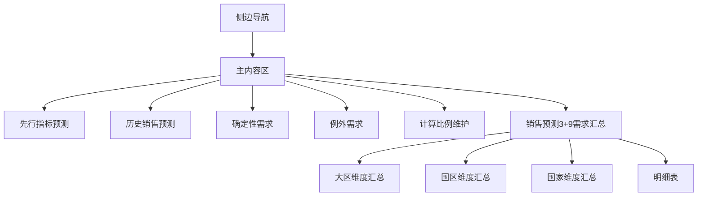
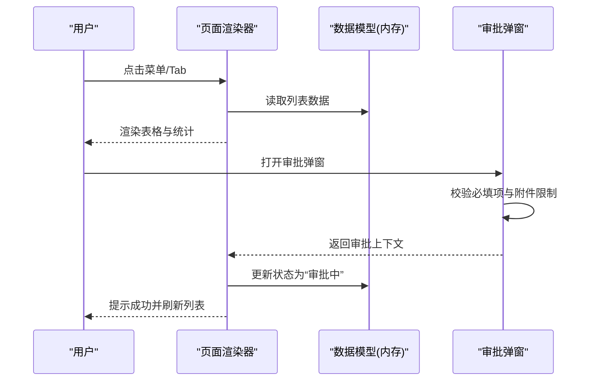
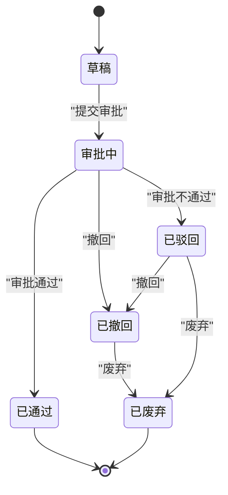
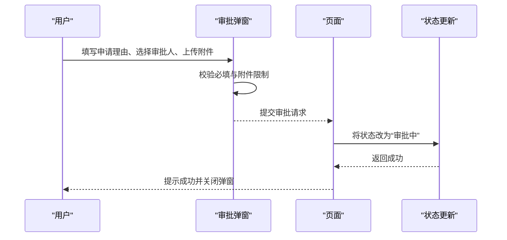
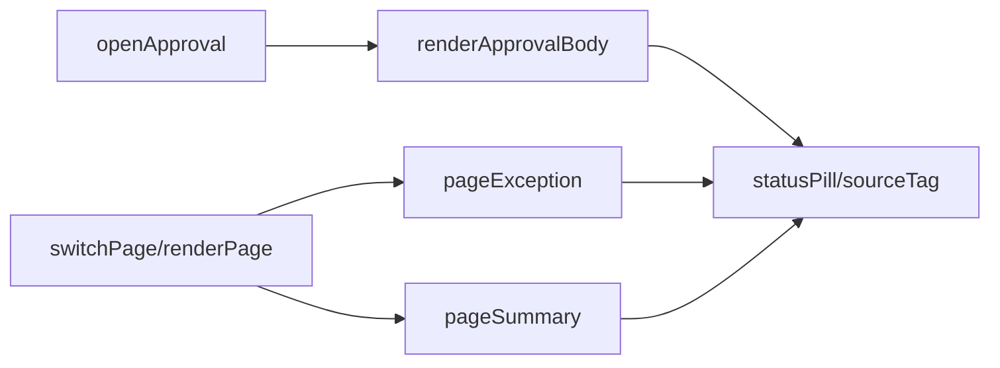

# 需求明细表管理

<cite>
**本文档中引用的文件**
- [sales-forecast-prototype.html](file://sales-forecast-prototype.html)
- [sales-forecast-prototype_副本.html](file://sales-forecast-prototype_副本.html)
</cite>

## 目录
1. [简介](#简介)
2. [项目结构](#项目结构)
3. [核心组件](#核心组件)
4. [架构总览](#架构总览)
5. [详细组件分析](#详细组件分析)
6. [依赖关系分析](#依赖关系分析)
7. [性能考虑](#性能考虑)
8. [故障排查指南](#故障排查指南)
9. [结论](#结论)
10. [附录：字段字典与操作规范](#附录字段字典与操作规范)

## 简介
本文件面向“销售预测3+9需求汇总”中的需求明细表管理，覆盖数据结构、字段含义、状态机流转、数据来源标识、审批流程、批量操作、数据验证、编辑权限、版本管理与变更记录，以及完整操作指南与最佳实践。原型界面与交互逻辑来源于高保真HTML原型，便于快速理解业务规则与系统行为。

## 项目结构
- 前端为单页应用（SPA）原型，包含侧边导航、主内容区、通用弹窗与审批弹窗。
- 页面模块包括：先行指标预测、历史销售预测、确定性需求、例外需求、计算比例维护、销售预测3+9需求汇总。
- 需求明细表位于“销售预测3+9需求汇总”的“明细表”Tab，提供多维汇总与明细查看、审批提交、撤回、废弃、删除、导出等能力。

图表来源
- [sales-forecast-prototype.html:108-126](file://sales-forecast-prototype.html#L108-L126)
- [sales-forecast-prototype.html:412-453](file://sales-forecast-prototype.html#L412-L453)

章节来源
- [sales-forecast-prototype.html:108-126](file://sales-forecast-prototype.html#L108-L126)
- [sales-forecast-prototype.html:412-453](file://sales-forecast-prototype.html#L412-L453)

## 核心组件
- 页面渲染与路由：通过函数切换当前页面并动态渲染DOM。
- 表格与分页：统一渲染列头、行数据、分页控件。
- 审批弹窗：支持选择审批人（多级）、填写申请理由、上传附件。
- 状态标签与来源标签：用于展示审批状态与数据来源类型。
- 工具函数：月份单元格渲染、查询栏、分页、弹窗控制等。

章节来源
- [sales-forecast-prototype.html:140-183](file://sales-forecast-prototype.html#L140-L183)
- [sales-forecast-prototype.html:184-281](file://sales-forecast-prototype.html#L184-L281)
- [sales-forecast-prototype.html:282-292](file://sales-forecast-prototype.html#L282-L292)

## 架构总览
整体采用“视图层（HTML/CSS/JS）+ 数据模型（内存数组）+ 交互逻辑（事件处理）”的前端原型架构。关键流程包括：
- 页面切换与渲染
- 列表查询与分页
- 审批弹窗与提交
- 状态与来源标签渲染

图表来源
- [sales-forecast-prototype.html:282-292](file://sales-forecast-prototype.html#L282-L292)
- [sales-forecast-prototype.html:184-281](file://sales-forecast-prototype.html#L184-L281)
- [sales-forecast-prototype.html:412-453](file://sales-forecast-prototype.html#L412-L453)

## 详细组件分析

### 需求明细表结构与字段说明
- 版本号：记录当前版本的标识，如V1.0、V3.2等，体现变更历史。
- 单据号：唯一标识一条需求明细，如DN-2026-0160。
- 审批单据号：关联审批流程的单号，如AP-0092；未发起审批时为“—”。
- 数据来源（需求预测类型）：区分“确定性需求”“例外需求”“历史销售预测”，影响后续处理策略。
- 需求类型：如合同订单、临时大单、紧急调拨、风险备货、预测需求等。
- 地理位置信息：作战区域编码/名称、国家编码/名称、国区编码/名称、大区编码/名称。
- 产品信息：机型、产品编码、产品名称、选配、配置说明。
- 数量信息：生效需求数量（修改前）、生效需求数量（修改后）。
- 价格信息：单价、总金额。
- 物流信息：发运计收、订单型/储备型、起运港、目的港、运输方式、贸易术语。
- 时间信息与责任人：预计入库日期、要求交货日期、创建时间、创建人、修改人、修改时间、审批通过时间。
- 客户信息：客户编码、客户名称。
- 审批状态：草稿、审批中、已通过、已驳回、已撤回、已废弃。

以上字段在“销售预测3+9需求汇总”的“明细表”列头中完整呈现，涵盖40+字段，满足多维度追踪与审计需求。

章节来源
- [sales-forecast-prototype.html:447-452](file://sales-forecast-prototype.html#L447-L452)

### 状态流转规则（状态机设计）
- 初始状态：草稿
- 提交审批后：进入“审批中”
- 审批通过后：变为“已通过”
- 审批不通过：变为“已驳回”
- 发起人可撤回：从“审批中”或“已驳回”回到“已撤回”
- 最终归档：从“已驳回/已撤回”可进入“已废弃”

图表来源
- [sales-forecast-prototype.html:450](file://sales-forecast-prototype.html#L450)

章节来源
- [sales-forecast-prototype.html:450](file://sales-forecast-prototype.html#L450)

### 数据来源标识系统与处理方式
- 确定性需求：来自已确认的合同订单，通常直接纳入计划，较少需要额外审批。
- 例外需求：临时性、突发性需求（如临时大单、紧急调拨、风险备货），需走审批流程管控。
- 历史销售预测：基于历史数据的预测需求，允许在特定条件下进行“修改”操作。

不同来源在明细表中以标签显示，并在操作按钮上有所差异（例如“历史销售预测”来源的行可能显示“修改”按钮）。

章节来源
- [sales-forecast-prototype.html:162-166](file://sales-forecast-prototype.html#L162-L166)
- [sales-forecast-prototype.html:451](file://sales-forecast-prototype.html#L451)

### 审批流程功能
- 提交审批：
  - 必填：申请理由
  - 必选：至少一名一级审批人（可多选，串行审批）
  - 可选：二级、三级审批人（可多选）
  - 附件：最多3个，单文件不超过30MB，支持图片、Excel、Word、PDF等格式
  - 成功后生成审批单号，并将数据状态更新为“审批中”
- 撤回：
  - 在“审批中”或“已驳回”状态下可撤回至“已撤回”
- 废弃：
  - 从“已驳回/已撤回”进入“已废弃”
- 删除：
  - 仅对“草稿/已废弃”状态的数据开放删除

图表来源
- [sales-forecast-prototype.html:184-281](file://sales-forecast-prototype.html#L184-L281)
- [sales-forecast-prototype.html:449](file://sales-forecast-prototype.html#L449)

章节来源
- [sales-forecast-prototype.html:184-281](file://sales-forecast-prototype.html#L184-L281)
- [sales-forecast-prototype.html:449](file://sales-forecast-prototype.html#L449)

### 批量操作功能
- 多选操作：表格首列提供复选框，支持批量选择行执行操作（如批量导入、导出、删除等）。
- 批量导入：提供“导入”和“下载导入模版”按钮，便于批量新增或更新数据。
- 批量导出：支持将当前筛选结果导出为文件。

章节来源
- [sales-forecast-prototype.html:360](file://sales-forecast-prototype.html#L360)
- [sales-forecast-prototype.html:449](file://sales-forecast-prototype.html#L449)

### 数据验证规则与必填字段校验
- 审批弹窗必填校验：
  - 申请理由为空时提示错误
  - 一级审批人未选择时提示错误
- 附件限制：
  - 最多3个附件
  - 单个文件大小不超过30MB
- 表单输入：
  - 数字输入限制范围（如比例维护页面的百分比）
  - 日期选择器约束有效日期

章节来源
- [sales-forecast-prototype.html:274-280](file://sales-forecast-prototype.html#L274-L280)
- [sales-forecast-prototype.html:263-272](file://sales-forecast-prototype.html#L263-L272)

### 编辑功能与权限控制
- 编辑按钮可见性与可用性：
  - 仅在“草稿/已驳回/已撤回”状态下可编辑
  - “已通过/审批中/已废弃”状态不可编辑
- 删除按钮可见性与可用性：
  - 仅在“草稿/已废弃”状态下可删除
- 来源相关编辑：
  - “历史销售预测”来源的行可能显示“修改”按钮，允许调整预测值

章节来源
- [sales-forecast-prototype.html:362](file://sales-forecast-prototype.html#L362)
- [sales-forecast-prototype.html:451](file://sales-forecast-prototype.html#L451)

### 版本管理机制与数据变更历史记录
- 版本号字段：每条记录携带版本号（如V1.0、V3.2），反映数据迭代历史。
- 修改前后对比：数量字段提供“修改前/修改后”对比，便于审计与追溯。
- 时间与责任人：记录创建时间、创建人、修改时间、修改人，确保变更可追溯。
- 审批时间：记录审批通过时间，形成完整的生命周期轨迹。

章节来源
- [sales-forecast-prototype.html:405-411](file://sales-forecast-prototype.html#L405-L411)
- [sales-forecast-prototype.html:447-452](file://sales-forecast-prototype.html#L447-L452)

### 操作指南与最佳实践
- 新增需求：
  - 使用“新增”按钮打开表单，填写必填字段（作战区域、国家、预计入库日期、产品编码等）
  - 保存后进入“草稿”状态
- 提交审批：
  - 在“草稿”或“已驳回/已撤回”状态下提交审批
  - 填写申请理由，选择至少一名一级审批人，可附加说明文件
- 撤回与废弃：
  - 在“审批中/已驳回”可撤回；在“已驳回/已撤回”可废弃
- 删除：
  - 仅对“草稿/已废弃”状态数据进行删除
- 导入导出：
  - 使用模板批量导入，注意字段映射与必填校验
  - 导出当前筛选结果，便于离线分析与汇报

章节来源
- [sales-forecast-prototype.html:360](file://sales-forecast-prototype.html#L360)
- [sales-forecast-prototype.html:449](file://sales-forecast-prototype.html#L449)

## 依赖关系分析
- 页面渲染依赖：
  - switchPage与renderPage负责页面切换与渲染
  - 各页面函数（pageException、pageSummary等）依赖数据数组与工具函数
- 审批弹窗依赖：
  - openApproval/closeApproval控制弹窗显隐
  - renderApprovalBody根据上下文动态渲染表单与附件列表
- 状态与来源标签依赖：
  - statusPill与sourceTag用于渲染状态与来源标签

图表来源
- [sales-forecast-prototype.html:282-292](file://sales-forecast-prototype.html#L282-L292)
- [sales-forecast-prototype.html:184-281](file://sales-forecast-prototype.html#L184-L281)
- [sales-forecast-prototype.html:157-166](file://sales-forecast-prototype.html#L157-L166)

章节来源
- [sales-forecast-prototype.html:282-292](file://sales-forecast-prototype.html#L282-L292)
- [sales-forecast-prototype.html:184-281](file://sales-forecast-prototype.html#L184-L281)
- [sales-forecast-prototype.html:157-166](file://sales-forecast-prototype.html#L157-L166)

## 性能考虑
- 前端渲染：大量列与行数据可能导致DOM体积较大，建议分页加载与虚拟滚动优化。
- 审批弹窗：附件上传与校验在前端完成，避免频繁网络请求。
- 状态与标签渲染：复用工具函数减少重复代码，提升渲染效率。

[本节为通用指导，无需引用具体文件]

## 故障排查指南
- 审批提交失败：
  - 检查是否填写申请理由与选择一级审批人
  - 检查附件数量与大小限制
- 编辑/删除不可用：
  - 检查当前状态是否符合权限规则（草稿/已驳回/已撤回可编辑；草稿/已废弃可删除）
- 数据不一致：
  - 核对版本号与修改前后数量对比，确认变更历史

章节来源
- [sales-forecast-prototype.html:274-280](file://sales-forecast-prototype.html#L274-L280)
- [sales-forecast-prototype.html:362](file://sales-forecast-prototype.html#L362)

## 结论
需求明细表管理通过清晰的状态机、严格的数据验证与完善的审批流程，保障了销售预测数据的准确性与可追溯性。结合多维汇总与明细视图，用户可高效完成新增、审批、撤回、废弃、删除与导入导出等操作。建议在实现阶段引入后端校验与权限控制，进一步提升系统的安全性与稳定性。

[本节为总结，无需引用具体文件]

## 附录：字段字典与操作规范

### 字段字典（节选）
- 版本号：记录数据版本，如V1.0、V3.2
- 单据号：唯一标识，如DN-2026-0160
- 审批单据号：关联审批单号，如AP-0092
- 数据来源（需求预测类型）：确定性需求/例外需求/历史销售预测
- 需求类型：合同订单/临时大单/紧急调拨/风险备货/预测需求
- 地理位置：作战区域编码/名称、国家编码/名称、国区编码/名称、大区编码/名称
- 产品信息：机型、产品编码、产品名称、选配、配置说明
- 数量信息：生效需求数量（修改前/修改后）
- 价格信息：单价、总金额
- 物流信息：发运计收、订单型/储备型、起运港、目的港、运输方式、贸易术语
- 时间信息与责任人：预计入库日期、要求交货日期、创建时间、创建人、修改人、修改时间、审批通过时间
- 客户信息：客户编码、客户名称
- 审批状态：草稿/审批中/已通过/已驳回/已撤回/已废弃

章节来源
- [sales-forecast-prototype.html:447-452](file://sales-forecast-prototype.html#L447-L452)

### 操作规范
- 新增：填写必填字段，保存后进入草稿
- 提交审批：填写申请理由，选择至少一名一级审批人，可上传附件
- 撤回：在审批中/已驳回状态下撤回至已撤回
- 废弃：在已驳回/已撤回状态下废弃
- 删除：仅草稿/已废弃状态可删除
- 导入导出：使用模板批量导入，导出当前筛选结果

章节来源
- [sales-forecast-prototype.html:360](file://sales-forecast-prototype.html#L360)
- [sales-forecast-prototype.html:449](file://sales-forecast-prototype.html#L449)