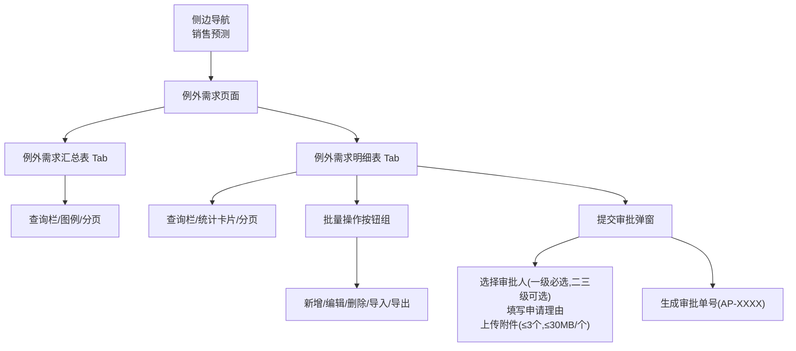
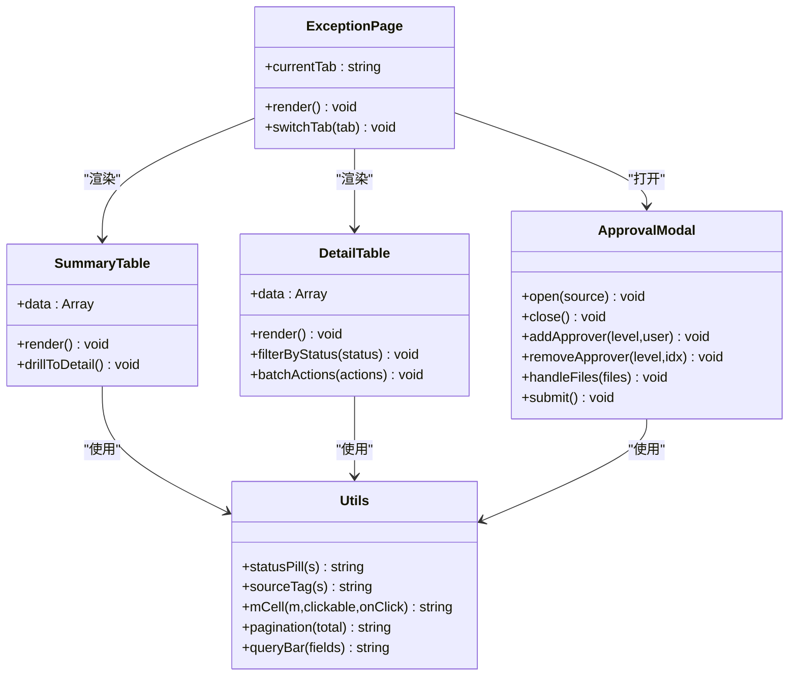
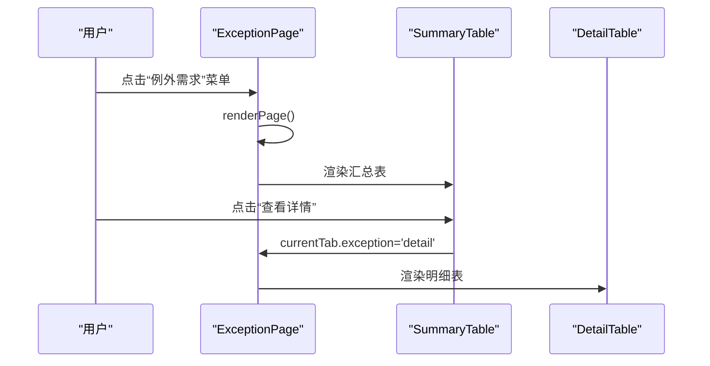
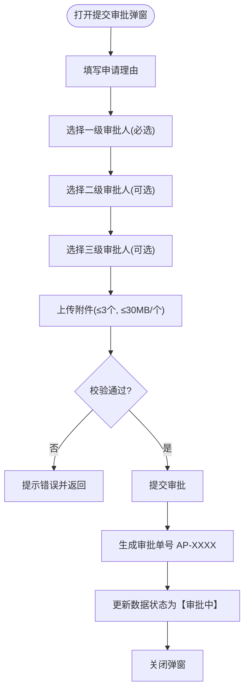
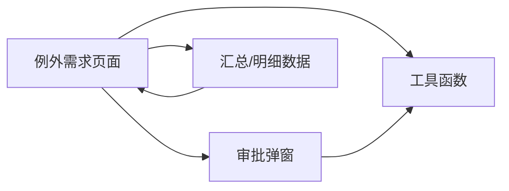

# 例外需求处理

<cite>
**本文档中引用的文件**
- [sales-forecast-prototype.html](file://sales-forecast-prototype.html)
- [sales-forecast-prototype_副本.html](file://sales-forecast-prototype_副本.html)
</cite>

## 目录
1. [简介](#简介)
2. [项目结构](#项目结构)
3. [核心组件](#核心组件)
4. [架构总览](#架构总览)
5. [详细组件分析](#详细组件分析)
6. [依赖关系分析](#依赖关系分析)
7. [性能考量](#性能考量)
8. [故障排查指南](#故障排查指南)
9. [结论](#结论)
10. [附录](#附录)

## 简介
本模块聚焦“例外需求处理”的双视图模式：汇总表与明细表。该设计面向销售预测中的异常、临时、紧急等场景，提供从聚合到明细的钻取能力，支持M月到M+12的时间序列展示，以及包含单据、产品、物流、审批等40多个字段的复杂明细结构。同时，模块内置三级审批流程（草稿→提交审批→审批中→已通过/已驳回/已撤回；已驳回/已撤回→废弃→已废弃），并提供新增、编辑、删除、导入导出等批量操作能力。

## 项目结构
- 前端原型由单页HTML构成，采用侧边导航+主内容区布局，通过Tab切换不同页面与子视图。
- “例外需求”页面包含两个Tab：
  - 例外需求汇总表：按作战区域、国家、机型、产品编码组织数据，展示M月~M+12时间序列。
  - 例外需求明细表：包含40+字段，覆盖单据信息、产品信息、物流信息、审批信息等。
- 通用弹窗用于新增、编辑、提交审批等操作；审批弹窗支持选择多级审批人、上传附件、生成审批单号。

图表来源
- [sales-forecast-prototype.html:112-126](file://sales-forecast-prototype.html#L112-L126)
- [sales-forecast-prototype.html:330-365](file://sales-forecast-prototype.html#L330-L365)
- [sales-forecast-prototype.html:184-280](file://sales-forecast-prototype.html#L184-L280)

章节来源
- [sales-forecast-prototype.html:108-126](file://sales-forecast-prototype.html#L108-L126)
- [sales-forecast-prototype.html:330-365](file://sales-forecast-prototype.html#L330-L365)

## 核心组件
- 双Tab视图控制器：维护当前Tab状态，渲染对应表格与工具栏。
- 汇总表格组件：展示M月~M+12时间序列，支持修改前后对比显示与点击钻取。
- 明细表格组件：展示40+字段，支持筛选、分页、行内操作（查看/编辑/删除）。
- 审批弹窗组件：三级审批人选择、申请理由输入、附件上传、审批单号生成。
- 通用弹窗组件：新增/编辑表单容器。
- 工具函数：状态标签、来源标签、月份单元格渲染、分页、查询栏等。

章节来源
- [sales-forecast-prototype.html:140-178](file://sales-forecast-prototype.html#L140-L178)
- [sales-forecast-prototype.html:330-365](file://sales-forecast-prototype.html#L330-L365)
- [sales-forecast-prototype.html:184-280](file://sales-forecast-prototype.html#L184-L280)

## 架构总览
“例外需求”页面以Tab为中心，将汇总与明细解耦，便于独立扩展与维护。数据层以数组对象承载样例数据，渲染层通过模板字符串拼接DOM，交互层通过事件绑定触发弹窗与状态更新。

图表来源
- [sales-forecast-prototype.html:330-365](file://sales-forecast-prototype.html#L330-L365)
- [sales-forecast-prototype.html:184-280](file://sales-forecast-prototype.html#L184-L280)
- [sales-forecast-prototype.html:140-178](file://sales-forecast-prototype.html#L140-L178)

## 详细组件分析

### 双视图模式设计与实现
- 设计理念：
  - 汇总表侧重聚合与趋势，快速定位问题区域与产品，支持时间序列对比（修改前/后）。
  - 明细表侧重业务全貌，涵盖单据、产品、物流、审批等维度，支撑执行与审计。
- 切换逻辑：
  - 通过Tab按钮切换currentTab.exception值，重新渲染页面内容。
  - 汇总表中“查看详情”按钮直接跳转到明细表视图。

图表来源
- [sales-forecast-prototype.html:330-365](file://sales-forecast-prototype.html#L330-L365)

章节来源
- [sales-forecast-prototype.html:330-365](file://sales-forecast-prototype.html#L330-L365)

### 汇总表字段结构与时间序列展示
- 字段组织：
  - 基础维度：作战区域编码/名称、国家编码/名称、机型、产品编码/名称。
  - 时间序列：M月~M+12，每个单元格展示修改前/后数值，差异高亮。
  - 管理维度：国区编码/名称、大区编码/名称、事业部名称/编码。
- 展示差异：
  - 修改前使用灰色删除线样式，修改后使用蓝色加粗样式。
  - 点击单元格可钻取到具体月份的明细（国家维度示例）。
- 交互：
  - 查询栏支持年份、产品线、作战区域筛选。
  - 图例说明修改前/后的视觉区分。

章节来源
- [sales-forecast-prototype.html:331-355](file://sales-forecast-prototype.html#L331-L355)

### 明细表复杂字段设计与业务含义
- 字段分组与含义：
  - 单据信息：单据号、行号、审批单据号、版本号、创建/修改时间、创建/修改人。
  - 产品信息：机型、产品编码/名称、选配、配置说明、需求备注。
  - 数量与金额：生效数量（修改前/后）、单价、总金额。
  - 物流信息：预计入库、要求交货、发运计收、订单/储备、起运港、目的港、运输方式、贸易术语。
  - 地理与组织：作战区域、国家、大区、国区、事业部。
  - 客户信息：客户编码/名称。
  - 审批信息：审批时间、审批状态。
- 交互与权限：
  - 编辑/删除按钮根据审批状态动态启用/禁用（如草稿、已驳回、已撤回可编辑；草稿、已废弃可删除）。
  - 支持批量勾选与批量操作（新增、编辑、删除、导入、导出）。

章节来源
- [sales-forecast-prototype.html:337-364](file://sales-forecast-prototype.html#L337-L364)

### 审批状态流转规则
- 状态集合：草稿、审批中、已通过、已驳回、已撤回、已废弃。
- 流转路径：
  - 草稿 → 提交审批 → 审批中 → 已通过 / 已驳回 / 已撤回
  - 已驳回 / 已撤回 → 废弃 → 已废弃
- 可视化：
  - 状态以彩色标签呈现，便于快速识别。
  - 明细表顶部展示状态流转提示。

章节来源
- [sales-forecast-prototype.html:157-166](file://sales-forecast-prototype.html#L157-L166)
- [sales-forecast-prototype.html:448-452](file://sales-forecast-prototype.html#L448-L452)

### 三级审批流程实现机制
- 审批人选择：
  - 一级审批人必选，可多选，串行审批。
  - 二级、三级审批人可选，可多选。
  - 支持从用户列表中选择并添加为芯片式标签，支持移除。
- 附件上传：
  - 支持图片、Excel、Word、PDF等格式。
  - 单文件不超过30MB，最多3个附件。
  - 提供文件列表与移除功能。
- 审批单号生成：
  - 提交成功后生成AP-XXXX格式的审批单号。
  - 数据状态更新为“审批中”。

图表来源
- [sales-forecast-prototype.html:184-280](file://sales-forecast-prototype.html#L184-L280)

章节来源
- [sales-forecast-prototype.html:184-280](file://sales-forecast-prototype.html#L184-L280)

### 批量操作功能说明
- 新增：
  - 通过弹窗表单录入必要字段（如作战区域、国家、预计入库日期、产品编码等）。
- 编辑：
  - 仅允许在特定状态下（草稿、已驳回、已撤回）进行编辑。
- 删除：
  - 仅允许在特定状态下（草稿、已废弃）进行删除。
- 导入/导出：
  - 支持批量导入与导出，提供导入模板下载。
- 提交审批/撤回/废弃：
  - 支持对选中记录发起审批、撤回或废弃操作。

章节来源
- [sales-forecast-prototype.html:356-364](file://sales-forecast-prototype.html#L356-L364)

## 依赖关系分析
- 页面级依赖：
  - 例外需求页面依赖通用工具函数（状态标签、来源标签、月份单元格、分页、查询栏）。
  - 依赖审批弹窗组件进行审批流程。
- 数据依赖：
  - 汇总与明细数据以数组形式定义，渲染时直接遍历生成表格。
- 交互依赖：
  - Tab切换依赖全局currentTab状态。
  - 弹窗操作依赖全局approvalContext上下文。

图表来源
- [sales-forecast-prototype.html:140-178](file://sales-forecast-prototype.html#L140-L178)
- [sales-forecast-prototype.html:330-365](file://sales-forecast-prototype.html#L330-L365)

章节来源
- [sales-forecast-prototype.html:140-178](file://sales-forecast-prototype.html#L140-L178)
- [sales-forecast-prototype.html:330-365](file://sales-forecast-prototype.html#L330-L365)

## 性能考量
- 渲染优化：
  - 使用模板字符串拼接减少DOM操作次数。
  - 分页限制每页显示条数，避免一次性渲染大量数据。
- 交互优化：
  - 月份单元格点击钻取仅在需要时触发，避免不必要的计算。
  - 审批弹窗附件上传限制数量与大小，防止内存占用过高。
- 可扩展性：
  - 数据与渲染分离，便于后续接入后端API与虚拟滚动。

[本节为通用指导，不直接分析具体文件]

## 故障排查指南
- 常见问题：
  - 审批弹窗无法提交：检查是否填写申请理由与选择一级审批人。
  - 附件上传失败：检查文件格式与大小是否符合限制。
  - 编辑/删除按钮不可用：检查当前记录的审批状态是否允许操作。
- 调试建议：
  - 打开浏览器控制台查看错误信息。
  - 检查全局变量currentTab与approvalContext是否正确更新。

章节来源
- [sales-forecast-prototype.html:184-280](file://sales-forecast-prototype.html#L184-L280)

## 结论
“例外需求处理”模块通过双视图模式实现了从聚合到明细的完整业务流程，结合三级审批与批量操作，满足复杂业务场景下的需求管理与审批控制。未来可进一步引入后端API、虚拟滚动与更精细的权限控制，以提升性能与安全性。

[本节为总结，不直接分析具体文件]

## 附录
- 时间序列字段：M月、M+1、M+2、M+3、M+4、M+5、M+6、M+7、M+8、M+9、M+10、M+11、M+12。
- 审批状态：草稿、审批中、已通过、已驳回、已撤回、已废弃。
- 附件限制：最多3个，单个不超过30MB，支持图片、Excel、Word、PDF。

[本节为补充信息，不直接分析具体文件]