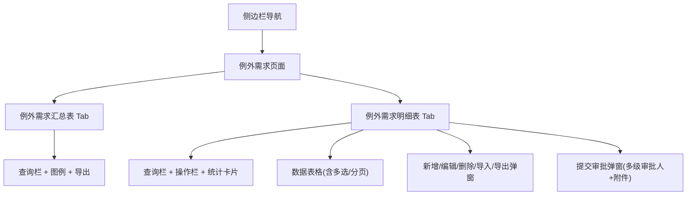
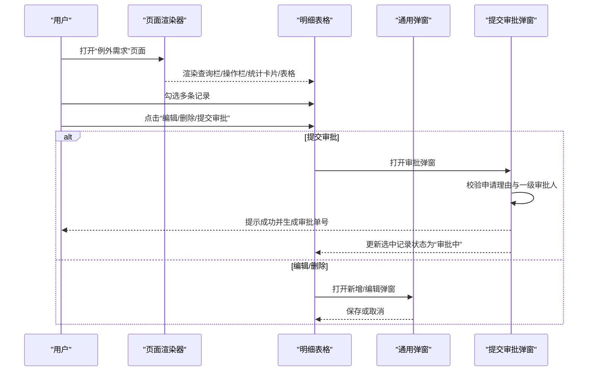
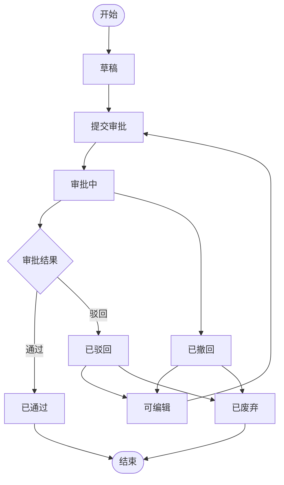
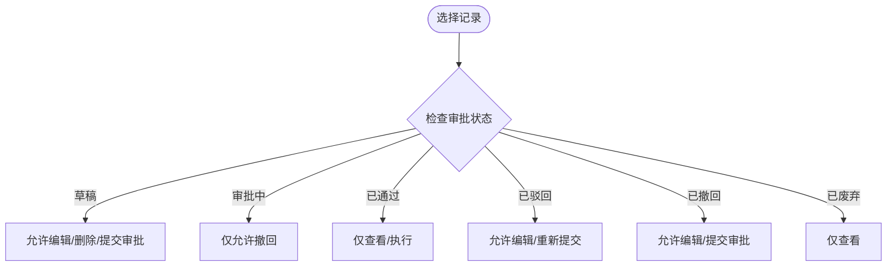
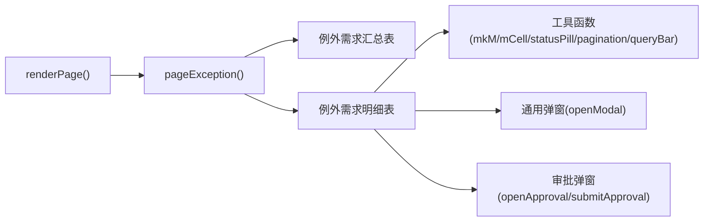

# 例外需求明细表

<cite>
**本文引用的文件**   
- [sales-forecast-prototype.html](file://sales-forecast-prototype.html)
</cite>

## 目录
1. [简介](#简介)
2. [项目结构](#项目结构)
3. [核心组件](#核心组件)
4. [架构总览](#架构总览)
5. [详细组件分析](#详细组件分析)
6. [依赖关系分析](#依赖关系分析)
7. [性能与可用性建议](#性能与可用性建议)
8. [故障排查指南](#故障排查指南)
9. [结论](#结论)
10. [附录：字段说明与使用指南](#附录字段说明与使用指南)

## 简介
本文件为“例外需求明细表”功能的高保真原型文档，面向业务与研发人员，系统化阐述该模块的数据结构、审批状态流转、批量操作能力、统计卡片展示以及字段级使用说明。该功能位于“销售预测”菜单下的“例外需求”页面，包含“例外需求汇总表”和“例外需求明细表”两个Tab，支持多条件查询、分页、新增/编辑/删除/导入导出、提交审批、撤回、废弃等完整业务流程。

## 项目结构
- 单页应用（SPA）原型，通过侧边栏切换页面，主内容区动态渲染表格、表单与弹窗。
- “例外需求”页面采用双Tab布局：
  - 例外需求汇总表：按区域/国家/产品维度聚合展示M月及后续月份的前后数量对比。
  - 例外需求明细表：以行式明细展示单据、产品、物流、客户、审批等全量字段，并提供批量操作入口。

**图表来源** 
- [sales-forecast-prototype.html:330-365](file://sales-forecast-prototype.html#L330-L365)

**章节来源**
- [sales-forecast-prototype.html:108-126](file://sales-forecast-prototype.html#L108-L126)
- [sales-forecast-prototype.html:330-365](file://sales-forecast-prototype.html#L330-L365)

## 核心组件
- 页面容器与路由：通过函数渲染不同页面，当前激活项高亮显示。
- 查询栏：支持按年份、产品线、作战区域、审批状态、单据号等多条件筛选。
- 操作栏：提供新增、提交审批、撤回、废弃、编辑、删除、导入、下载模板、导出等按钮。
- 统计卡片：展示各审批状态的记录数（草稿、审批中、已通过、已驳回、已撤回、总计）。
- 数据表格：支持多选、排序（示意）、分页、列宽自适应、横向滚动。
- 弹窗：通用弹窗用于新增/编辑；专用“提交审批”弹窗用于选择审批人与上传附件。

**章节来源**
- [sales-forecast-prototype.html:282-292](file://sales-forecast-prototype.html#L282-L292)
- [sales-forecast-prototype.html:356-365](file://sales-forecast-prototype.html#L356-L365)
- [sales-forecast-prototype.html:179-182](file://sales-forecast-prototype.html#L179-L182)
- [sales-forecast-prototype.html:184-280](file://sales-forecast-prototype.html#L184-L280)

## 架构总览
下图展示了“例外需求明细表”的交互流程与关键组件关系，包括查询、批量操作、审批提交流程。

**图表来源** 
- [sales-forecast-prototype.html:356-365](file://sales-forecast-prototype.html#L356-L365)
- [sales-forecast-prototype.html:184-280](file://sales-forecast-prototype.html#L184-L280)

## 详细组件分析

### 数据模型与字段结构（40+字段）
“例外需求明细表”每行代表一条需求明细，包含以下字段类别：
- 单据信息：单据号、行号、审批单据号
- 产品信息：需求类型、事业部、事业部编码、机型、产品编码、产品名称、选配、配置说明、需求备注
- 生效数量：生效数量(修改前)、生效数量(修改后)
- 日期信息：预计入库、要求交货、创建时间、修改时间、审批时间
- 物流信息：发运计收、订单/储备类型、起运港、目的港、运输方式、贸易术语
- 区域信息：作战区域、国家、大区、国区
- 财务信息：单价、总金额
- 客户信息：客户编码、客户名称
- 审计信息：创建人、修改人、版本号、审批状态

上述字段在明细表头中依次呈现，便于快速定位与核对。

**章节来源**
- [sales-forecast-prototype.html:356-365](file://sales-forecast-prototype.html#L356-L365)

### 审批状态管理
- 状态集合：草稿、审批中、已通过、已驳回、已撤回、已废弃
- 状态含义与约束：
  - 草稿：新建未提交，可编辑、删除、提交审批
  - 审批中：已发起审批，不可编辑/删除，等待审批结果
  - 已通过：审批完成，进入执行阶段
  - 已驳回：审批不通过，可编辑修正后重新提交
  - 已撤回：发起人主动撤回，可继续编辑
  - 已废弃：历史或无效数据归档，仅查看
- 状态流转规则（见流程图）

**图表来源** 
- [sales-forecast-prototype.html:157-161](file://sales-forecast-prototype.html#L157-L161)
- [sales-forecast-prototype.html:356-365](file://sales-forecast-prototype.html#L356-L365)

**章节来源**
- [sales-forecast-prototype.html:157-161](file://sales-forecast-prototype.html#L157-L161)
- [sales-forecast-prototype.html:356-365](file://sales-forecast-prototype.html#L356-L365)

### 批量操作与权限控制
- 批量操作：
  - 新增：打开新增弹窗，填写必填字段后保存
  - 编辑：根据状态判断是否允许编辑（草稿、已驳回、已撤回可编辑）
  - 删除：仅草稿、已废弃可删除
  - 提交审批：选择至少一个一级审批人，填写申请理由，支持上传附件（最多3个，单文件≤30MB）
  - 撤回：对审批中的单据可撤回至草稿
  - 废弃：将有效单据归档为已废弃
  - 导入/导出：支持批量导入与导出报表
- 权限控制：
  - 前端基于状态控制按钮可用性与操作可见性
  - 实际权限应在后端进行二次校验（如角色、数据范围）

**图表来源** 
- [sales-forecast-prototype.html:356-365](file://sales-forecast-prototype.html#L356-L365)

**章节来源**
- [sales-forecast-prototype.html:356-365](file://sales-forecast-prototype.html#L356-L365)
- [sales-forecast-prototype.html:184-280](file://sales-forecast-prototype.html#L184-L280)

### 统计卡片功能
- 展示维度：按审批状态统计（草稿、审批中、已通过、已驳回、已撤回、总计）
- 用途：快速掌握当前数据分布与处理进度
- 交互：点击卡片可联动筛选对应状态的明细

**章节来源**
- [sales-forecast-prototype.html:356-365](file://sales-forecast-prototype.html#L356-L365)

### 查询与分页
- 查询条件：年份、产品线、作战区域、审批状态、单据号等
- 分页：支持每页条数选择与翻页导航
- 导出：支持将当前查询结果导出为Excel

**章节来源**
- [sales-forecast-prototype.html:356-365](file://sales-forecast-prototype.html#L356-L365)

## 依赖关系分析
- 页面渲染依赖：
  - 工具函数：mkM（生成前后数量对比对象）、mCell（渲染月度单元格）、statusPill（状态标签）、sourceTag（来源标签）、pagination（分页HTML）、queryBar（查询栏HTML）
  - 弹窗组件：通用弹窗openModal/closeModal、审批弹窗openApproval/closeApproval/submitApproval
- 数据源：
  - 汇总数据数组excSummRows
  - 明细数据数组excDetailRows
- 交互逻辑：
  - switchPage/renderPage负责页面切换与渲染
  - pageException负责“例外需求”双Tab渲染与操作绑定

**图表来源** 
- [sales-forecast-prototype.html:282-292](file://sales-forecast-prototype.html#L282-L292)
- [sales-forecast-prototype.html:330-365](file://sales-forecast-prototype.html#L330-L365)
- [sales-forecast-prototype.html:179-182](file://sales-forecast-prototype.html#L179-L182)
- [sales-forecast-prototype.html:184-280](file://sales-forecast-prototype.html#L184-L280)

**章节来源**
- [sales-forecast-prototype.html:282-292](file://sales-forecast-prototype.html#L282-L292)
- [sales-forecast-prototype.html:330-365](file://sales-forecast-prototype.html#L330-L365)

## 性能与可用性建议
- 大数据量优化：
  - 虚拟滚动：当明细行数超过阈值时启用虚拟滚动，减少DOM节点数量
  - 分页加载：服务端分页+按需加载，避免一次性渲染全部数据
- 交互体验：
  - 防抖查询：输入框变更延迟触发查询，降低请求频率
  - 批量操作确认：对删除、废弃等危险操作增加二次确认
- 可访问性：
  - 键盘导航：支持Tab键在表格与按钮间移动
  - 屏幕阅读器：为状态标签与操作按钮添加ARIA描述

[本节为通用建议，不直接分析具体文件]

## 故障排查指南
- 审批弹窗无法提交：
  - 检查是否填写申请理由
  - 检查是否至少选择一个一级审批人
  - 检查附件数量与大小限制（最多3个，单文件≤30MB）
- 编辑/删除按钮不可用：
  - 检查当前记录的审批状态是否符合操作约束
- 查询无结果：
  - 检查查询条件组合是否过于严格
  - 检查是否存在空值或格式不一致（如产品线名称差异）
- 状态显示异常：
  - 检查状态枚举映射是否正确
  - 检查数据源字段命名是否与渲染函数一致

**章节来源**
- [sales-forecast-prototype.html:184-280](file://sales-forecast-prototype.html#L184-L280)
- [sales-forecast-prototype.html:356-365](file://sales-forecast-prototype.html#L356-L365)

## 结论
“例外需求明细表”作为销售预测体系中的重要环节，提供了从数据录入、审批到归档的全生命周期管理能力。其复杂数据结构覆盖单据、产品、物流、客户、审计等关键域，配合清晰的状态流转与批量操作，满足一线业务的高效协作需求。建议在工程化落地时强化后端权限校验、数据一致性保障与性能优化，以提升整体系统稳定性与用户体验。

[本节为总结性内容，不直接分析具体文件]

## 附录：字段说明与使用指南

### 字段分类与说明
- 单据信息
  - 单据号：唯一标识一条需求明细
  - 行号：同一单据下的行序号
  - 审批单据号：关联的审批单编号（若已提交审批）
- 产品信息
  - 需求类型：临时大单、紧急调拨、风险备货等
  - 事业部/事业部编码：归属组织单元
  - 机型/产品编码/产品名称：产品主数据
  - 选配/配置说明：产品配置细节
  - 需求备注：业务背景或特殊说明
- 生效数量
  - 生效数量(修改前)/生效数量(修改后)：记录数量变更对比
- 日期信息
  - 预计入库/要求交货：供应链计划关键日期
  - 创建时间/修改时间/审批时间：审计追踪
- 物流信息
  - 发运计收：海运计收、空运计收、陆运计收等
  - 订单/储备类型：订单型、储备型
  - 起运港/目的港：进出口港口
  - 运输方式：海运、空运、陆运
  - 贸易术语：CIF、FOB、DDP等
- 区域信息
  - 作战区域/国家/大区/国区：地理与组织架构维度
- 财务信息
  - 单价/总金额：价格与金额核算
- 客户信息
  - 客户编码/客户名称：客户主数据
- 审计信息
  - 创建人/修改人/版本号：版本与责任人追踪
  - 审批状态：草稿、审批中、已通过、已驳回、已撤回、已废弃

**章节来源**
- [sales-forecast-prototype.html:356-365](file://sales-forecast-prototype.html#L356-L365)

### 使用指南
- 新增：点击“新增”，填写必填字段（如作战区域、国家、预计入库日期、产品编码），保存后进入草稿状态
- 编辑：仅在草稿、已驳回、已撤回状态下可编辑，修改后需重新提交审批
- 删除：仅在草稿、已废弃状态下可删除
- 提交审批：填写申请理由，选择至少一个一级审批人，可上传附件，提交后状态变更为“审批中”
- 撤回：对“审批中”的记录可撤回至草稿
- 废弃：对有效记录可归档为“已废弃”
- 导入/导出：使用标准模板批量导入，导出当前查询结果
- 查询：按年份、产品线、作战区域、审批状态、单据号等条件筛选
- 统计卡片：关注各状态数量变化，辅助决策与跟踪

**章节来源**
- [sales-forecast-prototype.html:356-365](file://sales-forecast-prototype.html#L356-L365)
- [sales-forecast-prototype.html:184-280](file://sales-forecast-prototype.html#L184-L280)