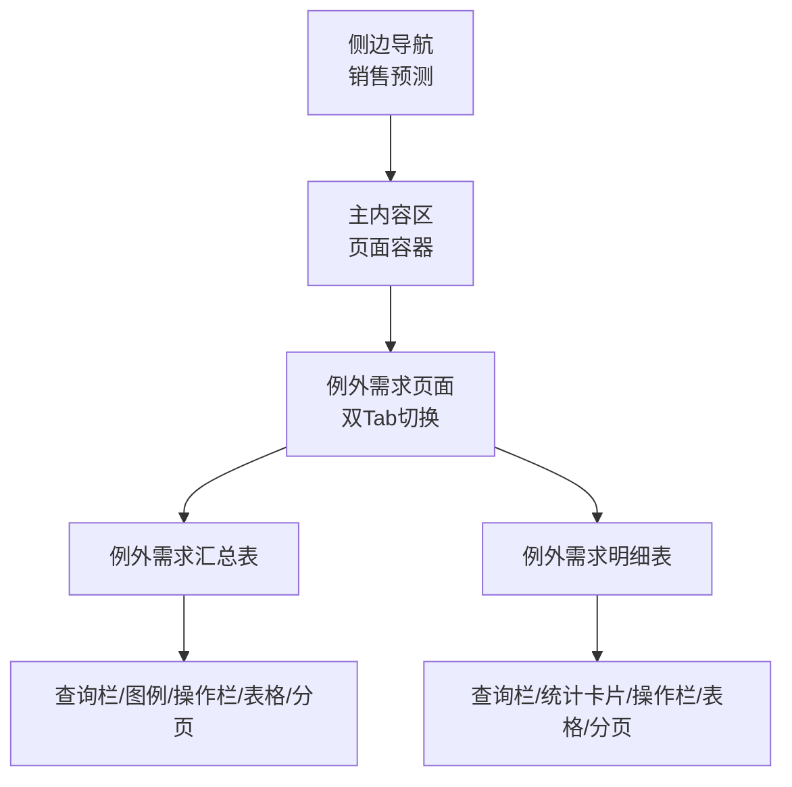
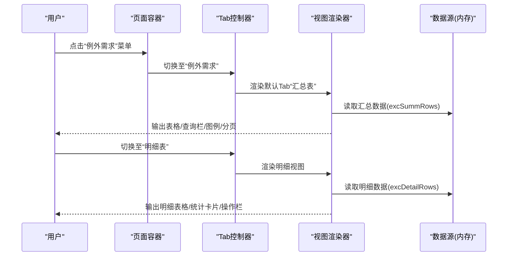
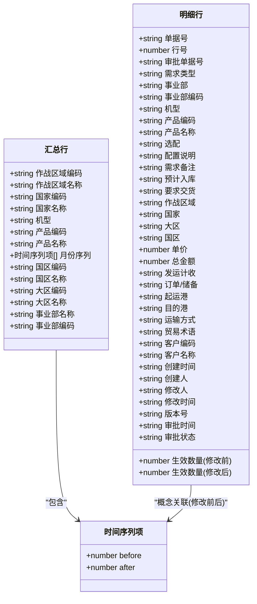
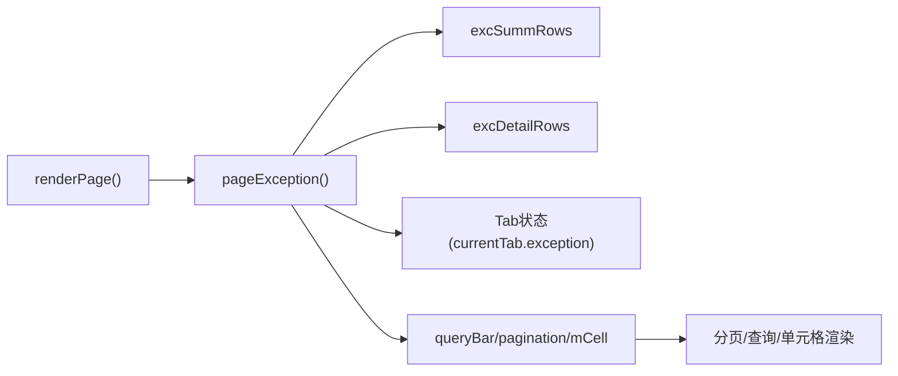
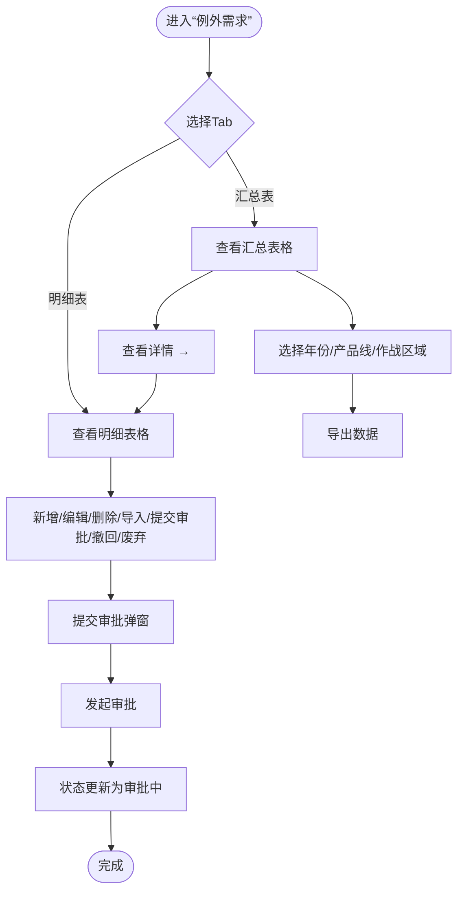

# 例外需求汇总表

<cite>
**本文档引用的文件**   
- [sales-forecast-prototype.html](file://sales-forecast-prototype.html)
- [sales-forecast-prototype_副本.html](file://sales-forecast-prototype_副本.html)
</cite>

## 目录
1. [简介](#简介)
2. [项目结构](#项目结构)
3. [核心组件](#核心组件)
4. [架构总览](#架构总览)
5. [详细组件分析](#详细组件分析)
6. [依赖关系分析](#依赖关系分析)
7. [性能考虑](#性能考虑)
8. [故障排查指南](#故障排查指南)
9. [结论](#结论)
10. [附录](#附录)

## 简介
本文件面向“例外需求汇总表”功能，系统性说明字段结构设计、时间序列展示机制（M月到M+12月）、修改前/后对比显示、层级信息组织（国区、大区、事业部等）、查询筛选逻辑、数据导出与分页实现，以及用户操作指南（查看详情跳转、编辑、审批等）。内容来源于原型页面的结构与交互定义，便于产品、设计与研发对齐实现。

## 项目结构
该功能位于“智能销售预测系统”的高保真原型中，通过单页应用方式组织多个页面模块，其中“例外需求”包含两个子Tab：
- 例外需求汇总表
- 例外需求明细表

页面采用侧边导航+主内容区布局，顶部面包屑显示当前页面名称，主体区域渲染表格、查询栏、图例、操作按钮与分页控件。

图表来源
- [sales-forecast-prototype.html:108-126](file://sales-forecast-prototype.html#L108-L126)
- [sales-forecast-prototype.html:345-365](file://sales-forecast-prototype.html#L345-L365)

章节来源
- [sales-forecast-prototype.html:108-126](file://sales-forecast-prototype.html#L108-L126)
- [sales-forecast-prototype.html:345-365](file://sales-forecast-prototype.html#L345-L365)

## 核心组件
- 时间序列标签常量：M月到M+12月的月份标签数组，用于生成表头与单元格渲染。
- 汇总行数据结构：每条汇总记录包含基础信息（作战区域编码/名称、国家编码/名称、机型、产品编码/名称）与时间序列数据（M到M+12的修改前/后值），以及层级信息（国区编码/名称、大区编码/名称、事业部名称/编码）。
- 明细行数据结构：包含单据号、行号、审批单号、需求类型、事业部、机型、产品、选配、配置说明、需求备注、生效数量（修改前/后）、预计入库、要求交货、地理维度（作战区域、国家、大区、国区）、价格金额、发运计收、订单/储备、港口、运输方式、贸易术语、客户信息、审计字段（创建/修改时间、创建人/修改人、版本号、审批时间、审批状态）等。
- 工具函数：mkM用于生成时间序列对象；mCell用于渲染带修改前后对比的单元格；statusPill用于状态徽章；sourceTag用于数据来源标签；pagination/queryBar/selectField/inputField用于通用UI组件。

章节来源
- [sales-forecast-prototype.html:142-178](file://sales-forecast-prototype.html#L142-L178)
- [sales-forecast-prototype.html:331-344](file://sales-forecast-prototype.html#L331-L344)

## 架构总览
“例外需求”页面由Tab驱动的双视图构成：
- 汇总表视图：以“作战区域+国家+机型+产品”为粒度，展示M到M+12的时间序列对比，并附带国区/大区/事业部的层级信息，支持按年份、产品线、作战区域筛选，提供导出与分页。
- 明细表视图：以“单据行”为粒度，展示完整业务字段与审批状态，支持新增、提交审批、撤回、废弃、编辑、删除、导入、下载模板等操作，并提供状态统计卡片与批量操作。

图表来源
- [sales-forecast-prototype.html:283-292](file://sales-forecast-prototype.html#L283-L292)
- [sales-forecast-prototype.html:345-365](file://sales-forecast-prototype.html#L345-L365)

## 详细组件分析

### 字段结构设计（汇总表）
- 基础信息字段
  - 作战区域编码、作战区域名称
  - 国家编码、国家名称（目的国）
  - 机型、产品编码、产品名称
- 时间序列字段
  - M月、M+1、M+2、…、M+12（共13列）
  - 每个时间列内显示“修改前”和“修改后”两行数值，差异时以删除线与高亮强调
- 层级信息字段
  - 国区编码、国区名称
  - 大区编码、大区名称
  - 事业部名称、事业部编码
- 操作字段
  - “查看详情 →”跳转到明细表或下级维度视图

章节来源
- [sales-forecast-prototype.html:349-355](file://sales-forecast-prototype.html#L349-L355)

### 时间序列数据展示机制（M月到M+12月）
- 数据模型：使用mkM将“修改前数组”与“修改后数组”映射为对象数组，每项包含before与after属性。
- 渲染逻辑：mCell根据before与after是否相等决定样式：
  - 若不相等：上方显示修改前（灰色删除线），下方显示修改后（蓝色加粗）
  - 若相等：仅显示统一颜色数值
- 可点击展开：在部分视图中（如国家维度）可对某个月份单元格点击，弹出当月明细弹窗，展示对应单据的修改前后对比。

章节来源
- [sales-forecast-prototype.html:149-156](file://sales-forecast-prototype.html#L149-L156)
- [sales-forecast-prototype.html:439-444](file://sales-forecast-prototype.html#L439-L444)

### 层级信息的组织方式
- 国区编码/名称：代表国家层面的运营单元，如“沪苏国区”“浙闽国区”等
- 大区编码/名称：代表区域层面，如“华东大区”“华南大区”“华北大区”
- 事业部编码/名称：代表业务条线，如“电子事业部”“通信事业部”
- 汇总表中，这些层级字段与基础信息并列展示，便于从作战区域向上钻取到国区、大区与事业部。

章节来源
- [sales-forecast-prototype.html:332-336](file://sales-forecast-prototype.html#L332-L336)

### 查询筛选功能
- 年份：下拉选择（如“2026年”“2025年”）
- 产品线：下拉选择（如“全部产品”“A系列”“B系列”“C系列”“D系列”）
- 作战区域：下拉选择（如“全部”“华东作战区”“苏南作战区”）
- 明细表额外筛选：
  - 审批状态：下拉选择（草稿、审批中、已通过、已驳回、已撤回、已废弃）
  - 单据号：文本输入框
- 查询栏统一封装为queryBar，内含“查询”“重置”按钮。

章节来源
- [sales-forecast-prototype.html:351-352](file://sales-forecast-prototype.html#L351-L352)
- [sales-forecast-prototype.html:359](file://sales-forecast-prototype.html#L359)
- [sales-forecast-prototype.html:170-172](file://sales-forecast-prototype.html#L170-L172)

### 数据导出功能
- 汇总表与明细表均提供“导出”按钮，用于将当前筛选结果导出为文件（通常为Excel）。
- 导出入口位于操作栏，与新增、提交审批等按钮并列。

章节来源
- [sales-forecast-prototype.html:353](file://sales-forecast-prototype.html#L353)
- [sales-forecast-prototype.html:449](file://sales-forecast-prototype.html#L449)

### 分页功能实现
- 分页组件包含：
  - 每页显示条数选择（10/20/50/100）
  - 上一页/下一页按钮
  - 当前页码与总页数提示
  - 总记录数提示
- 分页函数pagination接收总记录数，动态计算总页数并渲染控件。

章节来源
- [sales-forecast-prototype.html:167-169](file://sales-forecast-prototype.html#L167-L169)
- [sales-forecast-prototype.html:355](file://sales-forecast-prototype.html#L355)
- [sales-forecast-prototype.html:363](file://sales-forecast-prototype.html#L363)

### 用户操作指南
- 查看详情跳转
  - 汇总表行末“查看详情 →”可跳转到明细表或下级维度视图（如从大区→国区→国家→明细）
- 数据编辑
  - 明细表支持“编辑”按钮，仅在允许的状态下可用（如草稿、已驳回、已撤回）
- 新增与导入
  - 明细表支持“新增”“导入”“下载导入模版”
- 审批流程
  - 支持“提交审批”“撤回”“废弃”“删除”
  - 提交审批弹窗支持填写申请理由、选择多级审批人（一级必选，二三级可选）、上传附件（最多3个，单文件不超过30MB）
- 状态流转
  - 草稿→提交审批→审批中→已通过/已驳回/已撤回
  - 已驳回/已撤回→废弃→已废弃

章节来源
- [sales-forecast-prototype.html:354](file://sales-forecast-prototype.html#L354)
- [sales-forecast-prototype.html:360](file://sales-forecast-prototype.html#L360)
- [sales-forecast-prototype.html:185-280](file://sales-forecast-prototype.html#L185-L280)
- [sales-forecast-prototype.html:450](file://sales-forecast-prototype.html#L450)

### 类与数据模型（代码级）

图表来源
- [sales-forecast-prototype.html:331-344](file://sales-forecast-prototype.html#L331-L344)

## 依赖关系分析
- 页面渲染依赖：
  - 页面容器负责根据当前页面key调用对应渲染函数
  - Tab控制器维护currentTab状态，驱动视图切换
  - 工具函数被多处复用（mkM、mCell、pagination、queryBar等）
- 数据依赖：
  - 汇总视图依赖excSummRows
  - 明细视图依赖excDetailRows
- 交互依赖：
  - 查看详情跳转依赖Tab状态更新
  - 审批弹窗依赖approvalContext上下文

图表来源
- [sales-forecast-prototype.html:283-292](file://sales-forecast-prototype.html#L283-L292)
- [sales-forecast-prototype.html:345-365](file://sales-forecast-prototype.html#L345-L365)

章节来源
- [sales-forecast-prototype.html:283-292](file://sales-forecast-prototype.html#L283-L292)
- [sales-forecast-prototype.html:345-365](file://sales-forecast-prototype.html#L345-L365)

## 性能考虑
- 表格宽度较大（汇总表与明细表均设置min-width），建议在大数据量场景启用虚拟滚动或分页加载。
- 时间序列单元格渲染涉及字符串拼接与样式判断，建议对高频渲染进行缓存或按需渲染。
- 查询与筛选目前为前端静态过滤，后端接口应支持服务端过滤与分页以减少传输体积。
- 导出功能应避免全量导出，优先导出当前筛选结果。

[本节为通用指导，不直接分析具体文件]

## 故障排查指南
- 审批提交失败
  - 检查申请理由是否为空
  - 检查一级审批人是否至少选择一个
  - 检查附件数量是否超过限制（最多3个）与文件大小（单文件不超过30MB）
- 编辑/删除不可用
  - 检查审批状态是否允许编辑或删除（如草稿、已驳回、已撤回可编辑；草稿、已废弃可删除）
- 时间序列对比异常
  - 检查before与after是否一致，不一致时应显示删除线与高亮
- 分页显示异常
  - 检查总记录数是否正确传入pagination函数

章节来源
- [sales-forecast-prototype.html:274-280](file://sales-forecast-prototype.html#L274-L280)
- [sales-forecast-prototype.html:362](file://sales-forecast-prototype.html#L362)
- [sales-forecast-prototype.html:167-169](file://sales-forecast-prototype.html#L167-L169)

## 结论
“例外需求汇总表”通过清晰的字段结构、直观的时间序列对比、完善的层级信息与丰富的操作能力，满足复杂业务场景下的需求管理与审批流程。建议在后续实现中强化服务端过滤与分页、优化大数据渲染性能，并完善错误提示与用户体验一致性。

[本节为总结性内容，不直接分析具体文件]

## 附录

### 用户操作流程图（概览）

[此图为概念流程，不直接映射具体源码文件]