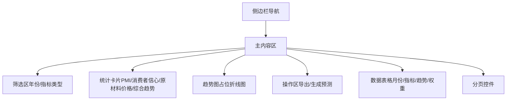
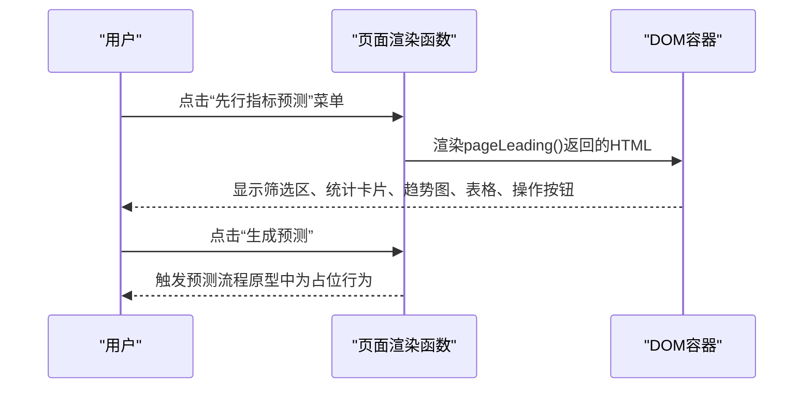
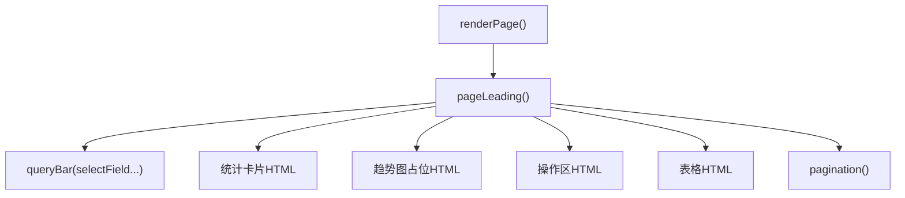

# 先行指标预测

<cite>
**本文档引用的文件**   
- [sales-forecast-prototype.html](file://sales-forecast-prototype.html)
- [sales-forecast-prototype_副本.html](file://sales-forecast-prototype_副本.html)
</cite>

## 目录
1. [简介](#简介)
2. [项目结构](#项目结构)
3. [核心组件](#核心组件)
4. [架构总览](#架构总览)
5. [详细组件分析](#详细组件分析)
6. [依赖关系分析](#依赖关系分析)
7. [性能与可用性考虑](#性能与可用性考虑)
8. [故障排查指南](#故障排查指南)
9. [结论](#结论)
10. [附录：操作指南与示例](#附录操作指南与示例)

## 简介
本文件面向“智能销售预测系统”中的“先行指标预测”模块，聚焦于PMI（采购经理指数）、消费者信心指数、原材料价格指数三类指标的监控与预测能力。文档从界面交互、数据展示、趋势分析与权重计算逻辑、预测生成流程等方面展开说明，并提供使用示例与可视化效果说明，帮助业务人员快速上手并正确解读先行指标数据以生成销售预测。

## 项目结构
该原型为单页应用，通过侧边栏菜单切换页面，当前页面由容器动态渲染。先行指标预测页面包含：
- 筛选区：年份、指标类型
- 统计卡片：PMI指数、消费者信心指数、原材料价格指数、综合预测趋势
- 趋势图占位区域：月度折线图（PMI/消费者信心/原材料价格）
- 操作区：导出、生成预测
- 数据表格：月份、PMI指数、消费者信心(×10)、原材料价格(÷10)、综合趋势、权重占比
- 分页控件

图表来源
- [sales-forecast-prototype.html:295-304](file://sales-forecast-prototype.html#L295-L304)
- [sales-forecast-prototype_副本.html:191-200](file://sales-forecast-prototype_副本.html#L191-L200)

章节来源
- [sales-forecast-prototype.html:295-304](file://sales-forecast-prototype.html#L295-L304)
- [sales-forecast-prototype_副本.html:191-200](file://sales-forecast-prototype_副本.html#L191-L200)

## 核心组件
- 筛选器
  - 年份：下拉选择（如2026年、2025年）
  - 指标类型：下拉选择（全部、PMI、消费者信心）
- 统计卡片
  - PMI指数：数值+较上月变化
  - 消费者信心指数：数值+较上月变化
  - 原材料价格指数：数值+较上月变化
  - 综合预测趋势：方向（上升/下降）+下一季度预期增长百分比
- 趋势图
  - 折线图占位，展示月度PMI、消费者信心、原材料价格三条线
- 数据表格
  - 列：月份、PMI指数、消费者信心(×10)、原材料价格(÷10)、综合趋势、权重占比
- 操作按钮
  - 导出：将当前视图数据导出
  - 生成预测：触发预测流程

章节来源
- [sales-forecast-prototype.html:295-304](file://sales-forecast-prototype.html#L295-L304)
- [sales-forecast-prototype_副本.html:191-200](file://sales-forecast-prototype_副本.html#L191-L200)

## 架构总览
先行指标预测页面的渲染由统一的路由与渲染函数驱动，页面函数负责组装HTML片段，包括筛选区、统计卡片、趋势图占位、操作区、表格与分页。

图表来源
- [sales-forecast-prototype.html:283-292](file://sales-forecast-prototype.html#L283-L292)
- [sales-forecast-prototype.html:295-304](file://sales-forecast-prototype.html#L295-L304)

章节来源
- [sales-forecast-prototype.html:283-292](file://sales-forecast-prototype.html#L283-L292)
- [sales-forecast-prototype.html:295-304](file://sales-forecast-prototype.html#L295-L304)

## 详细组件分析

### 先行指标采集与展示
- 采集方式（原型层面）
  - 数据以静态数组形式定义在页面函数中，包含月份、PMI、消费者信心、原材料价格、综合趋势与权重占比等字段。
  - 表格行由映射函数生成，趋势标签根据值动态着色（上升绿色、下降红色）。
- 展示方式
  - 统计卡片分别展示三大指标最新值及环比变化；综合趋势展示方向与下一季度预期增长。
  - 趋势图区域为占位符，预留折线图位置，用于后续接入真实图表库。
- 可交互性
  - 筛选区支持按年份与指标类型过滤（前端占位，未实现后端联动）。
  - 操作区提供“导出”“生成预测”按钮，便于后续扩展。

章节来源
- [sales-forecast-prototype.html:295-304](file://sales-forecast-prototype.html#L295-L304)
- [sales-forecast-prototype_副本.html:191-200](file://sales-forecast-prototype_副本.html#L191-L200)

### 趋势分析方法
- 趋势判定
  - 表格中“综合趋势”列以“上升/下降”标签呈现，颜色区分（上升绿色、下降红色），便于快速识别方向。
- 可视化
  - 趋势图占位提示“月度折线图”，未来可接入PMI、消费者信心、原材料价格的时序数据，形成对比趋势。
- 权重占比
  - 表格中“权重占比”列展示各指标在综合预测中的权重（例如35%、30%等），体现不同指标对预测的贡献度。

章节来源
- [sales-forecast-prototype.html:295-304](file://sales-forecast-prototype.html#L295-L304)

### 权重计算逻辑
- 权重展示
  - 表格中直接展示权重占比，便于用户理解各指标对综合预测的影响程度。
- 计算建议（概念性说明）
  - 可采用加权平均或回归模型，依据历史拟合误差与业务重要性设定权重；权重可按区域/产品线/国家维度维护（参考“计算比例维护”页面）。
  - 权重需定期校准，结合滚动窗口与回测结果优化。

章节来源
- [sales-forecast-prototype.html:295-304](file://sales-forecast-prototype.html#L295-L304)

### 预测生成流程
- 入口
  - “生成预测”按钮位于操作区，点击后触发预测流程。
- 流程步骤（概念性说明）
  - 读取筛选条件（年份、指标类型）
  - 拉取对应月份的PMI、消费者信心、原材料价格数据
  - 应用权重与趋势分析方法计算综合预测
  - 输出预测结果（可导出或进入汇总页面）
- 原型现状
  - 按钮存在但无具体实现，属于占位交互，便于后续接入后端服务或算法引擎。

章节来源
- [sales-forecast-prototype.html:295-304](file://sales-forecast-prototype.html#L295-L304)

### 界面操作指南
- 年份筛选
  - 在筛选区选择目标年份（如2026年、2025年），影响后续数据加载范围。
- 指标类型选择
  - 选择“全部”或特定指标（PMI、消费者信心），用于过滤展示或分析维度。
- 图表查看
  - 趋势图区域预留折线图位置，待接入真实数据后可直观观察指标走势。
- 数据导出
  - 点击“导出”按钮，可将当前表格与图表数据导出为常用格式（原型中为占位）。
- 生成预测
  - 点击“生成预测”按钮，触发预测流程，得到下一期销售预测结果。

章节来源
- [sales-forecast-prototype.html:295-304](file://sales-forecast-prototype.html#L295-L304)

### 使用示例：解读先行指标并生成销售预测
- 场景
  - 选择年份2026年，指标类型“全部”，查看PMI、消费者信心、原材料价格趋势。
- 步骤
  - 观察统计卡片：PMI指数上升、消费者信心指数上升、原材料价格指数上升。
  - 查看趋势图：三条线均呈上升趋势，表明宏观环境向好。
  - 查看表格：综合趋势为“上升”，权重占比合理分配。
  - 点击“生成预测”：系统输出下一季度预期增长（如8.5%），并可导出报告。
- 解读要点
  - 若PMI持续高于荣枯线（如50），通常预示经济扩张；消费者信心上升增强需求预期；原材料价格上涨可能推高成本，需关注利润空间。
  - 权重占比高的指标对预测影响更大，应重点跟踪其变动。

章节来源
- [sales-forecast-prototype.html:295-304](file://sales-forecast-prototype.html#L295-L304)

### 统计卡片与趋势图可视化效果
- 统计卡片
  - 四大卡片分别展示PMI指数、消费者信心指数、原材料价格指数、综合预测趋势，数值醒目，附带环比变化与预期增长描述。
- 趋势图
  - 折线图占位提示“月度折线图”，未来可展示三条线的走势对比，便于识别拐点与相关性。

章节来源
- [sales-forecast-prototype.html:295-304](file://sales-forecast-prototype.html#L295-L304)

## 依赖关系分析
- 页面渲染依赖
  - switchPage与renderPage负责菜单切换与页面渲染，pageLeading函数负责先行指标页面的HTML组装。
- 工具函数
  - queryBar、selectField、inputField、pagination等通用组件函数被多处复用，提升一致性。
- 样式与布局
  - 全局CSS定义了卡片、表格、按钮、分页等样式，确保界面一致性与响应式布局。

图表来源
- [sales-forecast-prototype.html:283-292](file://sales-forecast-prototype.html#L283-L292)
- [sales-forecast-prototype.html:295-304](file://sales-forecast-prototype.html#L295-L304)

章节来源
- [sales-forecast-prototype.html:283-292](file://sales-forecast-prototype.html#L283-L292)
- [sales-forecast-prototype.html:295-304](file://sales-forecast-prototype.html#L295-L304)

## 性能与可用性考虑
- 性能
  - 当前为静态数据渲染，性能开销低；未来接入真实数据时建议分页加载与缓存策略。
- 可用性
  - 筛选区与操作按钮清晰可见；统计卡片突出关键指标；趋势图占位预留扩展空间。
- 可扩展性
  - 页面函数模块化，便于替换数据源与接入图表库；权重计算与预测流程可抽象为独立服务。

## 故障排查指南
- 常见问题
  - 趋势图不显示：确认是否已接入真实图表库与数据源。
  - 筛选无效：检查前端筛选逻辑是否与后端接口对齐。
  - 生成预测无响应：确认按钮事件绑定与后端服务可用性。
- 调试建议
  - 打开浏览器控制台查看错误信息；检查网络请求与数据格式。
  - 逐步验证筛选、数据加载、渲染流程。

## 结论
先行指标预测模块通过清晰的界面与结构化数据展示，帮助用户快速把握PMI、消费者信心、原材料价格等宏观指标的趋势与权重贡献。尽管当前为原型阶段，但其模块化设计与占位交互为后续接入真实数据与算法引擎奠定了良好基础。建议优先完善趋势图可视化与预测生成流程，并结合“计算比例维护”页面优化权重配置。

## 附录：操作指南与示例
- 操作步骤
  - 选择年份与指标类型
  - 查看统计卡片与趋势图
  - 点击“生成预测”获取结果
  - 使用“导出”保存数据
- 示例解读
  - 当PMI与消费者信心同步上升且原材料价格稳定时，预测结果通常乐观；若原材料价格大幅上涨，需调整成本假设与利润预期。
- 最佳实践
  - 定期校准权重与模型参数
  - 结合历史销售预测准确率评估预测质量
  - 关注异常波动并及时复盘