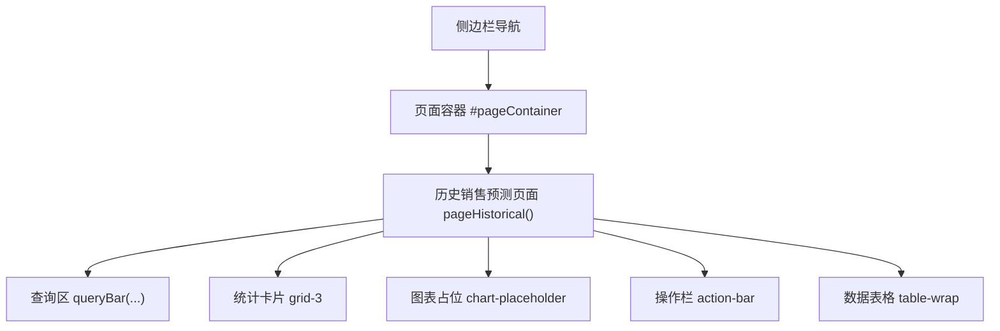
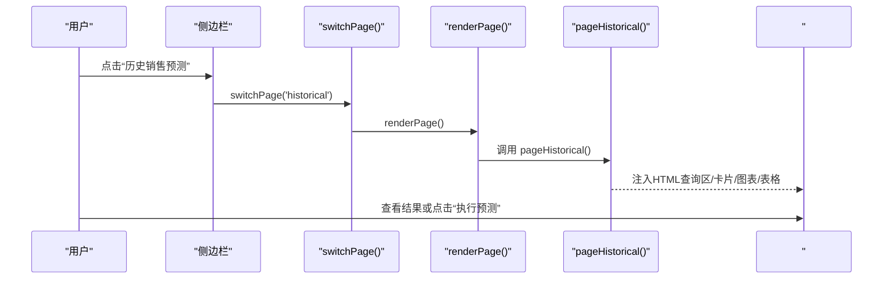
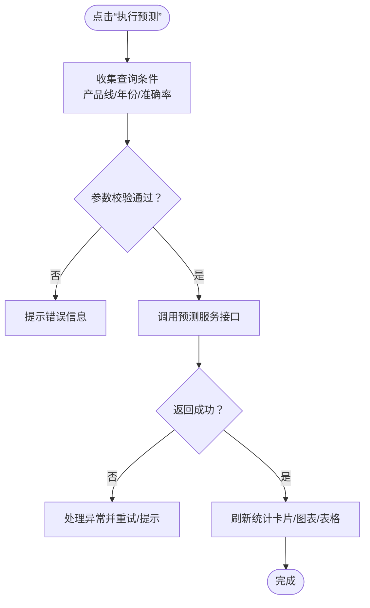
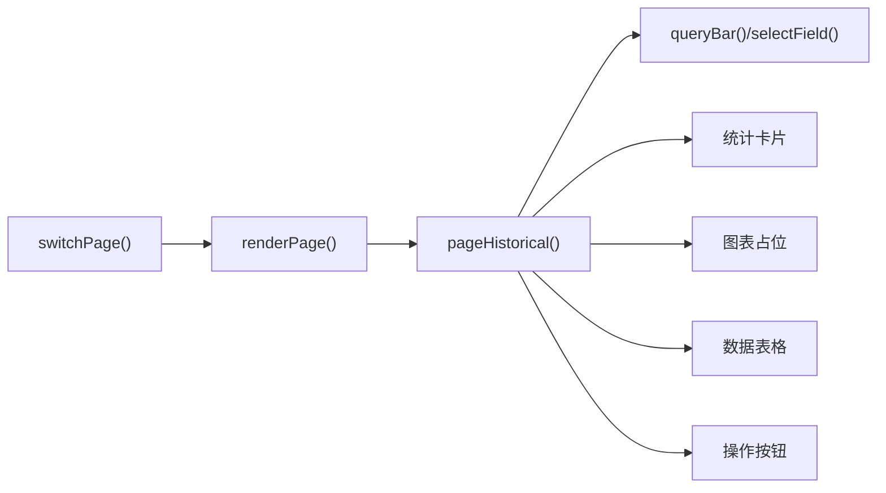

# 历史销售预测

<cite>
**本文引用的文件**   
- [sales-forecast-prototype.html](file://sales-forecast-prototype.html)
- [sales-forecast-prototype_副本.html](file://sales-forecast-prototype_副本.html)
</cite>

## 目录
1. [简介](#简介)
2. [项目结构](#项目结构)
3. [核心组件](#核心组件)
4. [架构总览](#架构总览)
5. [详细组件分析](#详细组件分析)
6. [依赖关系分析](#依赖关系分析)
7. [性能考量](#性能考量)
8. [故障排查指南](#故障排查指南)
9. [结论](#结论)
10. [附录](#附录)

## 简介
本模块聚焦“历史销售预测”功能，面向业务用户展示并分析历史实际销售额与预测销售额的对比情况，提供准确率统计、同比增长率统计以及按产品线、年份、准确率等维度的筛选能力。页面包含统计卡片（平均预测准确率、累计实际销售额、累计预测销售额）、柱状图对比区域、数据表格与“执行预测”操作入口，便于快速定位偏差、评估模型表现并驱动后续预测流程。

## 项目结构
该原型为单页应用，通过侧边栏菜单切换不同页面，当前页面内容通过函数动态渲染到主容器。历史销售预测页面由一个独立的渲染函数负责生成查询区、统计卡片、图表占位区、操作按钮与数据表格。

图示来源
- [sales-forecast-prototype.html:108-126](file://sales-forecast-prototype.html#L108-L126)
- [sales-forecast-prototype.html:289-292](file://sales-forecast-prototype.html#L289-L292)
- [sales-forecast-prototype.html:307-316](file://sales-forecast-prototype.html#L307-L316)

章节来源
- [sales-forecast-prototype.html:108-126](file://sales-forecast-prototype.html#L108-L126)
- [sales-forecast-prototype.html:289-292](file://sales-forecast-prototype.html#L289-L292)

## 核心组件
- 查询区：支持“产品线”“年份”“准确率”三个筛选条件，用于缩小数据范围。
- 统计卡片：展示“平均预测准确率”“累计实际销售额”“累计预测销售额”，用于总体概览。
- 图表对比：以柱状图形式直观对比“实际销售额 vs 预测销售额”。
- 数据表格：按月展示“3个月实际(万元)”“9个月预测(万元)”“合计(万元)”“同比增长”，用于明细核对。
- 操作按钮：“导出”“执行预测”，分别用于数据导出与触发预测流程。

章节来源
- [sales-forecast-prototype.html:307-316](file://sales-forecast-prototype.html#L307-L316)
- [sales-forecast-prototype_副本.html:203-212](file://sales-forecast-prototype_副本.html#L203-L212)

## 架构总览
历史销售预测页面的渲染与交互遵循统一的前端模板模式：
- 页面路由：switchPage(key) 更新当前页面标识并调用 renderPage()。
- 页面渲染：renderPage() 根据 currentPage 选择对应渲染函数，将 HTML 注入 #pageContainer。
- 历史页面：pageHistorical() 返回包含查询区、统计卡片、图表占位、操作栏与表格的 HTML 字符串。

图示来源
- [sales-forecast-prototype.html:283-292](file://sales-forecast-prototype.html#L283-L292)
- [sales-forecast-prototype.html:307-316](file://sales-forecast-prototype.html#L307-L316)

## 详细组件分析

### 查询区与筛选逻辑
- 产品线筛选：下拉选项包括“全部产品”“A系列”“B系列”“C系列”，用于限定产品维度。
- 年份筛选：下拉选项包括“2026年”“2025年”，用于限定时间维度。
- 准确率筛选：下拉选项包括“全部”“≥98%”“≥97%”，用于过滤准确率阈值。
- 查询行为：查询区内置“查询”和“重置”按钮，原型中未实现具体过滤逻辑，仅作为交互占位。

章节来源
- [sales-forecast-prototype.html:310](file://sales-forecast-prototype.html#L310)
- [sales-forecast-prototype_副本.html:206](file://sales-forecast-prototype_副本.html#L206)

### 统计卡片的含义与计算逻辑
- 平均预测准确率：对选定范围内各月“实际/预测”比率求均值，并以百分比展示。
- 累计实际销售额：对选定范围内各月“实际销售额”求和，单位为“万”。
- 累计预测销售额：对选定范围内各月“预测销售额”求和，单位为“万”。
- 使用方式：卡片数值随查询条件变化而刷新；在原型中为静态示例值，实际系统应基于后端数据实时计算。

章节来源
- [sales-forecast-prototype.html:311](file://sales-forecast-prototype.html#L311)
- [sales-forecast-prototype_副本.html:207](file://sales-forecast-prototype_副本.html#L207)

### 图表对比功能（柱状图）
- 目的：直观对比“实际销售额 vs 预测销售额”，帮助识别偏差月份与幅度。
- 交互：原型中以占位图显示，实际系统可接入图表库（如ECharts/AntV）渲染月度柱状图。
- 建议字段：X轴为月份，Y轴为金额（万元），双柱（实际/预测），并可叠加误差线或差异标注。

章节来源
- [sales-forecast-prototype.html:312](file://sales-forecast-prototype.html#L312)
- [sales-forecast-prototype_副本.html:208](file://sales-forecast-prototype_副本.html#L208)

### 数据表格与同比增长率
- 列说明：
  - 月份：统计周期。
  - 3个月实际(万元)：近三个月实际销售额合计。
  - 9个月预测(万元)：未来九个月预测销售额合计。
  - 合计(万元)：实际与预测的合计值（原型中显示为差值示例）。
  - 同比增长：同比增幅百分比（原型中显示为准确率示例，需区分指标）。
- 数据来源：表格数据在原型中为静态示例，实际系统应从后端接口获取并按筛选条件聚合。

章节来源
- [sales-forecast-prototype.html:314](file://sales-forecast-prototype.html#L314)
- [sales-forecast-prototype_副本.html:210](file://sales-forecast-prototype_副本.html#L210)

### “执行预测”按钮的工作流程
- 触发点：点击“执行预测”按钮。
- 前端处理：原型中未绑定具体事件，实际系统应收集当前查询条件（产品线、年份、准确率），发起后端预测请求。
- 后端处理：根据历史数据与比例维护配置进行预测计算，返回新的预测结果与准确率评估。
- 结果反馈：刷新统计卡片、图表与表格，提示执行成功或失败原因。

图示来源
- [sales-forecast-prototype.html:313](file://sales-forecast-prototype.html#L313)

章节来源
- [sales-forecast-prototype.html:313](file://sales-forecast-prototype.html#L313)

### 计算比例维护（与历史预测相关）
- 作用：维护不同区域/国家/时间段的预测权重比例（M、M1、M2~M4、M5~M6、M7~M12），影响预测结果的分布。
- 管理项：支持新增、编辑、启用/停用、查看详情等操作。
- 关联：历史销售预测在执行时可能引用这些比例配置进行加权计算。

章节来源
- [sales-forecast-prototype.html:368-382](file://sales-forecast-prototype.html#L368-L382)

## 依赖关系分析
- 页面渲染依赖：
  - switchPage() 与 renderPage() 控制页面切换与渲染。
  - pageHistorical() 依赖通用工具函数（queryBar、selectField、pagination）构建界面。
- 数据依赖：
  - 统计卡片与表格数据来源于后端接口（原型中为静态示例）。
  - 图表数据来源于同一数据源，需保证一致性。
- 外部依赖：
  - 图表库（待集成）用于渲染柱状图。
  - 可能的第三方验证或导出库用于“导出”功能。

图示来源
- [sales-forecast-prototype.html:283-292](file://sales-forecast-prototype.html#L283-L292)
- [sales-forecast-prototype.html:307-316](file://sales-forecast-prototype.html#L307-L316)

章节来源
- [sales-forecast-prototype.html:283-292](file://sales-forecast-prototype.html#L283-L292)
- [sales-forecast-prototype.html:307-316](file://sales-forecast-prototype.html#L307-L316)

## 性能考量
- 数据量优化：当筛选条件较多或数据量大时，建议采用分页与懒加载策略，减少首屏渲染压力。
- 图表渲染：大数据量下建议使用虚拟滚动或按需渲染，避免阻塞主线程。
- 接口缓存：对不频繁变化的统计数据（如累计值）进行短期缓存，降低重复请求。
- 前端计算：准确率与同比等指标尽量在后端计算，前端只做展示，避免重复计算带来的性能问题。

## 故障排查指南
- 页面空白或无数据：
  - 检查 switchPage/renderPage 是否正确调用。
  - 确认后端接口是否返回有效数据及字段映射。
- 筛选无效：
  - 检查查询区事件绑定与参数传递。
  - 确认后端是否支持相应筛选条件。
- 图表不显示：
  - 检查图表库是否加载成功。
  - 确认数据格式是否符合图表要求。
- “执行预测”无响应：
  - 检查按钮事件绑定与参数校验逻辑。
  - 查看网络请求与错误提示。

章节来源
- [sales-forecast-prototype.html:283-292](file://sales-forecast-prototype.html#L283-L292)
- [sales-forecast-prototype.html:307-316](file://sales-forecast-prototype.html#L307-L316)

## 结论
历史销售预测模块通过清晰的查询、统计、图表与表格组合，帮助用户快速理解实际与预测的差异，评估模型准确性，并驱动后续预测流程。建议在真实系统中完善数据绑定、接口交互与图表渲染，确保用户体验与数据准确性。

## 附录
- 术语说明：
  - 平均预测准确率：实际与预测比率的平均值。
  - 累计实际/预测销售额：选定范围内的总和。
  - 同比增长：与去年同期相比的增长率。
- 扩展建议：
  - 增加趋势折线图辅助观察长期走势。
  - 支持多产品线对比与钻取到明细。
  - 引入置信区间与敏感性分析。