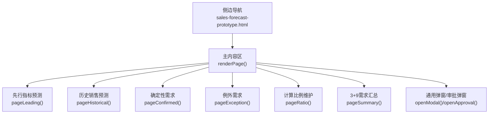
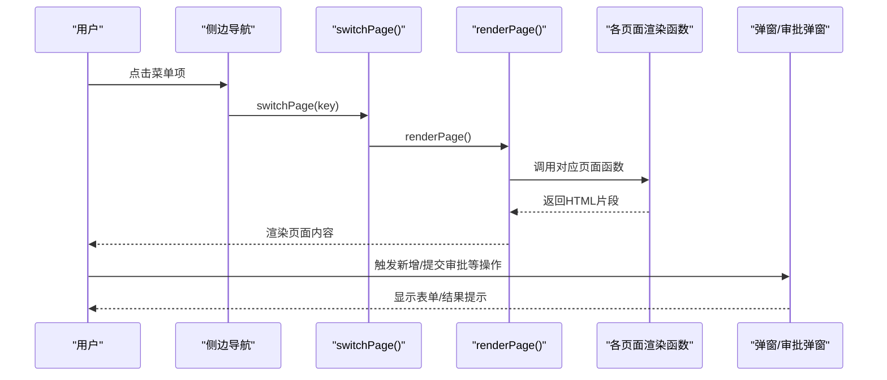
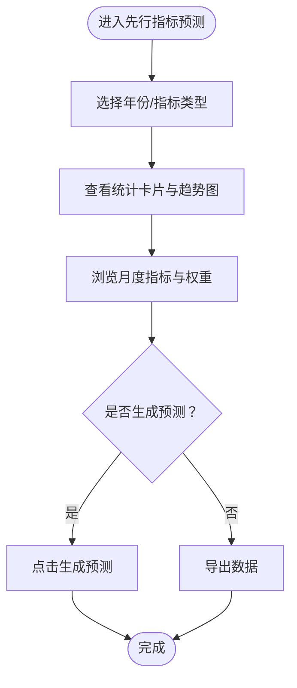
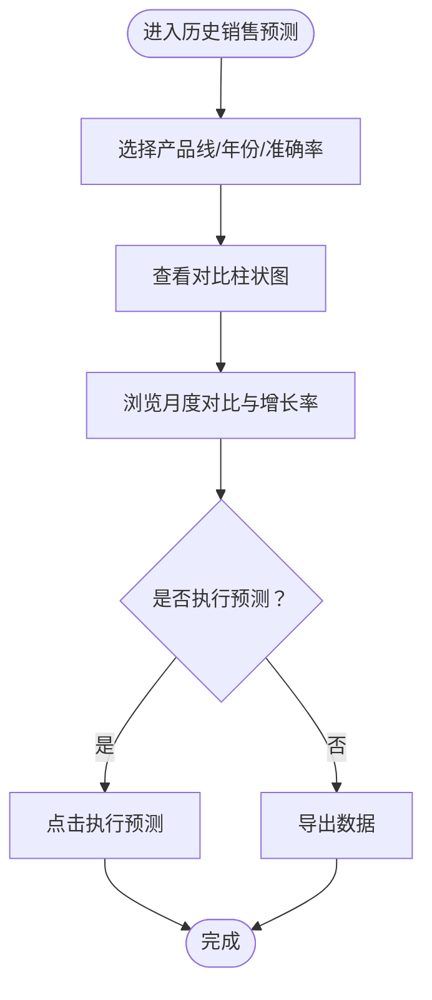
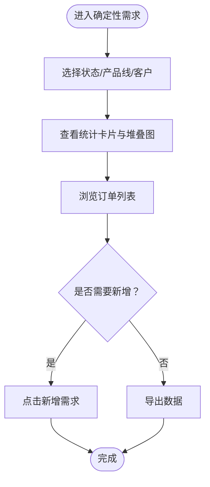
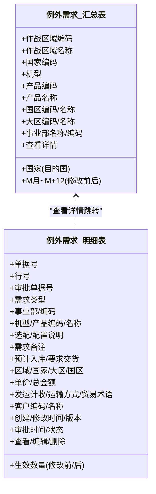
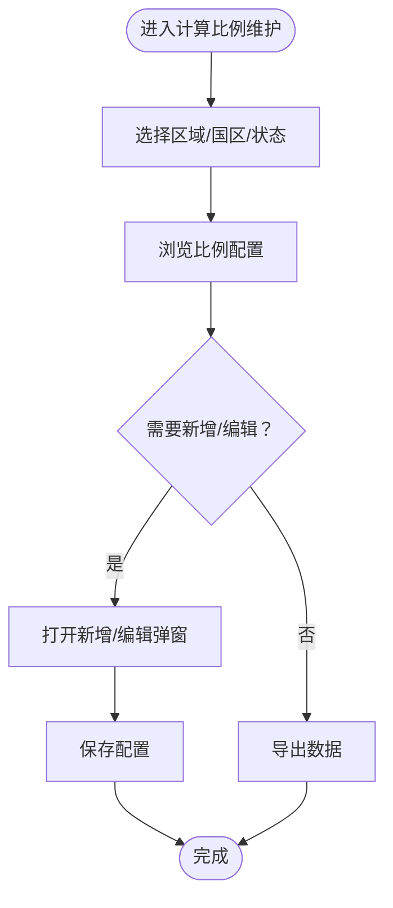
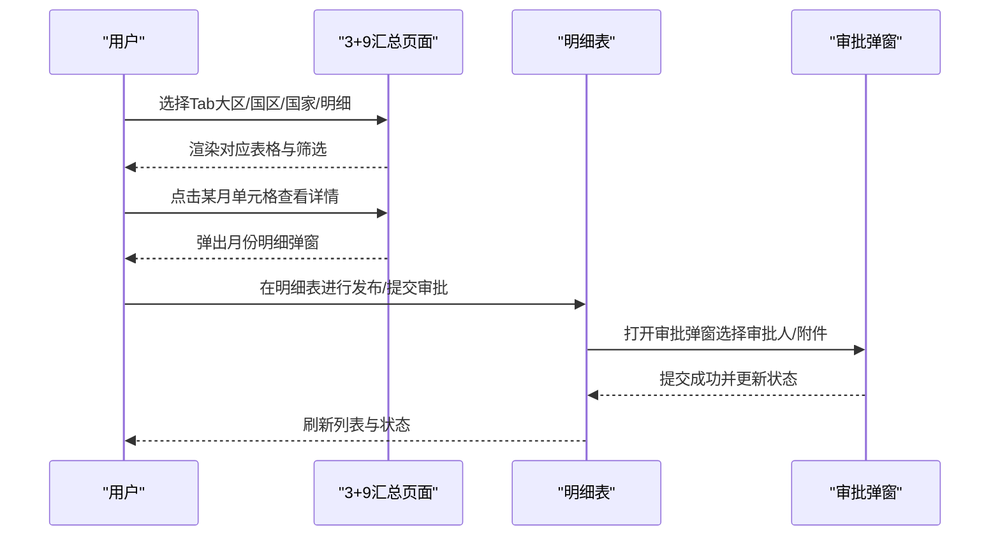
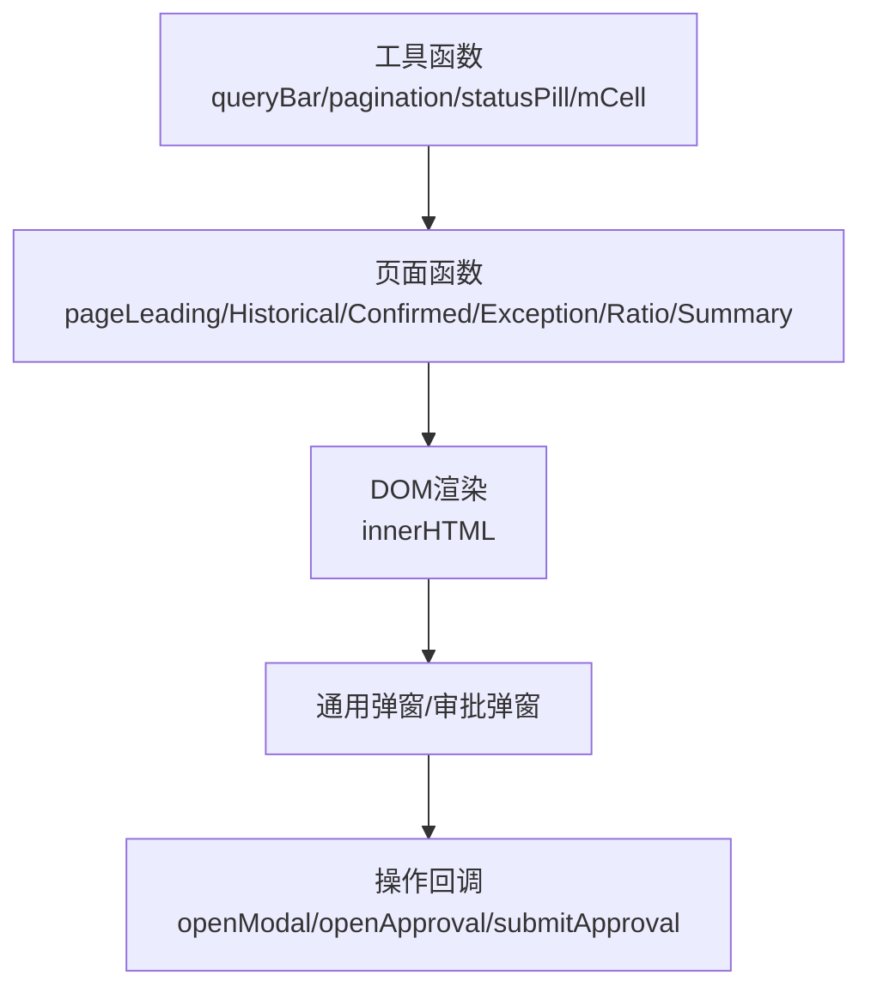

# 核心功能模块

<cite>
**本文档引用的文件**   
- [sales-forecast-prototype.html](file://sales-forecast-prototype.html)
- [sales-forecast-prototype_副本.html](file://sales-forecast-prototype_副本.html)
</cite>

## 目录
1. [简介](#简介)
2. [项目结构](#项目结构)
3. [核心组件](#核心组件)
4. [架构总览](#架构总览)
5. [详细组件分析](#详细组件分析)
6. [依赖关系分析](#依赖关系分析)
7. [性能考虑](#性能考虑)
8. [故障排查指南](#故障排查指南)
9. [结论](#结论)
10. [附录](#附录)

## 简介
本文件为“智能销售预测系统”高保真原型的功能与交互说明，聚焦六大核心功能：先行指标预测、历史销售预测、确定性需求管理、例外需求处理（双视图）、计算比例维护、3+9需求汇总与分析。每个模块均包含业务逻辑说明、界面操作指南、数据展示方式与用户体验设计要点，并提供使用示例与最佳实践建议，帮助产品、研发与运营人员快速理解并落地实现。

## 项目结构
- 单页应用结构：左侧导航菜单 + 顶部面包屑 + 右侧内容区
- 页面切换通过函数渲染对应模块的HTML片段
- 通用弹窗与审批弹窗复用同一套模态框机制
- 表格统一采用可横向滚动的容器，支持分页控件
- 查询栏提供筛选条件与快捷操作按钮

图表来源
- [sales-forecast-prototype.html:108-126](file://sales-forecast-prototype.html#L108-L126)
- [sales-forecast-prototype.html:283-292](file://sales-forecast-prototype.html#L283-L292)

章节来源
- [sales-forecast-prototype.html:108-126](file://sales-forecast-prototype.html#L108-L126)
- [sales-forecast-prototype.html:283-292](file://sales-forecast-prototype.html#L283-L292)

## 核心组件
- 导航与路由：侧边菜单项绑定页面键值，点击后更新当前页并渲染
- 查询栏：统一的筛选表单与查询/重置按钮
- 统计卡片：关键指标的概览展示（如PMI、消费者信心指数、订单数等）
- 表格与分页：宽表滚动、行内状态标签、分页控件
- 弹窗与审批：通用弹窗与带审批人选择、附件上传的审批弹窗

章节来源
- [sales-forecast-prototype.html:141-178](file://sales-forecast-prototype.html#L141-L178)
- [sales-forecast-prototype.html:179-183](file://sales-forecast-prototype.html#L179-L183)
- [sales-forecast-prototype.html:184-281](file://sales-forecast-prototype.html#L184-L281)

## 架构总览
整体采用“页面函数渲染”模式，每个功能模块一个渲染函数，返回该页面的HTML片段；工具函数负责生成查询栏、分页、状态标签、月份单元格等通用UI元素；审批流程通过独立弹窗承载。

图表来源
- [sales-forecast-prototype.html:283-292](file://sales-forecast-prototype.html#L283-L292)
- [sales-forecast-prototype.html:179-183](file://sales-forecast-prototype.html#L179-L183)
- [sales-forecast-prototype.html:184-281](file://sales-forecast-prototype.html#L184-L281)

## 详细组件分析

### 先行指标预测（PMI指数、消费者信心指数监控）
- 业务逻辑
  - 聚合PMI、消费者信心指数、原材料价格指数等宏观指标，形成综合趋势判断
  - 支持按年份与指标类型筛选，输出月度指标与权重占比
  - 提供“生成预测”入口，驱动后续预测流程
- 界面操作
  - 顶部筛选：年份、指标类型
  - 统计卡片：PMI、消费者信心、原材料价格、综合趋势
  - 趋势图占位：折线图展示多指标走势
  - 数据表格：月份、PMI、消费者信心、原材料价格、综合趋势、权重占比
  - 操作：导出、生成预测
- 数据展示
  - 指标以数值与趋势标签呈现，权重占比用于解释贡献度
- 用户体验
  - 关键指标一目了然，趋势图辅助决策；生成预测按钮突出，便于下一步操作

图表来源
- [sales-forecast-prototype.html:294-304](file://sales-forecast-prototype.html#L294-L304)

章节来源
- [sales-forecast-prototype.html:294-304](file://sales-forecast-prototype.html#L294-L304)

### 历史销售预测（预测准确率分析与趋势对比）
- 业务逻辑
  - 对比实际销售额与预测销售额，计算平均准确率与累计差异
  - 支持产品线、年份、准确率范围筛选
  - 提供执行预测入口，驱动模型或规则计算
- 界面操作
  - 筛选：产品线、年份、准确率
  - 统计卡片：平均准确率、累计实际、累计预测
  - 对比柱状图占位：实际 vs 预测
  - 数据表格：月份、3个月实际、9个月预测、合计、同比增长
  - 操作：导出、执行预测
- 数据展示
  - 以百分比与金额为主，强调准确率与差异
- 用户体验
  - 对比直观，执行预测按钮明确；支持按产品线与准确率维度快速定位问题

图表来源
- [sales-forecast-prototype.html:306-316](file://sales-forecast-prototype.html#L306-L316)

章节来源
- [sales-forecast-prototype.html:306-316](file://sales-forecast-prototype.html#L306-L316)

### 确定性需求管理（订单跟踪和状态管理）
- 业务逻辑
  - 管理已确认与待确认订单，统计数量与金额，展示月度分布
  - 支持按状态、产品线、客户名称筛选
- 界面操作
  - 筛选：状态、产品线、客户名称
  - 统计卡片：已确认订单数、待确认订单数、总需求数量、预计交付金额
  - 堆叠柱状图占位：月度分布
  - 数据表格：单据号、客户名称、产品、数量、金额、交付日期、状态
  - 操作：新增需求、导出
- 数据展示
  - 以订单为核心，状态标签区分进度
- 用户体验
  - 新增需求入口明显；状态与金额一目了然，便于跟踪与调度

图表来源
- [sales-forecast-prototype.html:318-328](file://sales-forecast-prototype.html#L318-L328)

章节来源
- [sales-forecast-prototype.html:318-328](file://sales-forecast-prototype.html#L318-L328)

### 例外需求处理（双视图模式：汇总表/明细表）
- 业务逻辑
  - 汇总表：按作战区域、国家、机型、产品编码、产品名称等多维聚合，展示M月及后续月份的修改前后对比
  - 明细表：逐条记录需求变更，含审批信息、发运与贸易条款、客户信息等
  - 支持新增、编辑、删除、导入、提交审批、撤回、废弃等操作
- 界面操作
  - Tab切换：例外需求汇总表 / 例外需求明细表
  - 筛选：年份、产品线、作战区域（汇总表）；审批状态、单据号、产品线（明细表）
  - 统计卡片：草稿、审批中、已通过、已驳回、已撤回、总计
  - 操作：新增、提交审批、撤回、废弃、编辑、删除、导入、下载模板
- 数据展示
  - 汇总表：月份单元格显示修改前/后对比，支持点击查看下钻
  - 明细表：字段丰富，状态标签清晰，操作按钮根据状态动态启用/禁用
- 用户体验
  - 双视图满足不同场景：汇总看趋势，明细查原因；审批弹窗支持多级审批人与附件上传

图表来源
- [sales-forecast-prototype.html:330-365](file://sales-forecast-prototype.html#L330-L365)

章节来源
- [sales-forecast-prototype.html:330-365](file://sales-forecast-prototype.html#L330-L365)

### 计算比例维护（历史销售预测比例配置）
- 业务逻辑
  - 维护各区域/国家在M、M1、M2~M4、M5~M6、M7~M12的比例配置，影响历史销售预测的计算
  - 支持新增、编辑、停用/启用、删除、导出
- 界面操作
  - 筛选：作战区域、国区、状态
  - 数据表格：序号、区域/国区/大区/国家、各期比例、创建时间、状态、操作
  - 操作：新增、删除、查看详情、编辑、停用/启用、导出
- 数据展示
  - 比例以百分比形式展示，状态标签区分启用/停用
- 用户体验
  - 新增弹窗集中输入比例字段；详情只读展示；启用/停用控制生效范围

图表来源
- [sales-forecast-prototype.html:367-382](file://sales-forecast-prototype.html#L367-L382)

章节来源
- [sales-forecast-prototype.html:367-382](file://sales-forecast-prototype.html#L367-L382)

### 3+9需求汇总（多维度需求汇总和分析）
- 业务逻辑
  - 四个Tab：大区维度、国区维度、国家维度、明细表
  - 汇总维度展示M月及后续月份的修改前后对比，支持下钻到更细粒度
  - 明细表整合来自确定性需求、例外需求、历史销售预测的多源数据，支持发布、提交审批、撤回、废弃、删除、导出
- 界面操作
  - Tab切换：大区/国区/国家/明细
  - 筛选：年份、产品线、作战区域
  - 操作：发布、提交审批、撤回、废弃、删除、导出
  - 状态流转：草稿→提交审批→审批中→已通过/已驳回/已撤回 | 已驳回/已撤回→废弃→已废弃
- 数据展示
  - 汇总：月份单元格显示修改前后对比，支持点击查看某月的明细
  - 明细：字段完整，状态标签与来源标签清晰，操作按钮按来源与状态控制
- 用户体验
  - 多维汇总满足从宏观到微观的分析路径；审批流程与状态流转可视化，便于协同与审计

图表来源
- [sales-forecast-prototype.html:384-453](file://sales-forecast-prototype.html#L384-L453)
- [sales-forecast-prototype.html:184-281](file://sales-forecast-prototype.html#L184-L281)

章节来源
- [sales-forecast-prototype.html:384-453](file://sales-forecast-prototype.html#L384-L453)
- [sales-forecast-prototype.html:184-281](file://sales-forecast-prototype.html#L184-L281)

## 依赖关系分析
- 页面渲染依赖：所有页面函数依赖工具函数（查询栏、分页、状态标签、月份单元格）
- 审批弹窗依赖：通用弹窗与审批弹窗共享模态框结构与事件
- 数据流：页面函数内定义静态数据，渲染时直接拼接HTML；未来可替换为API数据源

图表来源
- [sales-forecast-prototype.html:141-178](file://sales-forecast-prototype.html#L141-L178)
- [sales-forecast-prototype.html:283-292](file://sales-forecast-prototype.html#L283-L292)
- [sales-forecast-prototype.html:179-183](file://sales-forecast-prototype.html#L179-L183)
- [sales-forecast-prototype.html:184-281](file://sales-forecast-prototype.html#L184-L281)

章节来源
- [sales-forecast-prototype.html:141-178](file://sales-forecast-prototype.html#L141-L178)
- [sales-forecast-prototype.html:283-292](file://sales-forecast-prototype.html#L283-L292)
- [sales-forecast-prototype.html:179-183](file://sales-forecast-prototype.html#L179-L183)
- [sales-forecast-prototype.html:184-281](file://sales-forecast-prototype.html#L184-L281)

## 性能考虑
- 表格宽度较大：使用横向滚动容器避免布局抖动；必要时对列进行分组或虚拟化
- 频繁渲染：页面切换与Tab切换通过innerHTML重绘，建议在数据量大时引入虚拟滚动或分页加载
- 弹窗交互：审批弹窗包含多选与附件上传，注意事件绑定与内存清理
- 图表占位：实际接入图表库时需按需渲染，避免初始化开销过大

[本节为通用指导，不直接分析具体文件]

## 故障排查指南
- 页面无法切换
  - 检查菜单项onclick绑定是否正确，页面键值映射是否一致
- 表格显示异常
  - 确认mCell与statusPill等工具函数返回值格式正确
- 审批弹窗未显示
  - 检查openApproval与closeApproval调用与模态框类名切换
- 筛选无效
  - 确认queryBar生成的select/input与后端或前端过滤逻辑匹配

章节来源
- [sales-forecast-prototype.html:283-292](file://sales-forecast-prototype.html#L283-L292)
- [sales-forecast-prototype.html:179-183](file://sales-forecast-prototype.html#L179-L183)
- [sales-forecast-prototype.html:184-281](file://sales-forecast-prototype.html#L184-L281)

## 结论
本原型以清晰的模块化设计与一致的交互规范，覆盖了销售预测的核心场景。通过先行指标、历史预测、确定性需求、例外需求、比例维护与3+9汇总六大模块，形成从宏观指标到微观明细的完整闭环。建议在后续开发中引入真实数据源与图表库，完善权限与审计能力，提升性能与可维护性。

[本节为总结性内容，不直接分析具体文件]

## 附录
- 使用示例
  - 先行指标预测：选择2026年与PMI指标，查看趋势图后点击“生成预测”，进入下一流程
  - 历史销售预测：筛选A系列与≥97%准确率，查看对比柱状图后点击“执行预测”
  - 确定性需求：新增一条待确认订单，查看月度分布与金额统计
  - 例外需求：在明细表中新增临时大单，提交审批并上传附件，跟踪审批状态
  - 计算比例维护：为华东作战区新增M7~M12比例为40%的配置并启用
  - 3+9需求汇总：在大区维度查看A系列智能终端的月度变化，点击某月下钻至国家维度明细
- 最佳实践
  - 保持筛选条件与展示字段的一致性，减少认知负担
  - 对敏感操作（删除、废弃）增加二次确认
  - 审批流程需记录操作日志与版本变更
  - 大数据量表格采用分页与懒加载，优化首屏性能

[本节为补充说明，不直接分析具体文件]