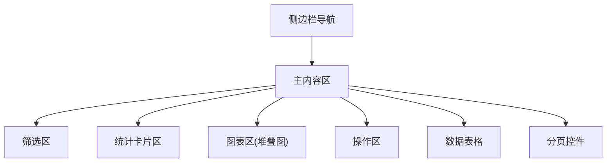
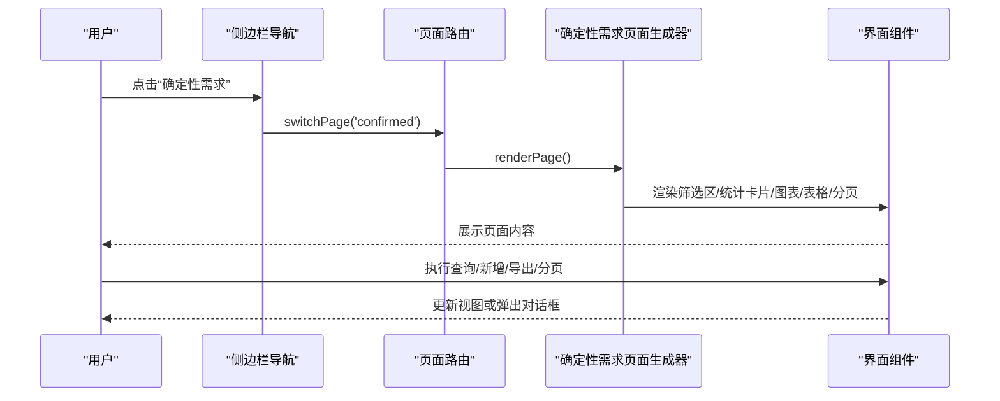
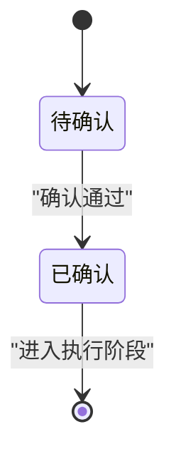
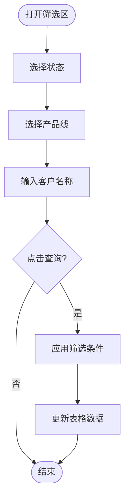
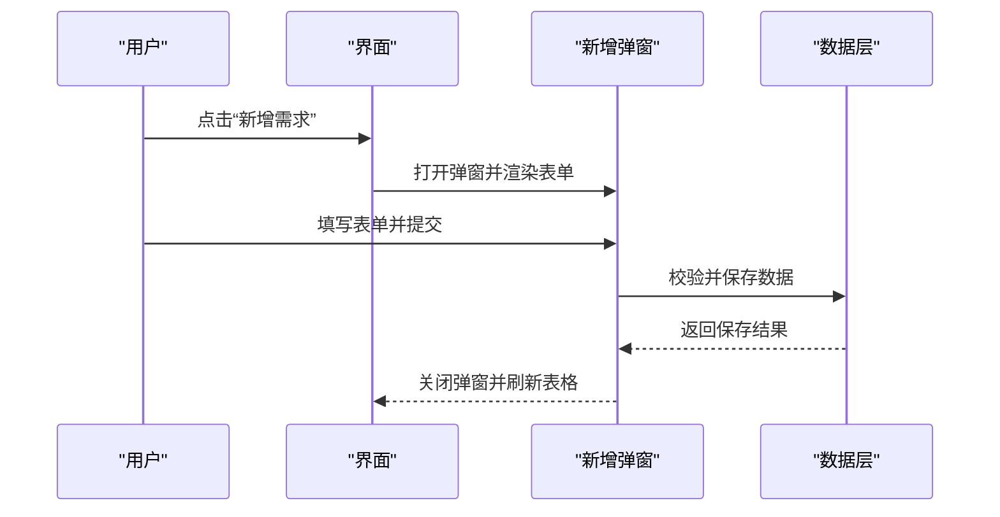
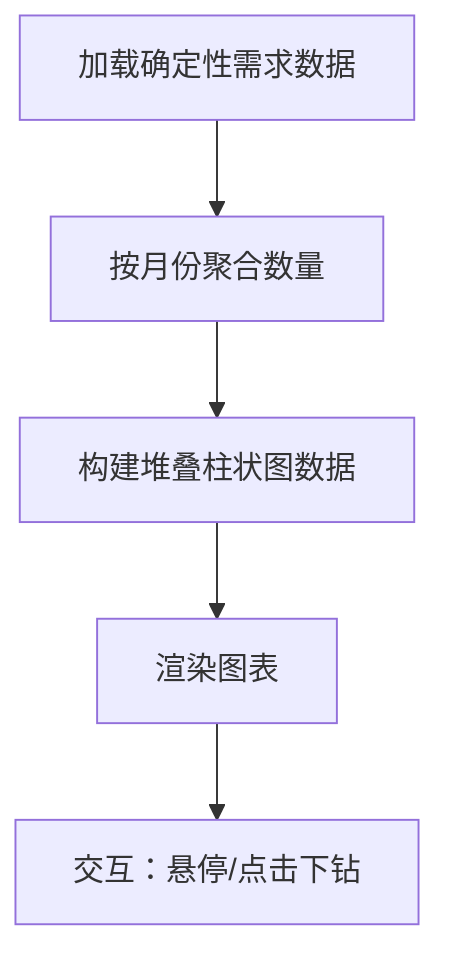
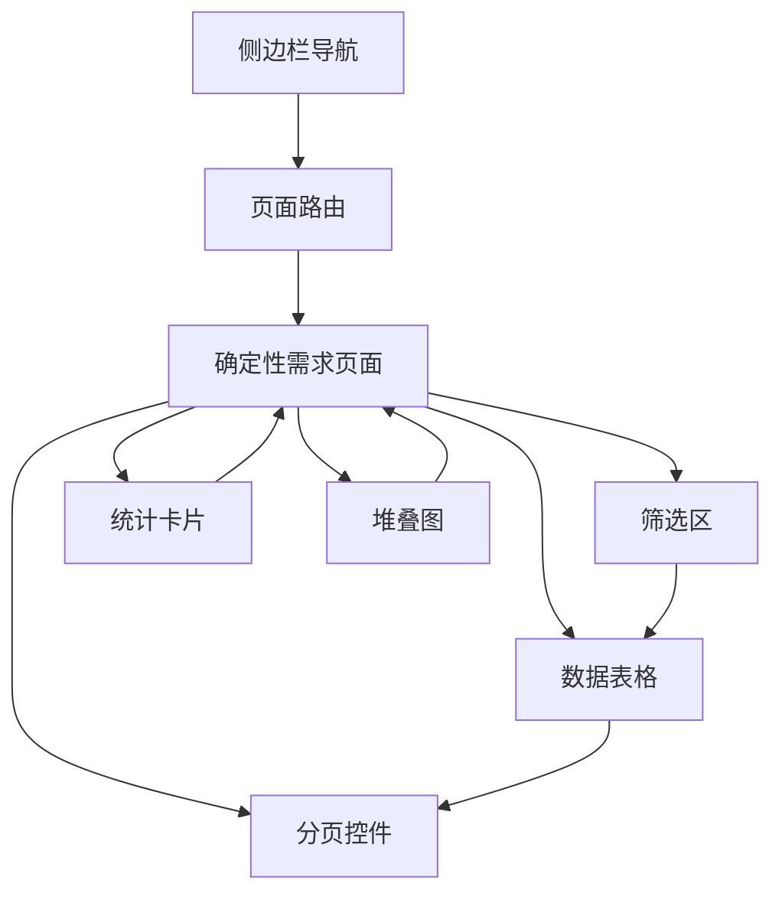

# 确定性需求管理

<cite>
**本文档引用的文件**   
- [sales-forecast-prototype.html](file://sales-forecast-prototype.html)
- [sales-forecast-prototype_副本.html](file://sales-forecast-prototype_副本.html)
</cite>

## 目录
1. [简介](#简介)
2. [项目结构](#项目结构)
3. [核心组件](#核心组件)
4. [架构总览](#架构总览)
5. [详细组件分析](#详细组件分析)
6. [依赖关系分析](#依赖关系分析)
7. [性能考量](#性能考量)
8. [故障排查指南](#故障排查指南)
9. [结论](#结论)
10. [附录](#附录)

## 简介
本文件面向“确定性需求管理”功能模块，围绕订单跟踪与状态管理机制、查询筛选、统计卡片含义、新增需求流程、月度分布堆叠图展示逻辑以及表格字段与操作按钮进行系统化说明。该模块位于“智能销售预测系统”的“确定性需求”页面中，用于集中管理已确认与待确认两类订单，并提供多维度的汇总与可视化能力，支撑后续的销售预测与交付计划制定。

## 项目结构
- 前端采用单页应用（SPA）模式，通过侧边栏菜单切换不同业务页面，当前页面容器动态渲染。
- “确定性需求”页面包含：
  - 顶部筛选区：支持按状态、产品线、客户名称快速定位数据。
  - 统计卡片区：展示已确认订单数、待确认订单数、总需求数量、预计交付金额等关键指标。
  - 图表区：展示“确定性需求月度分布”堆叠柱状图（占位）。
  - 操作区：提供“新增需求”“导出”等操作入口。
  - 数据表格：展示单据号、客户名称、产品、数量、金额、交付日期、状态等字段。
  - 分页控件：支持每页条数选择与翻页。

[无图示来源；此图为概念性结构示意]

**章节来源**
- [sales-forecast-prototype.html:108-126](file://sales-forecast-prototype.html#L108-L126)
- [sales-forecast-prototype.html:318-328](file://sales-forecast-prototype.html#L318-L328)

## 核心组件
- 筛选区组件：封装了状态下拉、产品线下拉、客户名称输入框，统一渲染为查询栏。
- 统计卡片组件：以网格布局展示四个关键指标，分别对应已确认订单数、待确认订单数、总需求数量、预计交付金额。
- 图表组件：预留堆叠柱状图区域，用于展示各月需求数量的分布情况（含修改前/后对比）。
- 表格组件：展示确定性需求明细，包含基础字段与状态标签。
- 分页组件：提供每页显示条数选择与翻页控制。
- 弹窗组件：通用模态框与审批专用模态框，用于新增需求与提交审批流程。

**章节来源**
- [sales-forecast-prototype.html:167-178](file://sales-forecast-prototype.html#L167-L178)
- [sales-forecast-prototype.html:318-328](file://sales-forecast-prototype.html#L318-L328)
- [sales-forecast-prototype.html:127-139](file://sales-forecast-prototype.html#L127-L139)

## 架构总览
确定性需求页面的渲染由统一的页面路由与渲染函数驱动，具体流程如下：
- 用户点击侧边栏“确定性需求”，触发页面切换。
- 渲染函数根据当前页面键值调用对应的页面生成器。
- 页面生成器依次构建筛选区、统计卡片、图表、操作区、表格与分页。
- 交互事件（如查询、新增、导出、分页）绑定到相应函数，更新视图或触发后续流程。

**图示来源**
- [sales-forecast-prototype.html:282-292](file://sales-forecast-prototype.html#L282-L292)
- [sales-forecast-prototype.html:318-328](file://sales-forecast-prototype.html#L318-L328)

**章节来源**
- [sales-forecast-prototype.html:282-292](file://sales-forecast-prototype.html#L282-L292)

## 详细组件分析

### 订单跟踪与状态管理机制
- 状态分类：
  - 已确认：表示订单已完成确认流程，进入可执行阶段。
  - 待确认：表示订单尚未完成确认，需进一步审核或补充信息。
- 状态展示：使用彩色标签区分状态，便于快速识别。
- 状态流转：在后续审批流程中，状态可能从“草稿→审批中→已通过/已驳回/已撤回→废弃→已废弃”。确定性需求页面主要体现“已确认/待确认”两种状态。

**图示来源**
- [sales-forecast-prototype.html:318-328](file://sales-forecast-prototype.html#L318-L328)

**章节来源**
- [sales-forecast-prototype.html:318-328](file://sales-forecast-prototype.html#L318-L328)

### 查询筛选功能
- 状态筛选：下拉选择“全部状态/已确认/待确认”，用于过滤表格数据。
- 产品线选择：下拉选择“全部产品/A系列/B系列”，按产品维度聚合或过滤。
- 客户名称搜索：文本输入框，支持模糊匹配客户名称。
- 查询与重置：提供“查询”和“重置”按钮，分别触发筛选与清空条件。

**图示来源**
- [sales-forecast-prototype.html:318-328](file://sales-forecast-prototype.html#L318-L328)

**章节来源**
- [sales-forecast-prototype.html:318-328](file://sales-forecast-prototype.html#L318-L328)

### 统计卡片的业务含义
- 已确认订单数：当前处于“已确认”状态的订单总数，反映已进入执行阶段的订单规模。
- 待确认订单数：当前处于“待确认”状态的订单总数，反映尚需处理的订单量。
- 总需求数量：所有确定性需求的合计数量（件），体现整体需求规模。
- 预计交付金额：所有确定性需求的预计交付总金额（万元），用于财务与交付计划参考。

计算方式建议：
- 已确认订单数 = 统计表中状态为“已确认”的记录数
- 待确认订单数 = 统计表中状态为“待确认”的记录数
- 总需求数量 = 所有记录的“数量”字段求和
- 预计交付金额 = 所有记录的“金额”字段求和（单位：万元）

**章节来源**
- [sales-forecast-prototype.html:318-328](file://sales-forecast-prototype.html#L318-L328)

### 新增需求的操作流程与界面交互
- 入口：点击“新增需求”按钮。
- 弹窗表单：包含必填字段（如作战区域、国家、预计入库日期、产品编码等），支持网格布局与校验提示。
- 保存：填写完成后点击“保存”，系统校验通过后插入新记录，并刷新表格。
- 取消：关闭弹窗，不保存任何更改。

**图示来源**
- [sales-forecast-prototype.html:356-365](file://sales-forecast-prototype.html#L356-L365)

**章节来源**
- [sales-forecast-prototype.html:356-365](file://sales-forecast-prototype.html#L356-L365)

### 月度分布堆叠图的展示逻辑与数据聚合
- 展示目标：按月份展示确定性需求的数量分布，支持“修改前/后”对比。
- 数据聚合：将每条记录的“数量”按月份维度聚合，形成堆叠柱状图的数据源。
- 交互细节：鼠标悬停显示具体数值，点击可下钻查看明细。
- 占位实现：当前为占位图，实际开发时需接入图表库（如ECharts）并绑定数据。

**图示来源**
- [sales-forecast-prototype.html:318-328](file://sales-forecast-prototype.html#L318-L328)

**章节来源**
- [sales-forecast-prototype.html:318-328](file://sales-forecast-prototype.html#L318-L328)

### 表格字段与操作按钮说明
- 字段含义：
  - 单据号：唯一标识一条确定性需求记录。
  - 客户名称：需求所属客户。
  - 产品：需求对应的产品型号。
  - 数量：需求数量（件）。
  - 金额：需求金额（万元）。
  - 交付日期：预计交付时间。
  - 状态：当前订单状态（已确认/待确认）。
- 操作按钮：
  - 查看：查看单据详情。
  - 编辑：编辑单据信息（受状态限制）。
  - 删除：删除单据（受状态限制）。
  - 提交审批：发起审批流程（适用于特定状态）。
  - 撤回/废弃：对审批中的单据进行操作。

权限控制建议：
- 编辑：仅允许“草稿/已驳回/已撤回”状态编辑。
- 删除：仅允许“草稿/已废弃”状态删除。
- 提交审批：仅允许“草稿”状态提交。

**章节来源**
- [sales-forecast-prototype.html:318-328](file://sales-forecast-prototype.html#L318-L328)

## 依赖关系分析
- 页面渲染依赖：
  - 侧边栏导航与页面路由：负责页面切换与标题更新。
  - 工具函数：提供查询栏、分页、状态标签等通用组件渲染。
  - 数据模型：确定性需求列表数据与统计卡片数据。
- 交互依赖：
  - 筛选区与表格：筛选条件变化触发表格数据更新。
  - 新增弹窗与数据层：表单提交后插入新记录并刷新表格。
  - 图表与数据层：图表数据来源于确定性需求数据的月度聚合。

**图示来源**
- [sales-forecast-prototype.html:282-292](file://sales-forecast-prototype.html#L282-L292)
- [sales-forecast-prototype.html:318-328](file://sales-forecast-prototype.html#L318-L328)

**章节来源**
- [sales-forecast-prototype.html:282-292](file://sales-forecast-prototype.html#L282-L292)
- [sales-forecast-prototype.html:318-328](file://sales-forecast-prototype.html#L318-L328)

## 性能考量
- 数据量优化：当确定性需求数据量较大时，建议后端分页与懒加载结合，减少首屏渲染压力。
- 图表性能：堆叠图数据聚合应在后端完成，前端仅负责渲染，避免大规模计算。
- 交互响应：筛选与查询应防抖处理，避免频繁请求。
- 内存管理：弹窗与图表组件销毁时应释放事件监听与缓存数据。

[本节为通用指导，无需代码来源]

## 故障排查指南
- 常见问题：
  - 筛选无效：检查筛选条件是否正确传递至数据层，确认字段映射无误。
  - 图表不显示：确认数据格式是否符合图表库要求，检查占位符是否替换为真实图表。
  - 新增失败：检查表单校验规则与必填字段，确认后端接口返回状态。
  - 状态按钮不可用：核对当前状态是否满足操作权限。
- 调试建议：
  - 使用浏览器开发者工具查看网络请求与错误日志。
  - 在关键函数中添加日志输出，追踪数据流与状态变化。
  - 模拟异常数据（如空值、非法字符）验证健壮性。

**章节来源**
- [sales-forecast-prototype.html:179-182](file://sales-forecast-prototype.html#L179-L182)
- [sales-forecast-prototype.html:274-280](file://sales-forecast-prototype.html#L274-L280)

## 结论
确定性需求管理模块通过清晰的订单状态分类、灵活的筛选机制、直观的统计卡片与图表展示，为销售预测与交付计划提供了可靠的数据基础。新增需求流程简洁易用，表格字段与操作按钮设计贴合业务场景。建议在后续开发中完善图表实现、增强权限控制与性能优化，以提升用户体验与系统稳定性。

[本节为总结性内容，无需代码来源]

## 附录
- 术语表：
  - 确定性需求：指已明确来源与数量的订单需求，区别于预测与例外需求。
  - 堆叠图：一种柱状图变体，用于展示多类别数据的叠加分布。
  - 审批流：指订单从草稿到最终状态的完整审批过程。
- 参考文件：
  - 先行指标预测页面：用于对比其他模块的交互与数据结构。
  - 历史销售预测页面：提供预测准确率与销售额对比的参考。
  - 例外需求页面：展示复杂审批状态与多维度汇总。

[本节为补充信息，无需代码来源]