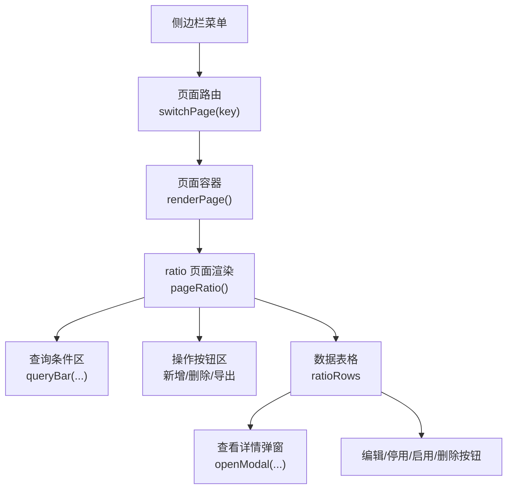
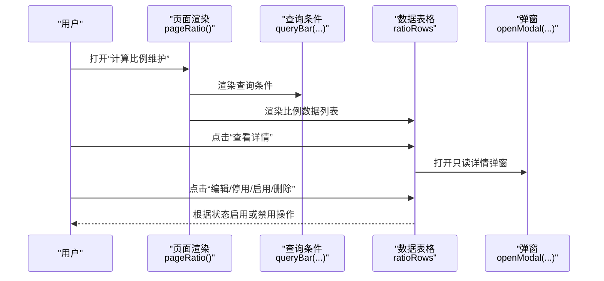
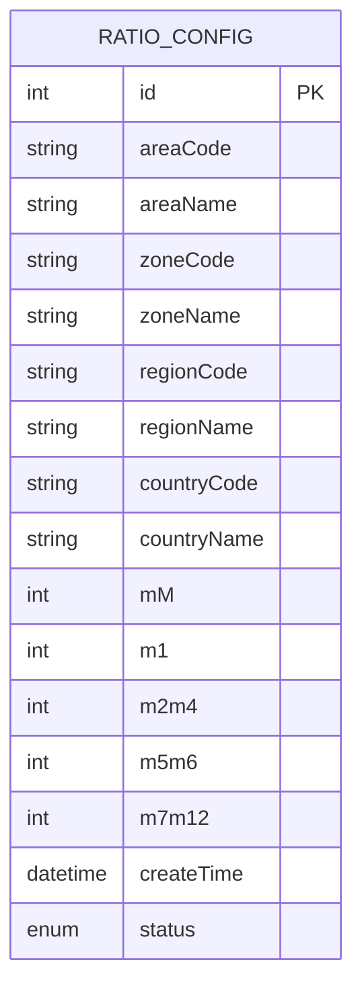
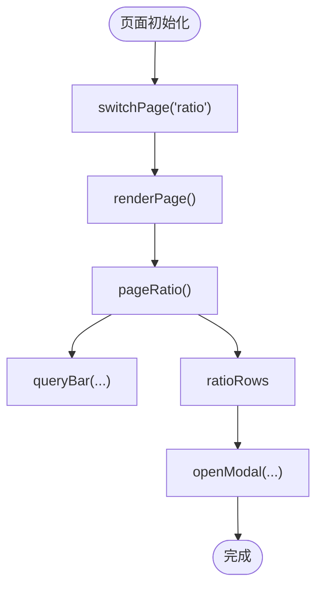

# 计算比例维护

<cite>
**本文引用的文件**   
- [sales-forecast-prototype.html](file://sales-forecast-prototype.html)
</cite>

## 目录
1. [简介](#简介)
2. [项目结构](#项目结构)
3. [核心组件](#核心组件)
4. [架构总览](#架构总览)
5. [详细组件分析](#详细组件分析)
6. [依赖关系分析](#依赖关系分析)
7. [性能考量](#性能考量)
8. [故障排查指南](#故障排查指南)
9. [结论](#结论)
10. [附录](#附录)

## 简介
本模块为“历史销售预测计算比例维护”功能，用于按组织层级（作战区域→国区→大区→国家）配置不同时间段的预测比例，支撑后续“3+9”需求汇总与预测计算。比例维度包含 M月、M1、M2~M4、M5~M6、M7~M12 五个时间段，支持新增、查看、编辑、停用/启用、删除、导出与多维度筛选。

## 项目结构
该原型采用单页应用结构，通过侧边栏菜单切换页面，当前页面由渲染函数动态生成。计算比例维护对应“ratio”页面，由统一的页面路由与渲染机制驱动。

图表来源
- [sales-forecast-prototype.html:283-292](file://sales-forecast-prototype.html#L283-L292)
- [sales-forecast-prototype.html:375-382](file://sales-forecast-prototype.html#L375-L382)

章节来源
- [sales-forecast-prototype.html:108-126](file://sales-forecast-prototype.html#L108-L126)
- [sales-forecast-prototype.html:283-292](file://sales-forecast-prototype.html#L283-L292)

## 核心组件
- 比例数据模型：每条记录包含组织层级编码与名称（作战区域、国区、大区、国家）、五段比例字段（mM、m1、m2m4、m5m6、m7m12）、创建时间与状态。
- 列表与筛选：提供按作战区域、国区、状态的筛选；支持分页与导出。
- 表单与校验：新增弹窗包含必填项标记与数值范围提示。
- 详情视图：只读弹窗展示各字段的格式化显示（百分比）。
- 权限控制：仅停用的记录允许编辑与删除；启用状态不可编辑/删除。
- 版本管理：比例记录含创建时间，便于版本追溯；业务上建议结合版本号字段进行变更追踪（详见附录）。

章节来源
- [sales-forecast-prototype.html:368-374](file://sales-forecast-prototype.html#L368-L374)
- [sales-forecast-prototype.html:375-382](file://sales-forecast-prototype.html#L375-L382)

## 架构总览
计算比例维护页面的交互流程如下：用户进入页面后，系统渲染查询区与操作区，加载比例数据表；用户可执行新增、查看、编辑、停用/启用、删除、导出等操作。查看详情以弹窗形式呈现只读信息。

图表来源
- [sales-forecast-prototype.html:375-382](file://sales-forecast-prototype.html#L375-L382)

## 详细组件分析

### 比例数据模型与层级结构
- 组织层级：从作战区域到国区、大区、国家的四级架构，每条记录均包含对应的编码与名称字段，确保比例配置精准定位到具体组织单元。
- 比例字段：M、M1、M2~M4、M5~M6、M7~M12，分别代表不同时间段的预测权重分配。
- 元数据：创建时间、状态（启用/停用），用于版本与生命周期管理。

图表来源
- [sales-forecast-prototype.html:368-374](file://sales-forecast-prototype.html#L368-L374)

章节来源
- [sales-forecast-prototype.html:368-374](file://sales-forecast-prototype.html#L368-L374)

### 比例分配原则（业务逻辑）
- 时间段划分：
  - M月：当月预测比例
  - M1：下月预测比例
  - M2~M4：第2至第4月合并比例
  - M5~M6：第5至第6月合并比例
  - M7~M12：第7至第12月合并比例
- 分配原则：
  - 各时间段比例之和应等于100%，保证预测总量一致。
  - 近月（M、M1）通常占比更高，体现短期确定性；远月（M7~M12）占比随不确定性增加而调整。
  - 不同组织层级可按实际业务策略差异化配置，如华东作战区与华南作战区的季节性差异。
- 验证规则：
  - 前端需校验每个比例在0~100之间。
  - 保存前校验总和是否为100%。
  - 若不符合规则，阻止提交并提示修正。

章节来源
- [sales-forecast-prototype.html:375-382](file://sales-forecast-prototype.html#L375-L382)

### 新增比例配置的表单与校验
- 表单字段：
  - 作战区域（必填）
  - 大区（可选）
  - 国区（可选）
  - 国家（可选）
  - M、M1、M2~M4、M5~M6、M7~M12（均为必填，数值范围0~100）
- 校验规则：
  - 必填项为空时禁止保存。
  - 数值输入需在0~100范围内。
  - 五段比例之和必须等于100%，否则提示错误。
- 交互说明：
  - 新增弹窗内包含保存与取消按钮。
  - 保存成功后返回列表并刷新。

章节来源
- [sales-forecast-prototype.html:375-382](file://sales-forecast-prototype.html#L375-L382)

### 查看详情界面（只读模式）
- 展示内容：
  - 组织层级信息：作战区域、国区、大区、国家。
  - 比例字段：M、M1、M2~M4、M5~M6、M7~M12，均以百分比格式显示。
- 交互特性：
  - 弹窗标题为“查看详情”。
  - 所有字段为只读，不可编辑。
  - 关闭按钮返回主列表。

章节来源
- [sales-forecast-prototype.html:375-382](file://sales-forecast-prototype.html#L375-L382)

### 编辑与删除的权限控制
- 权限规则：
  - 仅当记录状态为“停用”时，才允许编辑与删除。
  - 当记录状态为“启用”时，编辑与删除按钮被禁用。
- 操作流程：
  - 用户点击“编辑”或“删除”，系统检查状态后决定是否允许操作。
  - 编辑成功后，可再次停用或启用。
  - 删除后列表即时更新。

章节来源
- [sales-forecast-prototype.html:375-382](file://sales-forecast-prototype.html#L375-L382)

### 查询与筛选功能
- 筛选维度：
  - 作战区域：支持全部与具体作战区域选择。
  - 国区：支持全部与具体国区选择。
  - 状态：支持全部、启用、停用。
- 交互行为：
  - 点击“查询”按钮触发筛选。
  - 点击“重置”按钮恢复默认条件。
  - 结果支持分页与导出。

章节来源
- [sales-forecast-prototype.html:375-382](file://sales-forecast-prototype.html#L375-L382)

### 启用/停用机制与版本管理
- 启用/停用：
  - 每条记录具有“启用”或“停用”状态。
  - 启用状态下比例生效，参与预测计算。
  - 停用状态下比例不生效，但保留历史记录。
- 版本管理：
  - 记录包含创建时间，可用于版本追溯。
  - 建议在业务层引入版本号字段，记录每次修改的版本号，便于审计与回滚。

章节来源
- [sales-forecast-prototype.html:368-374](file://sales-forecast-prototype.html#L368-L374)
- [sales-forecast-prototype.html:375-382](file://sales-forecast-prototype.html#L375-L382)

## 依赖关系分析
- 页面渲染依赖：
  - switchPage：根据菜单键值切换页面。
  - renderPage：根据当前页面调用对应渲染函数。
  - pageRatio：负责比例维护页面的渲染与交互。
- 数据依赖：
  - ratioRows：静态示例数据，包含组织层级与比例字段。
- 工具函数：
  - queryBar：生成查询条件区。
  - openModal：打开弹窗。
  - pagination：生成分页控件。

图表来源
- [sales-forecast-prototype.html:283-292](file://sales-forecast-prototype.html#L283-L292)
- [sales-forecast-prototype.html:375-382](file://sales-forecast-prototype.html#L375-L382)

章节来源
- [sales-forecast-prototype.html:283-292](file://sales-forecast-prototype.html#L283-L292)
- [sales-forecast-prototype.html:375-382](file://sales-forecast-prototype.html#L375-L382)

## 性能考量
- 数据量优化：当比例记录较多时，建议后端分页与按需加载，减少前端渲染压力。
- 校验性能：前端校验应在输入时实时反馈，避免批量提交时的集中校验开销。
- 导出性能：大数据量导出建议使用服务端生成文件，避免前端内存占用过高。

[本节为通用指导，无需引用具体文件]

## 故障排查指南
- 常见问题：
  - 比例总和不为100%：检查新增或编辑时的校验逻辑，确保五段比例之和为100%。
  - 编辑/删除按钮不可用：确认记录状态是否为“停用”，启用状态下按钮会被禁用。
  - 筛选无效：检查查询条件是否正确传递，确认后端或前端过滤逻辑是否生效。
- 调试建议：
  - 使用浏览器开发者工具检查网络请求与数据绑定。
  - 在关键函数处添加日志输出，跟踪数据流转。

[本节为通用指导，无需引用具体文件]

## 结论
计算比例维护模块通过清晰的层级结构与时间段划分，为历史销售预测提供了灵活的比例配置能力。结合严格的表单校验、权限控制与筛选功能，确保了数据的准确性与操作的规范性。建议在生产环境中完善版本管理与性能优化，以提升用户体验与系统稳定性。

[本节为总结性内容，无需引用具体文件]

## 附录
- 字段定义表：
  - 序号：自增编号
  - 作战区域编码/名称：组织层级之一
  - 国区编码/名称：组织层级之二
  - 大区编码/名称：组织层级之三
  - 国家编码/名称：组织层级之四
  - M/M1/M2~M4/M5~M6/M7~M12：比例字段，单位百分比
  - 创建时间：记录创建时间戳
  - 状态：启用/停用
- 业务流程图：
  - 新增 → 校验 → 保存 → 列表刷新
  - 查看详情 → 只读展示
  - 编辑/删除 → 状态检查 → 执行操作
  - 启用/停用 → 状态切换

[本节为补充信息，无需引用具体文件]