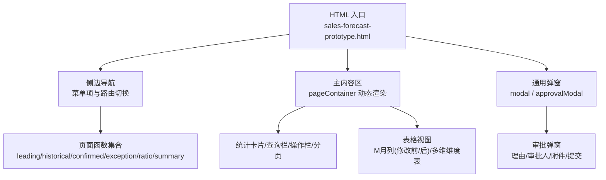
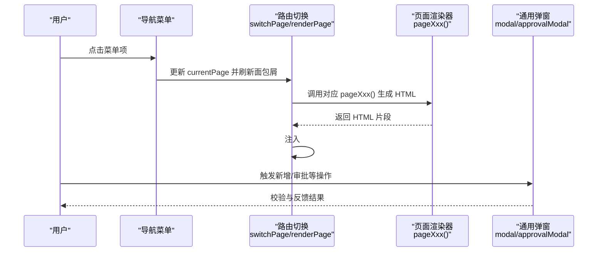
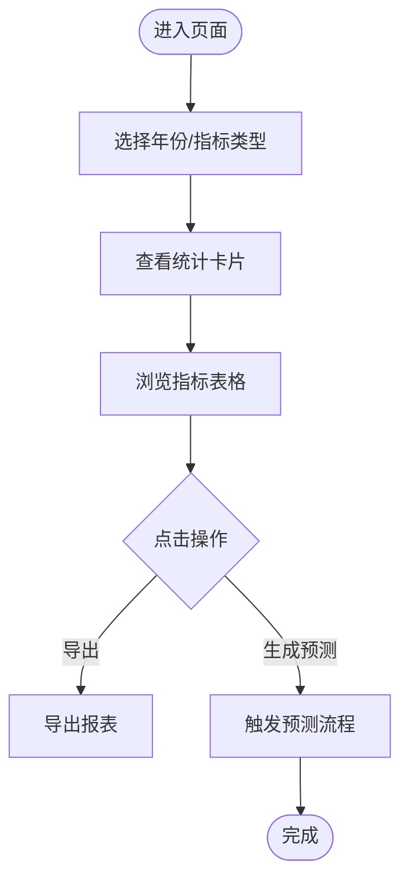
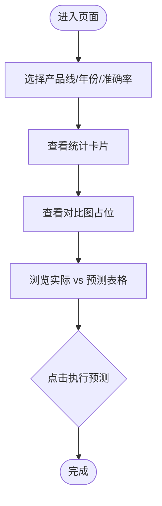
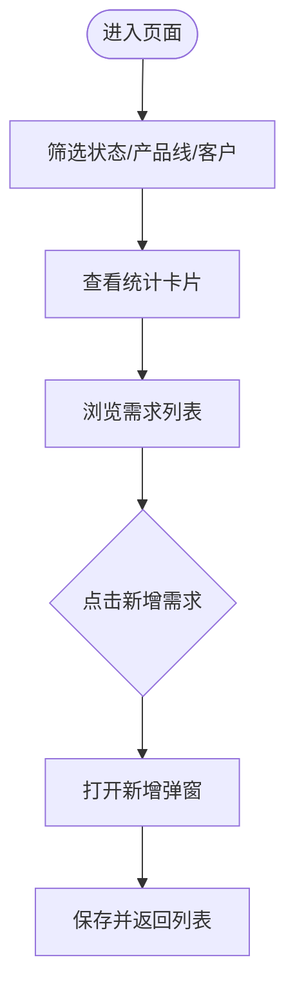
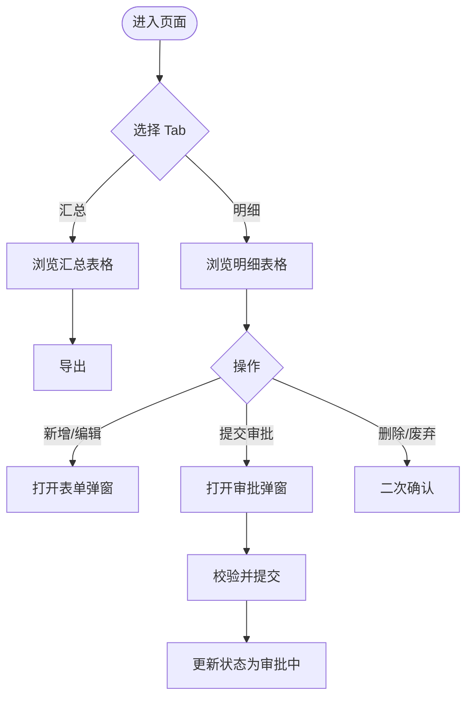
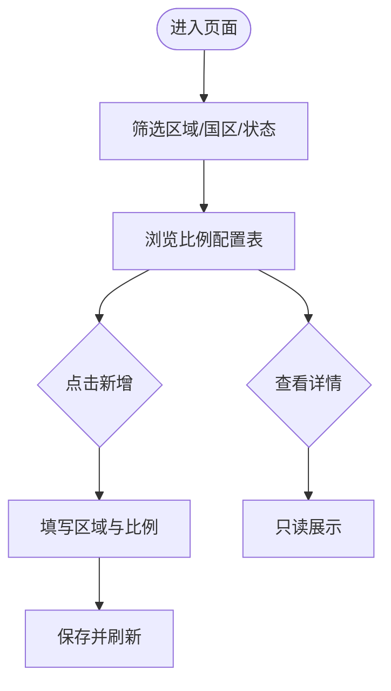
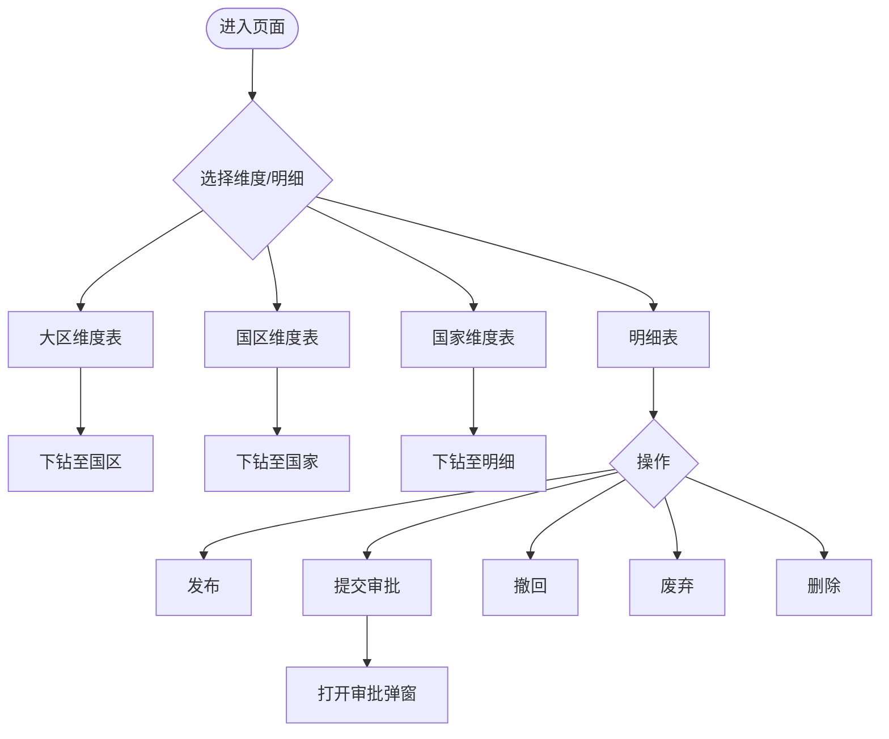
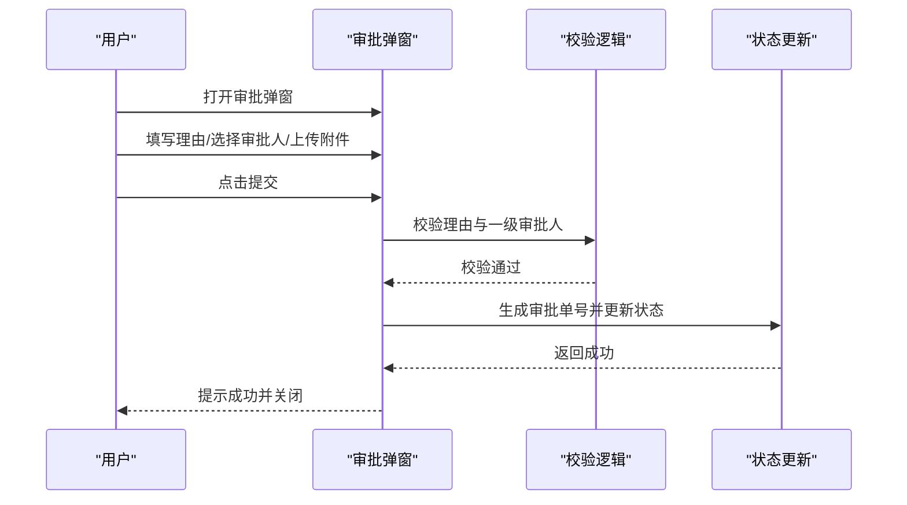
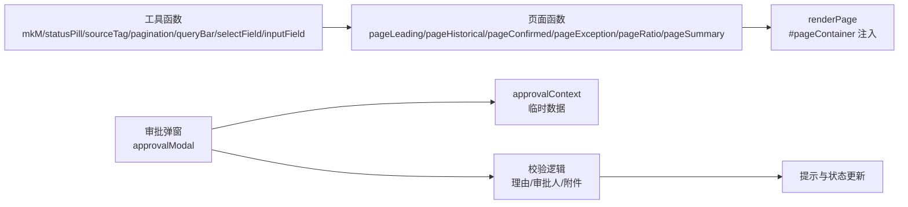

# 项目概述

<cite>
**本文档引用的文件**   
- [sales-forecast-prototype.html](file://sales-forecast-prototype.html)
- [sales-forecast-prototype_副本.html](file://sales-forecast-prototype_副本.html)
</cite>

## 目录
1. [简介](#简介)
2. [项目结构](#项目结构)
3. [核心组件](#核心组件)
4. [架构总览](#架构总览)
5. [详细组件分析](#详细组件分析)
6. [依赖关系分析](#依赖关系分析)
7. [性能考量](#性能考量)
8. [故障排查指南](#故障排查指南)
9. [结论](#结论)
10. [附录](#附录)

## 简介
本项目是一个零依赖的前端高保真原型，采用单页应用（SPA）模式实现企业级销售预测与需求管理功能。技术栈为纯 HTML5/CSS3/JavaScript ES6，无需构建工具或第三方库即可在浏览器中直接运行。系统围绕“先行指标预测、历史销售预测、确定性需求管理、例外需求处理、计算比例维护、3+9需求汇总”六大核心能力展开，提供统一的数据查询、统计看板、表格展示、审批流程与导出能力，满足业务侧快速验证与演示需求。

核心价值：
- 快速验证：以真实交互界面呈现完整业务流程，便于产品与业务对齐需求。
- 零依赖部署：单文件即可运行，降低环境门槛与集成成本。
- 数据可视化：通过占位图表与统计卡片直观展示关键指标趋势与对比。
- 审批流支持：内置多级审批人选择、附件上传与状态流转说明，贴近企业治理要求。

适用场景：
- 售前演示与方案评审
- 需求确认与交互走查
- 前端页面结构与样式规范沉淀
- 后续工程化重构的参考基线

**章节来源**
- [sales-forecast-prototype.html:1-126](file://sales-forecast-prototype.html#L1-L126)
- [sales-forecast-prototype_副本.html:1-133](file://sales-forecast-prototype_副本.html#L1-L133)

## 项目结构
项目由两个单页 HTML 文件组成：
- sales-forecast-prototype.html：完整版原型，包含全部页面与审批弹窗逻辑。
- sales-forecast-prototype_副本.html：精简版原型，保留基础页面与部分交互。

整体布局采用左右分栏：左侧导航菜单，右侧内容区承载各功能页面；顶部面包屑显示当前页面名称；底部通用弹窗用于新增、详情与审批等交互。

**图示来源**
- [sales-forecast-prototype.html:108-126](file://sales-forecast-prototype.html#L108-L126)
- [sales-forecast-prototype.html:127-139](file://sales-forecast-prototype.html#L127-L139)
- [sales-forecast-prototype.html:282-292](file://sales-forecast-prototype.html#L282-L292)

**章节来源**
- [sales-forecast-prototype.html:1-126](file://sales-forecast-prototype.html#L1-L126)
- [sales-forecast-prototype_副本.html:1-133](file://sales-forecast-prototype_副本.html#L1-L133)

## 核心组件
- 导航与路由
  - 侧边菜单项绑定点击事件，切换 currentPage 并更新面包屑标题，调用 renderPage 渲染对应页面。
- 页面渲染器
  - 每个功能模块对应一个 pageXxx() 函数，返回 HTML 字符串注入到 #pageContainer。
- 通用 UI 组件
  - 统计卡片、查询栏、操作栏、分页、标签/徽章、Tab 切换、模态框等，均以 CSS 类名复用。
- 数据与工具
  - M 月标签数组、状态/来源标签映射、mkM 生成前后值单元格、statusPill/sourceTag/pagination/queryBar/selectField/inputField/openModal/closeModal 等。
- 审批弹窗
  - 支持申请理由、三级审批人选择（可多选）、附件上传（数量与大小限制）、提交校验与提示。

**章节来源**
- [sales-forecast-prototype.html:141-183](file://sales-forecast-prototype.html#L141-L183)
- [sales-forecast-prototype.html:184-281](file://sales-forecast-prototype.html#L184-L281)
- [sales-forecast-prototype.html:282-292](file://sales-forecast-prototype.html#L282-L292)

## 架构总览
本原型采用“单文件 SPA + 函数式页面渲染”的轻量架构：
- 入口：HTML 文件内嵌 <style> 与 <script>，无外部依赖。
- 路由：基于全局变量 currentPage 与 switchPage 控制页面切换。
- 渲染：renderPage 根据 currentPage 调用对应 pageXxx() 生成 DOM 片段。
- 交互：按钮与表单事件触发 openModal、openApproval、submitApproval 等函数。
- 数据：内存中的常量数组模拟后端数据，支撑表格与统计展示。

**图示来源**
- [sales-forecast-prototype.html:282-292](file://sales-forecast-prototype.html#L282-L292)
- [sales-forecast-prototype.html:179-183](file://sales-forecast-prototype.html#L179-L183)
- [sales-forecast-prototype.html:184-281](file://sales-forecast-prototype.html#L184-L281)

## 详细组件分析

### 先行指标预测
- 功能要点
  - 统计卡片展示 PMI、消费者信心指数、原材料价格指数与综合趋势。
  - 查询栏支持年份与指标类型筛选。
  - 表格展示月度指标与权重占比，并提供导出与生成预测按钮。
- 交互流程
  - 点击“生成预测”触发前端提示（原型阶段），实际业务中应调用预测服务。

**图示来源**
- [sales-forecast-prototype.html:294-304](file://sales-forecast-prototype.html#L294-L304)

**章节来源**
- [sales-forecast-prototype.html:294-304](file://sales-forecast-prototype.html#L294-L304)

### 历史销售预测
- 功能要点
  - 统计平均预测准确率、累计实际与预测销售额。
  - 查询栏支持产品线、年份与准确率筛选。
  - 表格展示 3 个月实际与 9 个月预测合计及同比增长。
- 交互流程
  - “执行预测”触发预测计算（原型阶段为提示）。

**图示来源**
- [sales-forecast-prototype.html:306-316](file://sales-forecast-prototype.html#L306-L316)

**章节来源**
- [sales-forecast-prototype.html:306-316](file://sales-forecast-prototype.html#L306-L316)

### 确定性需求
- 功能要点
  - 统计已确认/待确认订单数、总需求数量与预计交付金额。
  - 查询栏支持状态、产品线与客户名称筛选。
  - 表格展示单据号、客户、产品、数量、金额、交付日期与状态。
- 交互流程
  - “新增需求”打开新增弹窗（原型阶段为占位表单）。

**图示来源**
- [sales-forecast-prototype.html:318-328](file://sales-forecast-prototype.html#L318-L328)

**章节来源**
- [sales-forecast-prototype.html:318-328](file://sales-forecast-prototype.html#L318-L328)

### 例外需求（双 Tab）
- 功能要点
  - 汇总表：按作战区域/国家/机型/产品等多维展示 M 月列（修改前/后），支持导出。
  - 明细表：展示单据行级字段（含审批信息、发运贸易条款、客户信息等），支持增删改、导入导出与批量操作。
  - 状态统计卡片：草稿、审批中、已通过、已驳回、已撤回、总计。
- 交互流程
  - 新增/编辑/删除受审批状态约束；提交审批打开审批弹窗。

**图示来源**
- [sales-forecast-prototype.html:330-365](file://sales-forecast-prototype.html#L330-L365)

**章节来源**
- [sales-forecast-prototype.html:330-365](file://sales-forecast-prototype.html#L330-L365)

### 计算比例维护
- 功能要点
  - 维护不同区域/国区/大区的 M/M1/M2~M4/M5~M6/M7~M12 比例配置。
  - 支持新增、查看详情、启用/停用、删除与导出。
- 交互流程
  - 新增弹窗包含区域选择与比例输入；详情弹窗只读展示。

**图示来源**
- [sales-forecast-prototype.html:367-382](file://sales-forecast-prototype.html#L367-L382)

**章节来源**
- [sales-forecast-prototype.html:367-382](file://sales-forecast-prototype.html#L367-L382)

### 销售预测 3+9 需求汇总（四 Tab）
- 功能要点
  - 大区维度、国区维度、国家维度三张汇总表格，均展示 M 月列（修改前/后）与事业部信息。
  - 明细表聚合多来源（确定性需求、例外需求、历史销售预测），展示版本、审批单号、状态与操作。
  - 操作栏支持发布、提交审批、撤回、废弃、删除与导出。
- 交互流程
  - 点击“提交审批”打开审批弹窗；状态流转提示位于表格上方。

**图示来源**
- [sales-forecast-prototype.html:384-453](file://sales-forecast-prototype.html#L384-L453)

**章节来源**
- [sales-forecast-prototype.html:384-453](file://sales-forecast-prototype.html#L384-L453)

### 审批弹窗（多级审批与附件）
- 功能要点
  - 必填申请理由；一级审批人必选且可多选（串行审批），二/三级可选。
  - 附件上传支持图片与常见办公格式，单文件不超过 30MB，最多 3 个。
  - 提交时校验理由与一级审批人，通过后生成审批单号并提示状态变更。
- 交互流程
  - 打开弹窗 → 选择审批人与附件 → 提交 → 校验 → 成功提示并关闭。

**图示来源**
- [sales-forecast-prototype.html:184-281](file://sales-forecast-prototype.html#L184-L281)

**章节来源**
- [sales-forecast-prototype.html:184-281](file://sales-forecast-prototype.html#L184-L281)

## 依赖关系分析
- 内部依赖
  - 页面函数依赖工具函数（mkM、statusPill、sourceTag、pagination、queryBar、selectField、inputField、openModal、closeModal）。
  - 审批弹窗依赖全局上下文 approvalContext 存储临时数据。
  - 所有页面共享 CSS 类名与布局结构，保证一致性。
- 外部依赖
  - 无第三方库依赖，纯原生 HTML/CSS/JS。
- 耦合与内聚
  - 页面函数与工具函数解耦良好，易于扩展新页面。
  - 审批弹窗逻辑集中，便于维护与增强校验规则。

**图示来源**
- [sales-forecast-prototype.html:141-183](file://sales-forecast-prototype.html#L141-L183)
- [sales-forecast-prototype.html:184-281](file://sales-forecast-prototype.html#L184-L281)
- [sales-forecast-prototype.html:282-292](file://sales-forecast-prototype.html#L282-L292)

**章节来源**
- [sales-forecast-prototype.html:141-292](file://sales-forecast-prototype.html#L141-L292)

## 性能考量
- 渲染策略
  - 使用 innerHTML 拼接字符串渲染，避免频繁 DOM 操作，适合原型阶段的静态数据展示。
- 表格性能
  - 大量列宽与横向滚动，建议在实际工程中引入虚拟滚动或分页加载优化大数据量场景。
- 交互体验
  - 弹窗与 Tab 切换即时响应，无网络请求，用户体验流畅。
- 可扩展性
  - 若接入后端 API，建议将数据获取与渲染分离，增加缓存与错误重试机制。

[本节为通用指导，不直接分析具体文件]

## 故障排查指南
- 常见问题
  - 页面未渲染：检查 currentPage 是否正确赋值，renderPage 是否被调用。
  - 弹窗不显示：确认 modal 或 approvalModal 的 class show 是否添加。
  - 审批提交失败：检查申请理由与一级审批人是否为空。
  - 附件上传限制：超过 30MB 或数量超过 3 个将被拒绝。
- 调试建议
  - 在浏览器控制台输出 approvalContext 与 currentPage 状态。
  - 逐步注释页面函数定位渲染问题。

**章节来源**
- [sales-forecast-prototype.html:179-183](file://sales-forecast-prototype.html#L179-L183)
- [sales-forecast-prototype.html:274-281](file://sales-forecast-prototype.html#L274-L281)

## 结论
本项目以极简的技术栈实现了完整的销售预测与需求管理原型，覆盖从指标预测、历史对比、确定性需求、例外处理、比例维护到 3+9 汇总的全链路场景。其零依赖、单文件特性使其成为快速验证与演示的理想载体，同时为后续工程化重构提供了清晰的架构参考。建议在后续迭代中引入数据层抽象、虚拟滚动与更完善的错误处理，以提升性能与可维护性。

[本节为总结性内容，不直接分析具体文件]

## 附录
- 术语对照
  - 先行指标预测：基于宏观指标（PMI、消费者信心、原材料价格）进行趋势预测。
  - 历史销售预测：对比实际与预测销售额，评估准确率与增长情况。
  - 确定性需求：已确认或待确认的客户订单需求。
  - 例外需求：临时大单、紧急调拨、风险备货等非计划需求。
  - 计算比例维护：按区域/国家/时间区间维护预测比例参数。
  - 3+9 需求汇总：整合多来源需求，形成大区/国区/国家/明细的多维汇总。

[本节为概念性内容，不直接分析具体文件]